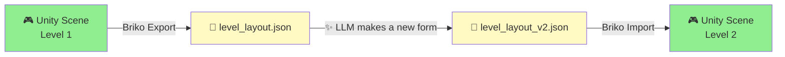
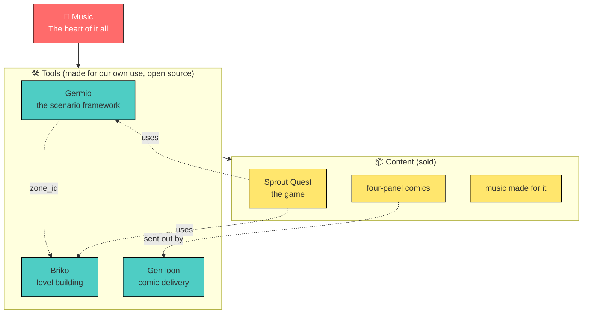
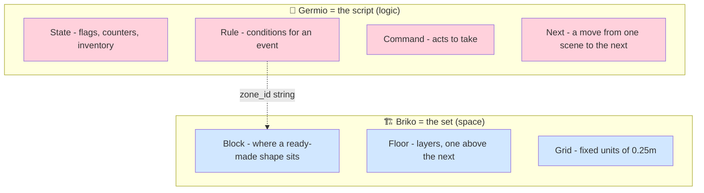
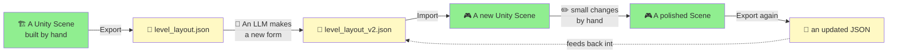
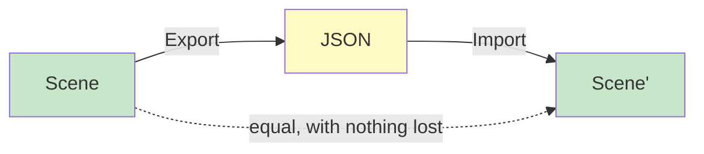
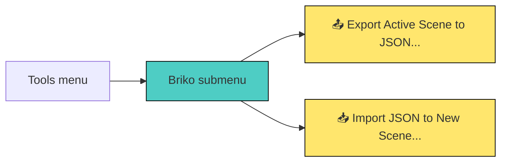
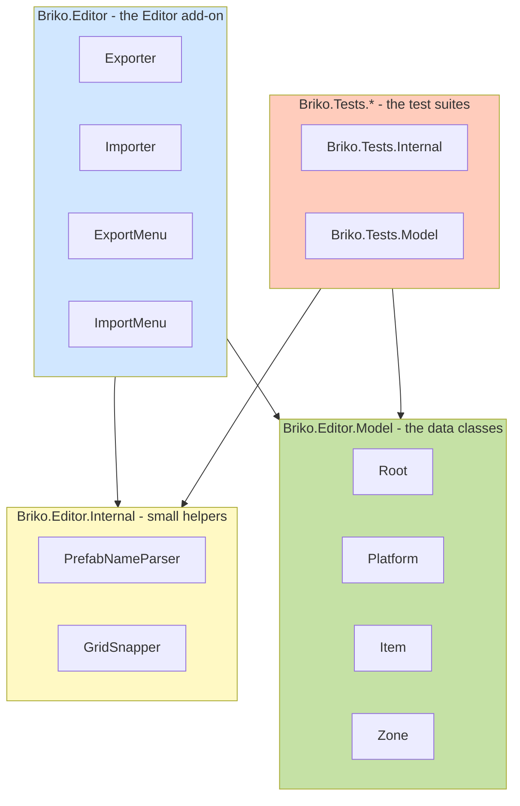
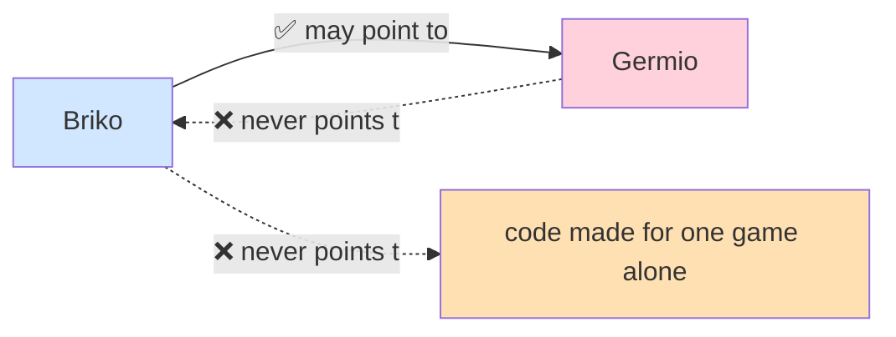
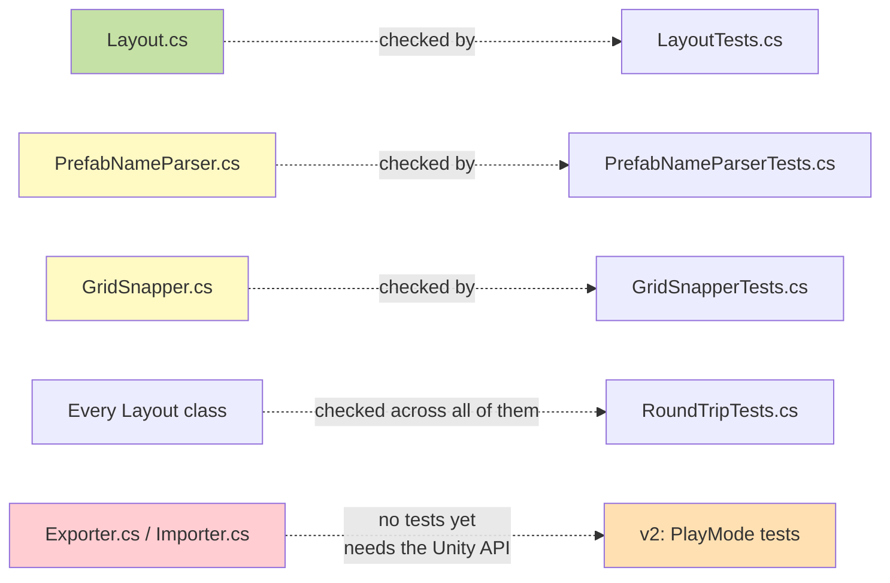
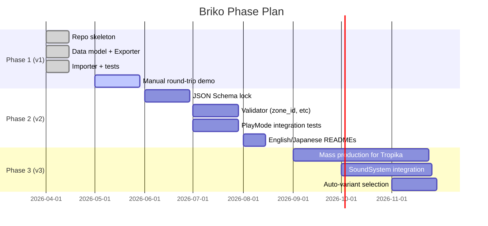

# Briko

> 🧱 **A Tool That Builds a Level Out of Blocks, for Germio**
>
> An LLM makes a Unity level, going both ways between a Scene and
> JSON.

[](https://unity.com/)


[](LICENSE)

---

## What is Briko?

**Briko** (the Esperanto word for *brick* 🧱) is a Unity Editor
add-on that turns a 3D level scene into clean, well-formed JSON —
and can build that same scene back again from the JSON. The JSON
is made so that a **Large Language Model can read it and write
it**, so an LLM can be handed a real level, and asked to make new
forms of it, sequels, or whole new stages.

Briko is the **set-design half** of a pair of tools. Its sibling,
[Germio](https://github.com/hiroxpepe/germio), handles the
scenario's own logic (state machines, rules, moves from one state
to the next). Together, they let a game be built with an LLM's
help, with no loss of creative control.



---

## Why Briko?

> **"An LLM cannot put 3D shapes in space in any real, working
> way."**

This was the starting fact that led to Briko. Ask Claude or GPT to
"design a level like Mario's" and back comes 60 points in space
that do not fit together at all, with platforms floating in the
air and jumps no one could ever make. When an LLM has to reason
about space with no real limit at all, it makes up facts that are
not true — badly, and often.

Briko gets around this by **making the LLM's own choices smaller**:

| An open-ended problem | Briko's own, narrow answer |
| --- | --- |
| "Put a block somewhere that makes sense" | Pick from a fixed list of ready-made shapes |
| "Pick X, Y, Z points" | Snap to a 0.25m grid (whole numbers only) |
| "Set the turn" | Pick from `{0°, 90°, 180°, 270°}` |
| "See a whole 3D scene in your mind" | Edit a JSON list (a thing an LLM is very good at) |

By cutting the space of choice down to **a small, fixed set of
words the LLM can really reason about**, Briko turns level design
from a problem with no clean answer into **a problem the LLM can
finish on its own, one small step at a time**.

---

## Where Briko stands in the STUDIO MeowToon world

Briko is one tool, inside a larger picture. Music sits at the
center; tools serve the content; the content reaches people.



---

## Briko against Germio: a script against a set

The simplest way to see it: **Germio writes the script; Briko
builds the stage.** The two never overlap.



The **only tie** between the two is a `zone_id` string. When the
player steps into a Briko zone, Germio's own runtime sees a
`zone_id` event, and decides what happens next. Neither side knows
anything else at all about the other.

This split is not open for debate. Joining the two would break
both.

---

## How it works

### Going both ways



### Why going "both ways" matters

Most level-making tools only go **one way**: a tool puts out a
level, and the moment a person changes it by hand in Unity, the
JSON and the real scene fall out of step, and no one can say which
one is true. Briko fixes this by treating **Scene to JSON** as a
real, first-class act, not a thing added on as an afterthought.

This is what lets a person and an LLM take turns, editing back and
forth, while the JSON stays the one, true record.

Since each choice is a fixed, whole-number one, the change from
Scene to JSON loses nothing at all:



---

## Quick start

### What you need first

+ **Unity 6 LTS**, or **Unity 2022.3 and up**
+ **the .NET 9 SDK** (only needed to run the test suite)

### Putting it in (as a UPM `file:` reference)

In your own Unity project's `Packages/manifest.json`:

```jsonc
{
  "dependencies": {
    "com.meowtoon.briko": "file:../../briko",
    "com.unity.nuget.newtonsoft-json": "3.2.1"
  }
}
```

Change the path to match where you put this repository.

### How to use it

Once it is in, two menu items show up in the Unity Editor:



+ **Export**: writes out the open scene's own `Platform` and
  `Entity` trees, into one JSON file.
+ **Import**: reads a JSON file, and builds a new scene, with each
  shape put in place and every zone marked.

---

## The JSON form

Briko's own JSON can be read by a person, and is easy for an LLM
to work with. Here is its smallest form:

```json
{
  "layout_id": "tropika_stage_01",
  "grid_unit": 0.25,
  "target_duration_sec": 180,
  "bgm_track": "track_01_tropika_morning.mp3",
  "platforms": [
    {
      "floor": "1f",
      "grounds": [
        {
          "prefab": "Ground_10.0x0.5x10.0_Green",
          "variant": 1,
          "position": [0, 0, 0]
        }
      ],
      "blocks": [
        {
          "prefab": "Block_1.0x1.0x1.0_Plain_Green",
          "variant": 3,
          "position": [2, 0.5, 3]
        }
      ],
      "zones": [
        {
          "zone_id": "vol_boss_start",
          "position": [20, 0.5, 15]
        }
      ]
    }
  ]
}
```

### The data model


### The rules behind the design

| Rule | Why |
| --- | --- |
| **Only whole-number steps of grid_unit** | this removes any slow drift in float values; an LLM can never put something "almost on the grid" |
| **rotation_y is one of {0, 90, 180, 270}** | a fixed, small set of choices makes intent plain and clear |
| **The shape's name and its variant are kept apart** | the LLM picks from a fixed, finite list; how it looks stays apart from where it sits |
| **No materials, no scale changes** | these are already baked into each ready-made shape, so the LLM has nothing left to make up facts about |

---

## Project structure

```text
briko/
├── Editor/                              (all code here runs in the Editor alone)
│   ├── Briko.Editor.asmdef             (an assembly definition, for the Editor platform only)
│   ├── Exporter.cs                     (Scene to Root)
│   ├── ExportMenu.cs                   (wiring for the Tools/Briko/Export menu)
│   ├── Importer.cs                     (Root to Scene)
│   ├── ImportMenu.cs                   (wiring for the Tools/Briko/Import menu)
│   ├── Internal/
│   │   ├── PrefabNameParser.cs         (reads the naming rule, with a regex)
│   │   └── GridSnapper.cs              (snaps to the fixed 0.25m grid)
│   └── Model/
│       └── Layout.cs                   (Root, Platform, Item, Zone - one file)
├── Tests~/                              (a UPM rule: hidden from Unity,
│   └── IntegrationTests/                 but seen by dotnet's own tools)
│       ├── IntegrationTests.csproj
│       ├── Fixtures/
│       │   └── sample_level_minimal.json
│       └── Scripts/
│           ├── Internal/
│           │   ├── PrefabNameParserTests.cs
│           │   └── GridSnapperTests.cs
│           └── Model/
│               ├── LayoutTests.cs
│               └── RoundTripTests.cs
├── docs/
│   ├── briko_spec.md                   (the design itself - the why)
│   └── development_plan_v1_detail_JP.md (the build plan - the how)
├── package.json
└── README.md
```

### How the namespaces are layered



---

## Which way things can depend (a strict rule)



+ **Briko to Germio**: a one-way tie is allowed (not yet used, in
  v1)
+ **Germio to Briko**: not allowed at all (this would make a
  circle of dependence)
+ **Briko to code made for one game alone**: not allowed at all
  (Briko is a general tool, not a helper made just for Sprout
  Quest)

---

## Naming rules

Briko follows the rules of
[Stemic](https://github.com/hiroxpepe/stemic) (the parent game
project) with care. The key rules:

| Part | Rule | Example |
| --- | --- | --- |
| A class's own name | one word, with no prefix for this project | `Exporter`, not `BrikoExporter` |
| A public property (on a data class) | `snake_case` (to match the JSON's own keys) | `layout_id`, `grid_unit` |
| A public property (any other kind) | `camelCase` | `home`, `beat`, `mode` |
| A private field | `_snake_case` | `_do_update`, `_jump_power` |
| A local variable or argument | `snake_case` | `base_path`, `grid_unit` |
| A constant | `ALL_CAPS` | `GRID_UNIT`, `MENU_ROOT` |
| A method call (made for this project) | **always give each argument its own name** | `Snap(raw: pos, grid_unit: 0.25f)` |

Turning data into JSON uses no `[JsonProperty]` tags at all — each
property's own name is used, straight, as the JSON's own key.

---

## Building it further

### Running the tests

```sh
dotnet test Tests~/IntegrationTests/IntegrationTests.csproj
```

One test alone:

```sh
dotnet test Tests~/IntegrationTests/IntegrationTests.csproj --filter "FullyQualifiedName~LayoutTests"
```

The test project shares its own build with `Editor/Model/Layout.cs`
and the tools under `Internal/`, so plain C# logic can be checked
with no need to start Unity at all.

### The pattern behind test coverage

Briko follows Stemic's own rule of **one test file for one source
file**:



A class that needs the Unity API (Exporter, Importer, the menus)
has no NUnit test at all, in v1, matching how Stemic treats any
`MonoBehaviour` class (CameraSystem, GameSystem, and the rest).
Real, integration-level tests for these come in v2, through the
Unity Test Framework.

---

## Roadmap



### Where things stand now: **v0.1.0 — Phase 1 done** ✅

+ ✅ Going both ways, Scene to JSON and back, works
+ ✅ 18 of 18 tests pass
+ ✅ Stemic's own rules are held to
+ ⏳ Checking the round trip by hand is still going on (Tasks 5-6)

See
[`docs/development_plan_v1_detail_JP.md`](docs/development_plan_v1_detail_JP.md)
for the full, real state of the build.

---

## License

MIT — see [LICENSE](LICENSE).

---

## Where this came from

Briko is the second tool in a path that has run four years. After
[Germio](https://github.com/hiroxpepe/germio) settled into its own,
LLM-first scenario framework, over more than 20 rounds of change,
Briko was thought up to take on the spatial half — the part Germio,
on purpose, never took on for itself.

The question that drove it:

> **"Can one person, working with an LLM, put out a whole 3D game
> of climbing and jumping, at the same real scale a 1990s studio
> once made?"**

The answer turns on **whether building a level can be done by
machine, with no false, made-up facts about space.** Briko is the
bet placed on that answer.

The real aim is
[Sprout Quest](https://github.com/hiroxpepe/sprout-quest), four
years in the making, a second try at a first attempt that was
never finished. Built on Germio for its logic, filled in by Briko
for its space, and scored with music made by hand.

Rome was not built in one day. But Rome, in the end, **does** get
built.

---

> *"An LLM cannot put 3D shapes in space — but it can write JSON.
> So, we turn space into JSON."*

🐱 **STUDIO MeowToon** — 2026
