# Briko

> 🧱 **Block-based Level Construction Tool for Germio**
>
> LLM-driven Unity level generation via bidirectional Scene ↔ JSON conversion.

[](https://unity.com/)


[](LICENSE)

---

## What is Briko?

**Briko** (Esperanto for *brick* 🧱) is a Unity Editor extension that lets you serialize a 3D level scene into clean structured JSON — and reconstruct it back into a working Unity scene. The JSON is designed to be **read and written by Large Language Models**, which means you can hand a LLM your existing level and ask it to generate variations, sequels, or entire new stages.

Briko is the **set-design half** of a two-tool framework. Its sibling [Germio](https://github.com/hiroxpepe/germio) handles scenario logic (state machines, rules, transitions). Together they enable LLM-driven game development without losing creative control.

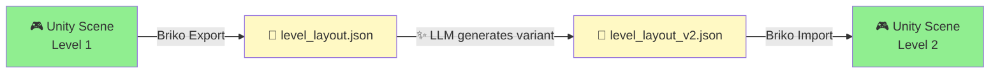

---

## Why Briko?

> **"LLMs cannot meaningfully place 3D models in space."**

This was the founding observation. Ask Claude or GPT to "design a Mario level" and you get 60 mismatched coordinates with floating platforms and impossible jumps. The hallucination rate on continuous spatial reasoning is brutal.

Briko sidesteps the problem by **shrinking the LLM's freedom**:

| Continuous problem                   | Briko's discrete reformulation               |
| ------------------------------------ | -------------------------------------------- |
| "Place a block somewhere reasonable" | Pick from a fixed prefab catalog             |
| "Choose XYZ coordinates"             | Snap to 0.25m grid (integer multiples only)  |
| "Set the rotation"                   | Choose from `{0°, 90°, 180°, 270°}`          |
| "Imagine a full 3D scene"            | Edit JSON arrays (a thing LLMs are great at) |

By constraining the search space to **a discrete vocabulary the LLM can actually reason over**, Briko turns level design from an unsolved problem into an **autocomplete problem**.

---

## Position in the STUDIO MeowToon Ecosystem

Briko is one tool in a larger picture. The center is music; tools serve content; content reaches people.

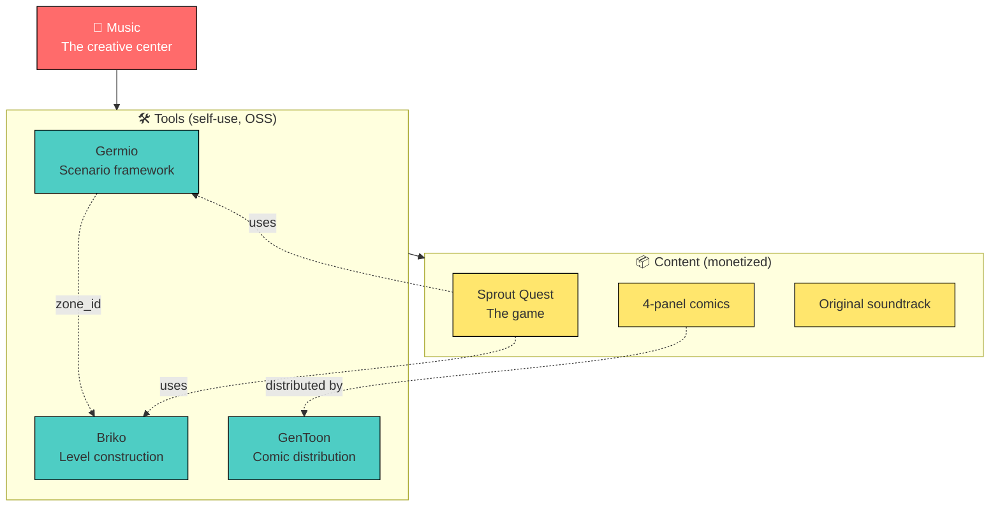

---

## Briko vs Germio: Storyboard vs Set Design

The cleanest mental model: **Germio writes the script, Briko builds the stage**. They never overlap.

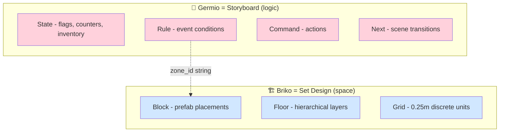

The **only contract** between them is a `zone_id` string. When the player enters a Briko zone, Germio's runtime sees a `zone_id` event and decides what happens. Neither side knows anything else about the other.

This separation is non-negotiable. Combining the two breaks both.

---

## How It Works

### The Bidirectional Flow

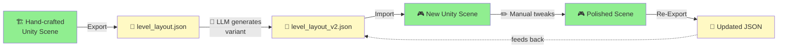

### Why "Round-trip" Matters

Most level generators are **one-way**: a tool spits out a level, and the moment a human edits it in Unity, the source-of-truth diverges. Briko fixes this by treating **Scene → JSON** as a first-class operation, not just an afterthought.

This is what enables the iterative LLM workflow: human and LLM take turns editing, and the JSON stays canonical.

The discreteness guarantees lossless conversion:

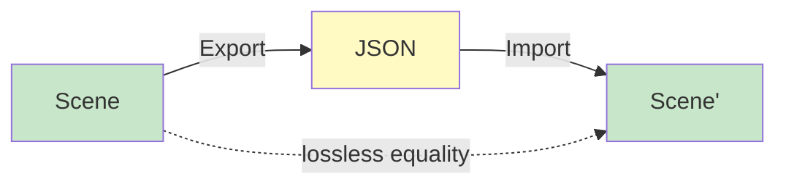

---

## Quick Start

### Prerequisites

+ **Unity 6 LTS** or **Unity 2022.3+**
+ **.NET 9 SDK** (only for running the test suite)

### Installation (UPM `file:` reference)

In your Unity project's `Packages/manifest.json`:

```jsonc
{
  "dependencies": {
    "com.meowtoon.briko": "file:../../briko",
    "com.unity.nuget.newtonsoft-json": "3.2.1"
  }
}
```

Adjust the relative path based on where you cloned this repository.

### Usage

Once installed, two menu items appear in the Unity Editor:

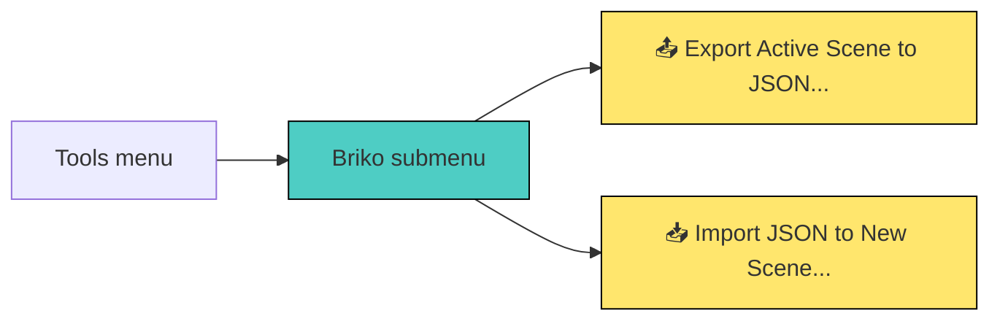

+ **Export**: dumps the active scene's `Platform` and `Entity` hierarchies into a JSON file.
+ **Import**: reads a JSON file and constructs a new scene with prefabs placed and zones marked.

---

## JSON Format

Briko's JSON is human-readable and LLM-friendly. Here's the minimal shape:

```json
{
  "layout_id": "tropika_stage_01",
  "grid_unit": 0.25,
  "target_duration_sec": 180,
  "bgm_track": "track_01_tropika_morning.mp3",
  "platforms": [
    {
      "floor": "1f",
      "grounds": [
        {
          "prefab": "Ground_10.0x0.5x10.0_Green",
          "variant": 1,
          "position": [0, 0, 0]
        }
      ],
      "blocks": [
        {
          "prefab": "Block_1.0x1.0x1.0_Plain_Green",
          "variant": 3,
          "position": [2, 0.5, 3]
        }
      ],
      "zones": [
        {
          "zone_id": "vol_boss_start",
          "position": [20, 0.5, 15]
        }
      ]
    }
  ]
}
```

### Data Model

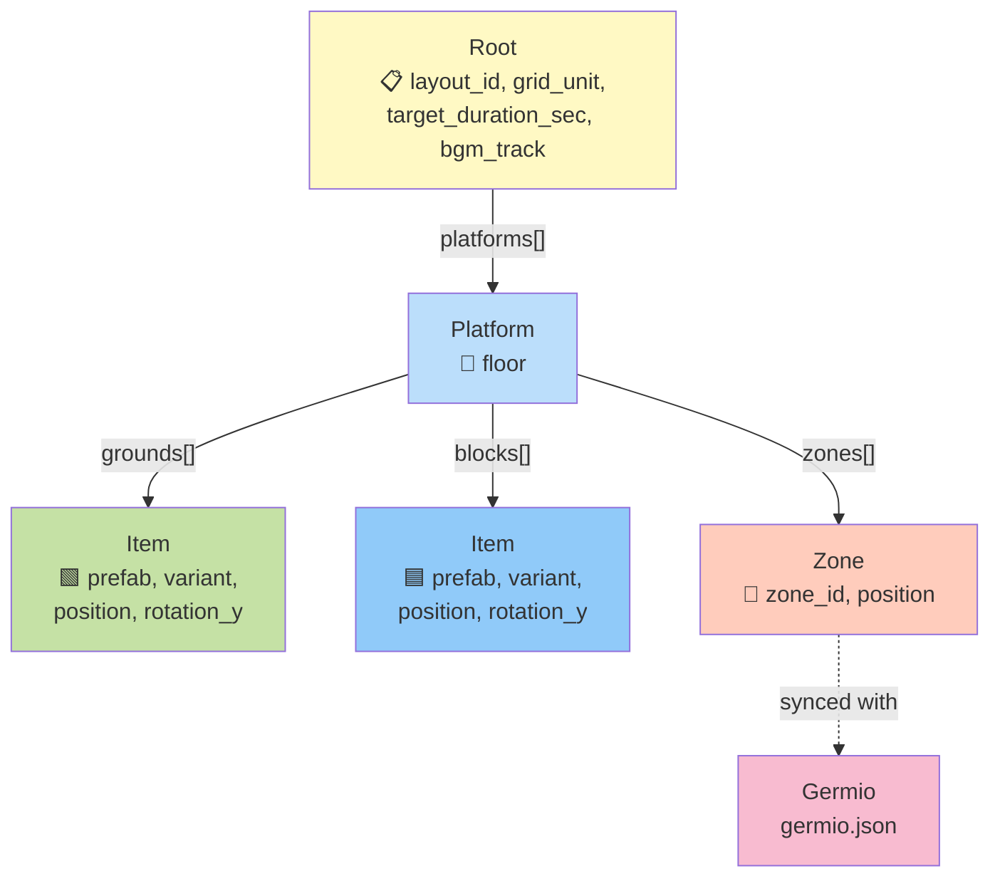

### Design Principles

| Principle                           | Rationale                                                                          |
| ----------------------------------- | ---------------------------------------------------------------------------------- |
| **Integer multiples of grid_unit**  | Float drift is eliminated; LLMs can never produce "almost on the grid" placements  |
| **rotation_y ∈ {0, 90, 180, 270}**  | Discretization makes intent unambiguous                                            |
| **Prefab name + variant separated** | LLM picks from a finite catalog; visual variation is decoupled from spatial choice |
| **No materials, no scales**         | Already baked into prefabs; nothing for the LLM to hallucinate                     |

---

## Project Structure

```text
briko/
├── Editor/                              ← all package code is editor-only
│   ├── Briko.Editor.asmdef             ← assembly definition (Editor platform only)
│   ├── Exporter.cs                     ← Scene → Root
│   ├── ExportMenu.cs                   ← Tools/Briko/Export menu wiring
│   ├── Importer.cs                     ← Root → Scene
│   ├── ImportMenu.cs                   ← Tools/Briko/Import menu wiring
│   ├── Internal/
│   │   ├── PrefabNameParser.cs         ← parses naming convention regex
│   │   └── GridSnapper.cs              ← 0.25m discrete snapping
│   └── Model/
│       └── Layout.cs                   ← Root, Platform, Item, Zone (single file)
├── Tests~/                              ← UPM convention: hidden from Unity
│   └── IntegrationTests/                  but visible to dotnet tooling
│       ├── IntegrationTests.csproj
│       ├── Fixtures/
│       │   └── sample_level_minimal.json
│       └── Scripts/
│           ├── Internal/
│           │   ├── PrefabNameParserTests.cs
│           │   └── GridSnapperTests.cs
│           └── Model/
│               ├── LayoutTests.cs
│               └── RoundTripTests.cs
├── docs/
│   ├── briko_spec.md                   ← design specification (the why)
│   └── development_plan_v1_detail_JP.md ← implementation plan (the how)
├── package.json
└── README.md
```

### Namespace Layers

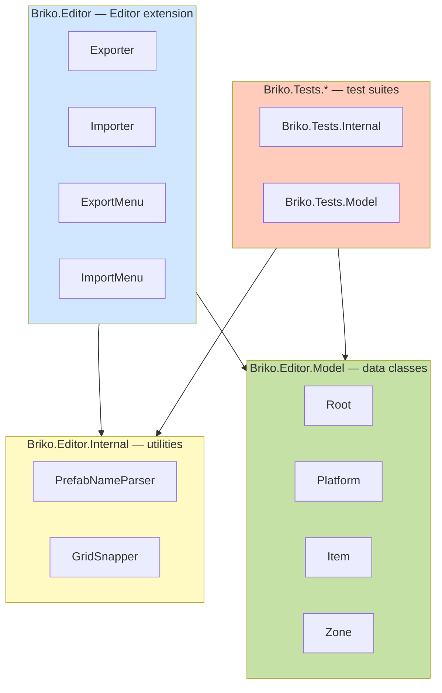

---

## Dependency Direction (Strict Rule)

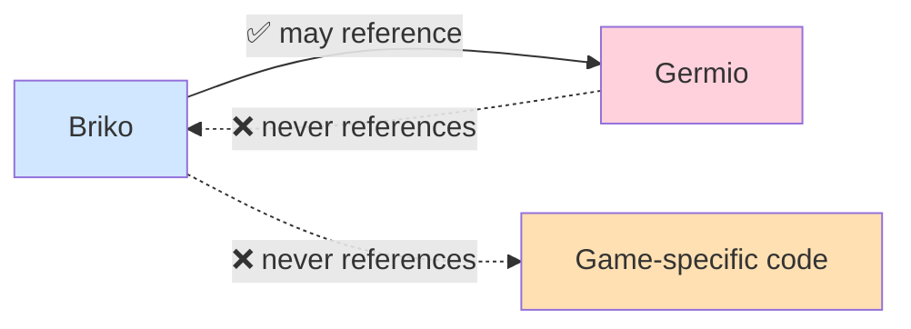

+ **Briko → Germio**: one-way reference allowed (currently unused in v1)
+ **Germio → Briko**: forbidden (would create circular dependency)
+ **Briko → game-specific code**: forbidden (Briko is a generic tool, not Sprout Quest's helper)

---

## Naming Conventions

Briko follows the conventions of [Stemic](https://github.com/hiroxpepe/stemic) (the parent game project) precisely. Key rules:

| Element                          | Convention                       | Example                            |
| -------------------------------- | -------------------------------- | ---------------------------------- |
| Class name                       | Single word, no project prefix   | `Exporter`, not `BrikoExporter`    |
| Public properties (data classes) | `snake_case` (matches JSON keys) | `layout_id`, `grid_unit`           |
| Public properties (other)        | `camelCase`                      | `home`, `beat`, `mode`             |
| Private fields                   | `_snake_case`                    | `_do_update`, `_jump_power`        |
| Local variables / parameters     | `snake_case`                     | `base_path`, `grid_unit`           |
| Constants                        | `ALL_CAPS`                       | `GRID_UNIT`, `MENU_ROOT`           |
| Method calls (project-defined)   | **Always use named parameters**  | `Snap(raw: pos, grid_unit: 0.25f)` |

JSON serialization uses no `[JsonProperty]` attributes — property names are the JSON keys directly.

---

## Development

### Running Tests

```sh
dotnet test Tests~/IntegrationTests/IntegrationTests.csproj
```

Single test:

```sh
dotnet test Tests~/IntegrationTests/IntegrationTests.csproj --filter "FullyQualifiedName~LayoutTests"
```

The test project shares source compilation with `Editor/Model/Layout.cs` and the `Internal/` utilities, so you can test pure C# logic without spinning up Unity.

### Test Coverage Pattern

Briko follows Stemic's **1:1 test mapping** rule:

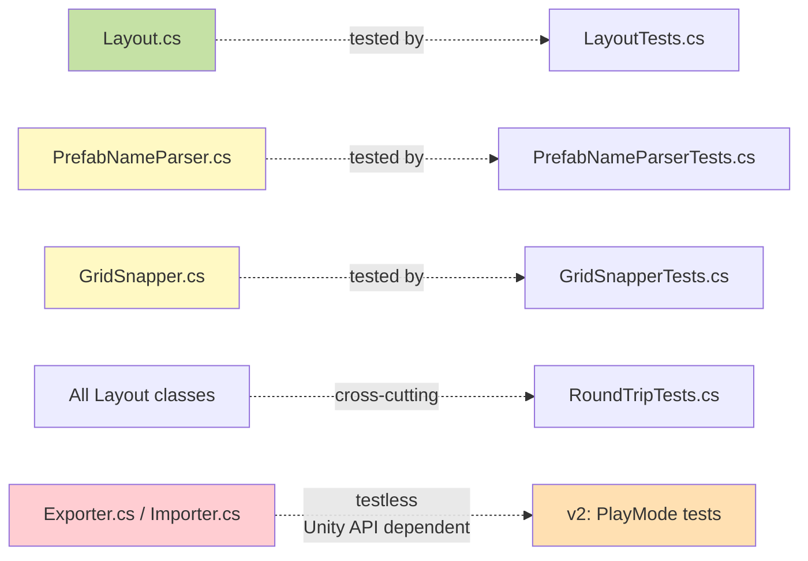

Unity-API-dependent classes (Exporter, Importer, menus) have no NUnit tests in v1, matching Stemic's convention for `MonoBehaviour`-class code (CameraSystem, GameSystem, etc.). Integration tests for these arrive in v2 via Unity Test Framework.

---

## Roadmap

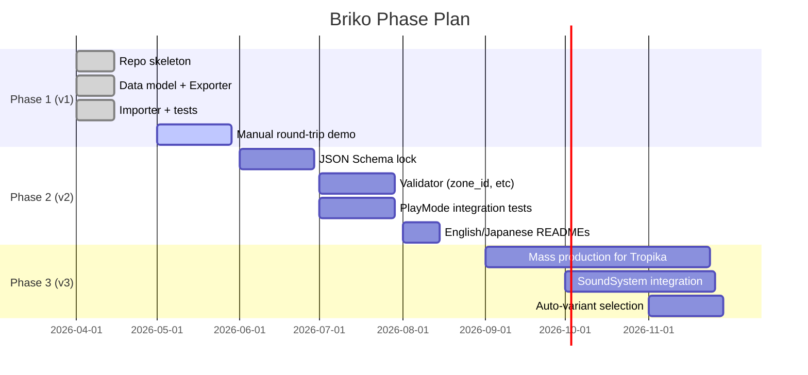

### Current Status: **v0.1.0 — Phase 1 Complete** ✅

+ ✅ Bidirectional Scene ↔ JSON conversion working
+ ✅ 18/18 tests passing
+ ✅ Stemic conventions enforced
+ ⏳ Manual round-trip validation in progress (Tasks 5-6)

See [`docs/development_plan_v1_detail_JP.md`](docs/development_plan_v1_detail_JP.md) for detailed implementation status.

---

## License

MIT — see [LICENSE](LICENSE).

---

## Background

Briko is the second tool in a 4-year arc. After [Germio](https://github.com/hiroxpepe/germio) crystallized the LLM-first scenario framework over more than 20 iterations, Briko was conceived to handle the spatial half — the part Germio deliberately refused to absorb.

The driving question:

> **"Can a single creator with an LLM produce a complete 3D platformer at the production scale of a 1990s studio?"**

The answer is gated on **whether level construction can be automated without spatial hallucination**. Briko is the bet on that answer.

The target is [Sprout Quest](https://github.com/hiroxpepe/sprout-quest), a 4-years-in-the-making revenge for an unfinished first attempt. Built on Germio for logic, populated by Briko for space, scored by hand-crafted music.

Rome wasn't built in a day. But Rome **does** eventually get built.

---

> *"LLMs cannot place 3D models in space — but they can write JSON. So we make space into JSON."*

🐱 **STUDIO MeowToon** — 2026
