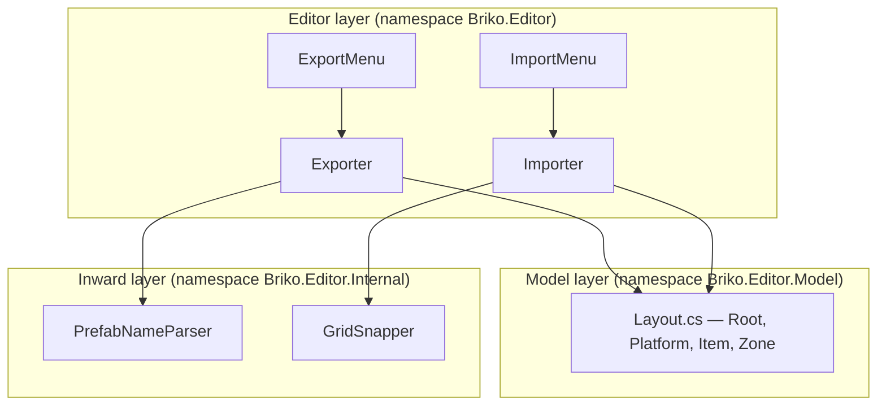

# Briko Roadmap

> **Document version**: 2.0
> **Status**: Active — Tasks 1-4 complete (found built and tested in the
> real code), Tasks 5-6 still need the master's own hand on a real
> Unity run
> **Depends on**: `briko_spec.md` (the why), the real Stemic code (the
> one true source for the coding standard)

---

## 1. The goal, in one line

Finish a UPM package that turns a Unity scene into JSON and back
again, and build the first step toward growing a Level 2 out of the
real Level 1 through an LLM.

---

## 2. What v1 covers

| # | Item | Task |
| - | ---- | ---- |
| 1 | Make the Briko repository | done, before v1 planning began |
| 2 | A least `package.json` | done, before v1 planning began |
| 3 | Build the Exporter | Task 2 |
| 4 | Turn the real Level 1 into JSON | Task 5 (by hand) |
| 5 | Have an LLM build a Level 2 | Task 6 (by hand) |
| 6 | Build the Importer | Task 3 |

Task 1 (the data model) and Task 4 (the test set) round out the full
task list.

**Kept out of v1, on purpose** (left for a later version): a JSON
Schema, a Validator, a way to pick a variant on its own, a link
between music events and level shape, a README in two languages, a
move to the `STUDIO-MeowToon` org, any edit to a Stemic scene, an
Inspector UI (v1 uses menu commands only), and a PlayMode/EditMode
test for the Exporter or Importer (Stemic itself has none for its own
`MonoBehaviour`-based classes, so Briko follows the same pattern).

---

## 3. The set-up

| Item | Value |
| ---- | ----- |
| Unity (build side) | Unity 6 LTS |
| Unity (`package.json` fits) | 2022.3 and up |
| .NET (test project) | .NET 9 |
| JSON library | Newtonsoft.Json |
| Namespace root | `Briko` |
| Character set | UTF-8, no BOM |
| Line end | LF |

Unity's own side leans on the UPM package
`com.unity.nuget.newtonsoft-json`; the test project (.NET 9) leans on
the NuGet package `Newtonsoft.Json` straight.

**The one-way rule**: `Briko` may point to `Germio` (though v1 does
not yet use it); `Briko` must never point to Stemic's own game code;
`Germio` must never point back to `Briko`.

Checking the real package inside Stemic is the master's own, real-run
step, done by pointing Stemic's own `Packages/manifest.json` at
`"com.meowtoon.briko": "file:../../../briko"`.

---

## 4. The shape, as built

The scene shape Briko reads and writes: a `Platform` branch (the
grounds and blocks Briko cares about) and an `Entity` branch (holding
only bare, named `zone_id` GameObjects; Briko does not touch
`System`).

**Choices settled for v1** (kept short; the full "why" for each sits
in §7 below): a block's own floor is guessed from its own Y position,
not read from the hierarchy; a zone is any bare GameObject under
`Entity` whose name fits `^vol_[a-z0-9_]+$`; Briko never fixes a scene
on its own, and never touches a material or a scale.

---

## 5. Tasks 1-4 — done, found in the real code

Every file these four tasks called for is in the repository now,
built and, where the plan called for a test, tested:

+ **Task 1** (the data model): `Editor/Model/Layout.cs` holds
  `Root`, `Platform`, `Item`, and `Zone`, each in `snake_case`, with
  no `[JsonProperty]` needed. The old, four-file `Editor/Data/` shape
  is gone. `Tests~/IntegrationTests/Scripts/Model/LayoutTests.cs`
  checks it.
+ **Task 2** (the Exporter): `Editor/Exporter.cs` and
  `Editor/ExportMenu.cs` are in place; the old `BrikoExporter.cs` is
  gone.
+ **Task 3** (the Importer): `Editor/Importer.cs` and
  `Editor/ImportMenu.cs` are in place; the old `BrikoImporter.cs` and
  `BrikoMenuItems.cs` are gone.
+ **Task 4** (the test set): the naming-rule test set alone runs 20
  files strong, all green.

No class carries a `Briko` or `MeowToon` word in its own name
(`Exporter`, not `BrikoExporter`); the namespace itself
(`Briko.Editor`) carries that sense instead, the same pattern Stemic
uses for its own `Germio.*` classes.

---

## 6. Tasks 5-6 — still open, and need the master's own hand

Both of these tasks call for a real Unity run; no sandbox can check
them.

### Task 5 — turn the real Level 1 into JSON

1. Add Briko to Stemic's own `game/Packages/manifest.json`:
   `"com.meowtoon.briko": "file:../../../briko"`.
2. Open Stemic in the Unity Editor, open the Level 1 scene.
3. Run `Tools/Briko/Export Active Scene to JSON...`.
4. Save to `briko/artifacts/level_01_export.json`.
5. Note any warning the Console gives (say, a grid-snap miss).

**Done when**: the file is made; at least one of grounds, blocks, or
zones is not empty (unless the real level truly has none); the
Console shows no hard error (a warning is fine).

**If a Platform or Entity branch cannot be found, or a prefab name or
a zone name does not fit the pattern this plan assumed**: this is
still within v1's own reach to fix — look at the real scene, and
change the pattern or the logic to match it.

### Task 6 — check that an LLM can build a Level 2

1. Show `level_01_export.json` to an LLM (Claude or ChatGPT), with a
   prompt asking for a Level 2 shaped like it, a little harder, with
   the same JSON shape, positions on the 0.5 grid, a rotation of only
   0/90/180/270, prefab names and their own variant numbers taken
   only from what Level 1 already uses, a prefab count within ±20%,
   and the same `zone_id` values throughout (so `germio_config.json`
   stays in step).
2. Save what comes back as `briko/artifacts/level_02_generated.json`.
3. In Stemic's own Unity Editor, run `Tools/Briko/Import JSON to New
   Scene...`, pointing at that file, into a new scene (say,
   `Level_02_Generated.unity`).
4. Open the new scene and look it over by eye.

**Done when**: the file is made; the Importer turns it into a real
scene with no crash; the scene shows on screen with nothing badly
broken. **The quality of Level 2 itself does not matter for v1** — a
rough first LLM try is fine, so long as the round trip itself (scene
to JSON, JSON to scene, JSON out to an LLM and back) truly works.

---

## 7. Design choices settled for v1 (why they are what they are)

+ **A block's own floor** is read from its own Y position (`under
  3.0` reads as floor 1, at or above reads as floor 2), since the
  real hierarchy groups blocks with no floor marking of their own,
  and the real grid's own ground depth (0.5m) plus block height
  (1-2.5m) puts 3m at a natural line between the two floors.
+ **A zone** is any bare GameObject under `Entity` whose name fits
  `^vol_[a-z0-9_]+$`; whether it carries a Collider is not checked.
+ **Newtonsoft.Json**, at close major versions on both sides (Unity's
  own UPM package build on 13.x; the .NET 9 test side on 13.0.3
  straight), so a value written by one side reads the same on the
  other.
+ **A round trip counts as "the same"** when `JToken.DeepEquals`
  says so — a check on meaning, not on the exact order or space of
  the raw text.
+ **No `Briko` word sits inside a namespace or a class name**
  (`Briko.Editor`, not `MeowToon.Briko.Editor`; `Exporter`, not
  `BrikoExporter`), matching how Stemic's own `Germio.*` classes
  carry no `Germio` word inside a class name either — the namespace
  alone carries that sense.

A later version might swap the Y-guess for a real `blocks_1f` /
`blocks_2f` split in the hierarchy, or add a marker component in
place of the `vol_` name pattern; neither is needed for v1.
