# Briko Specification

> **Block-based Level Construction Tool for Germio**
>
> A Unity Editor extension enabling LLM-driven level generation through bidirectional Scene ↔ JSON conversion.

---

**Document Version**: 1.1
**Last Updated**: 2026-05-05
**Status**: Stable (v1 implementation complete)
**Companion to**: [Germio Framework](https://github.com/hiroxpepe/germio)

---

## Table of Contents

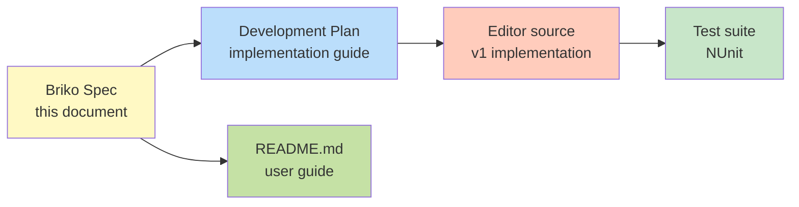

| Section | Topic                      |
| ------- | -------------------------- |
| 1       | Overview                   |
| 2       | Design Philosophy          |
| 3       | Relationship with Germio   |
| 4       | Coordinate System and Grid |
| 5       | Prefab Naming Convention   |
| 6       | Scene Hierarchy            |
| 7       | Layout JSON Format         |
| 8       | Bidirectional Converter    |
| 9       | Repository Structure       |
| 10      | Coding Conventions         |
| 11      | Common Layout Patterns     |
| 12      | LLM Workflow Models        |
| 13      | Failure Mode Catalog       |
| 14      | Roadmap                    |
| 15      | References                 |

---

## 1. Overview

### 1.1 What Briko Is

Briko is a Unity Editor extension that:

1. **Serializes** an existing Unity scene into structured JSON (the `Layout` document).
2. **Reconstructs** a Unity scene from a `Layout` document.
3. Maintains **lossless round-trip** between the two representations through strict discrete constraints.

The JSON format is designed to be read and written by Large Language Models (LLMs).

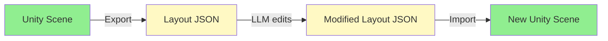

### 1.2 What Briko Is Not

| Briko is not                      | Justification                                                                   |
| --------------------------------- | ------------------------------------------------------------------------------- |
| A runtime level editor            | All operations execute in the Unity Editor only                                 |
| A procedural generator            | Briko has no random-generation logic; it transforms between two representations |
| An ML-based generator             | Briko provides no learned model; LLM intelligence is external                   |
| A scenario / state machine engine | That responsibility belongs to Germio                                           |
| An asset creation tool            | Prefabs must already exist in the host project                                  |
| A universal level format          | The format is specific to a constrained genre and prefab convention             |

### 1.3 Position Relative to Germio

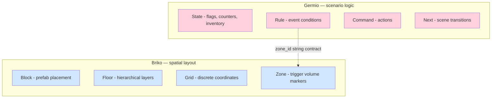

**Single point of contact**: a `zone_id` string. Beyond that, Germio and Briko are independent.

### 1.4 Comparison with Alternatives

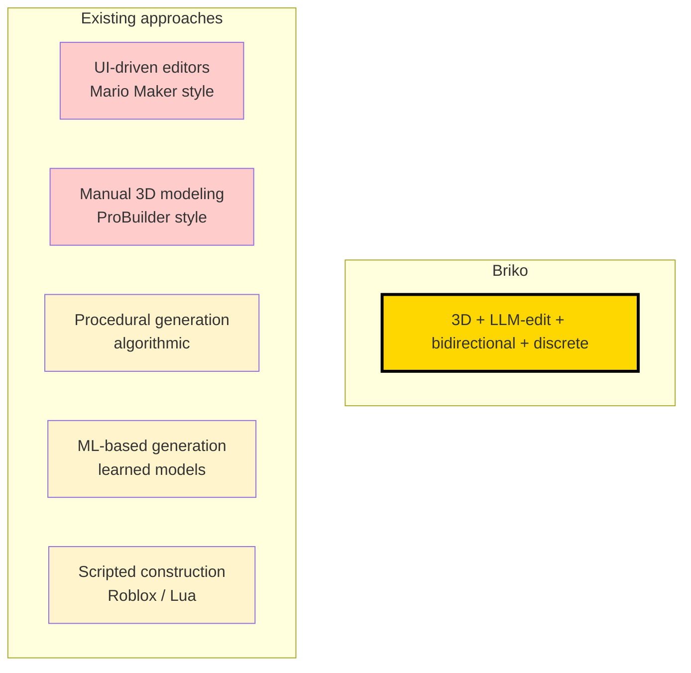

| Approach              | LLM-friendly | Bidirectional | Deterministic | Explainable |
| --------------------- | ------------ | ------------- | ------------- | ----------- |
| UI-driven editor      | No           | No            | Yes           | Yes         |
| Manual 3D modeling    | No           | No            | Yes           | Yes         |
| Procedural generation | Partial      | No            | No (random)   | Partial     |
| ML-based generation   | Partial      | No            | No            | No          |
| Scripted construction | Partial      | No            | Yes           | Yes         |
| **Briko**             | **Yes**      | **Yes**       | **Yes**       | **Yes**     |

---

## 2. Design Philosophy

### 2.1 The LLM Spatial Reasoning Problem

LLMs operate on token sequences. 3D space is a continuous coordinate field. The translation between them is unreliable when the LLM is asked to produce coordinates directly.

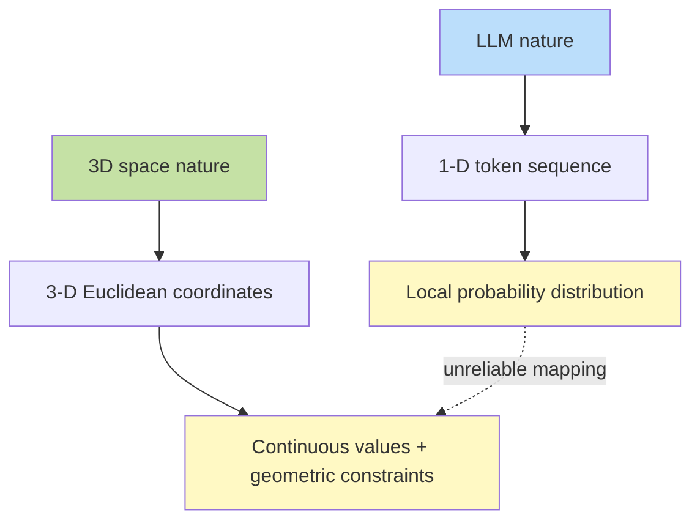

Common failure modes when an LLM is asked to produce 3D coordinates directly:

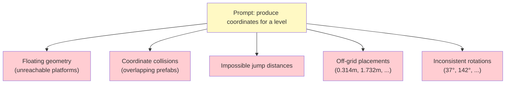

### 2.2 The Discrete Reformulation

Briko's approach: replace each continuous degree of freedom with a discrete choice.

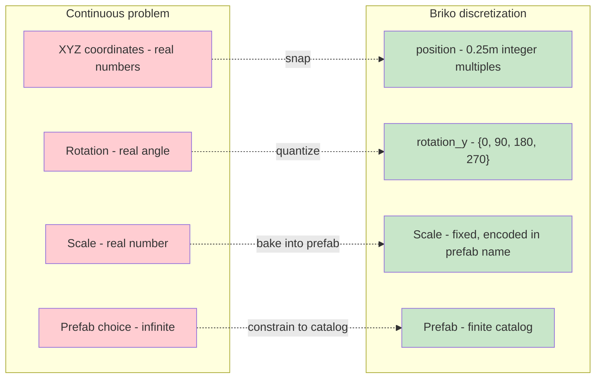

The principle: **reducing the LLM's freedom raises output quality** by making invalid outputs unrepresentable.

### 2.3 Bidirectional as a First-Class Property

Most level generators are unidirectional: tool emits a scene, and any subsequent human edit causes the source-of-truth to diverge from the original input.

Briko's solution: treat **Scene → JSON** as a primary operation, equal in importance to **JSON → Scene**.

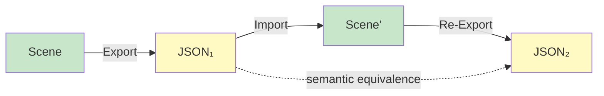

The discrete constraints from §2.2 mathematically guarantee this round-trip property (see §8.3).

### 2.4 LLM-First Design Principles

Briko inherits a subset of design principles from Germio's LLM-First framework:

| Principle                      | Application in Briko                               |
| ------------------------------ | -------------------------------------------------- |
| Closed minimal vocabulary      | Fixed prefab catalog, fixed rotation values        |
| Declarative not procedural     | JSON describes state, not steps                    |
| Self-correcting error format   | Failed parse logs warning and skips, never crashes |
| snake_case throughout          | All JSON keys and C# data class properties         |
| Public JSON schema             | The format is the API                              |
| Layered namespace architecture | `Briko.Editor.{Model, Internal}`                   |

---

## 3. Relationship with Germio

### 3.1 Role Separation

Germio and Briko are designed to **never overlap** in scope:

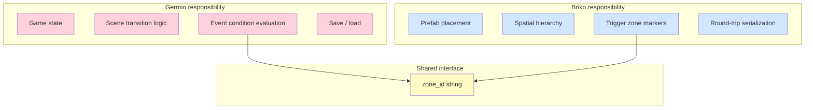

### 3.2 The zone_id Contract

The single string `zone_id` is the contract between Germio and Briko.

**Naming convention**: `zone_id` matches the regex `^vol_[a-z0-9_]+$`.

The `vol_` prefix denotes "volumetric trigger" — a 3D region that emits an event when the player enters it.

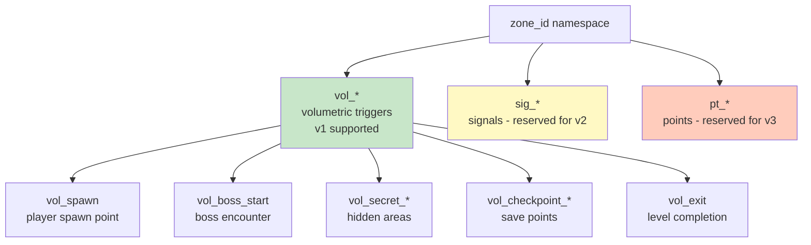

**v1 supports `vol_*` only.** Other prefixes are reserved for future expansion.

### 3.3 Runtime Data Flow

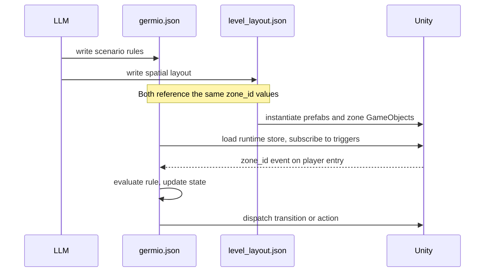

### 3.4 Why Integration Was Rejected

```mermaid
graph TB
    subgraph "Rejected: unified document"
        U1["Single 'world.json' with both scenario and layout"]
        U1 --> U2[Tight coupling]
        U2 --> U3[LLM struggles with cross-section consistency]
        U3 --> U4[Breaks Germio independence]
    end

    subgraph "Adopted: separate documents"
        S1["germio.json + level_layout.json"]
        S1 --> S2[Single responsibility per file]
        S2 --> S3[zone_id is the only cross-reference]
        S3 --> S4[Each file remains independently editable]
    end

    style U1 fill:#ffcdd2
    style U2 fill:#ffcdd2
    style U3 fill:#ffcdd2
    style U4 fill:#ffcdd2
    style S1 fill:#c8e6c9
    style S2 fill:#c8e6c9
    style S3 fill:#c8e6c9
    style S4 fill:#c8e6c9
```

### 3.5 Dependency Direction

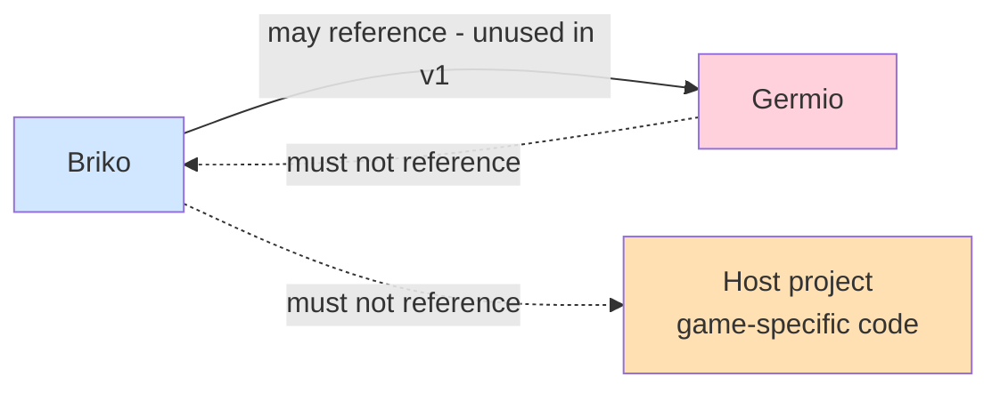

+ Briko → Germio: permitted but unused in v1
+ Germio → Briko: forbidden (would create circular dependency)
+ Briko → host project: forbidden (Briko remains generic)

---

## 4. Coordinate System and Grid

### 4.1 Unit System

```text
1 Briko unit = 1 meter (matches Unity's default world unit)
```

No conversion is applied between Unity coordinates and Briko coordinates. A position of `[10, 0, 5]` in Briko JSON corresponds directly to Unity world coordinates `(10, 0, 5)`.

### 4.2 Grid Hierarchy

The grid hierarchy is derived from observed prefab dimensions in the reference implementation:

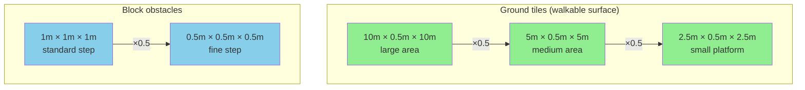

**Grid base unit: 0.25m. Sizes step in factors of 2 or 2.5.. Sizes step in factors of 2 or 2.5.

### 4.3 Discrete Constraints

| Quantity      | Constraint                      | Domain                       |          |
| ------------- | ------------------------------- | ---------------------------- | -------- |
| `position[i]` | Integer multiple of `grid_unit` | `{ k × 0.25 \                | k ∈ ℤ }` |
| `rotation_y`  | Discrete cardinal               | `{ 0, 90, 180, 270 }`        |          |
| `prefab`      | Member of the prefab catalog    | finite set, project-specific |          |
| `variant`     | Positive integer                | `{ 1, 2, 3, ... }`           |          |
| `grid_unit`   | Fixed value                     | `0.25` (v1)                  |          |

### 4.4 Snap Algorithm

For each axis component `v`:

```text
snapped(v) = round(v / grid_unit) × grid_unit
```

The reference implementation uses `Math.Round(v, MidpointRounding.AwayFromZero)`.

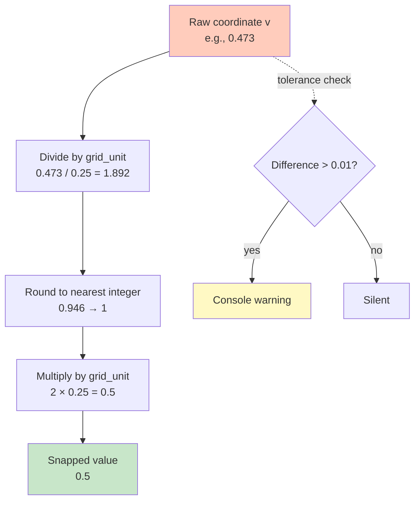

When the difference between raw and snapped exceeds 0.01m on any axis, the exporter emits a console warning to alert the user that source data is off-grid.

---

## 5. Prefab Naming Convention

### 5.1 Format

Prefab assets must follow this naming pattern:

```text
<Kind>_<Width>x<Height>x<Depth>_<Descriptor>_<Variant>
```

Where:

+ `Kind` is any arbitrary word (e.g., `Ground`, `Block`, `Enemy`, `Wall`, `Trap`). Open-ended and extensible.
+ `Width`, `Height`, `Depth` are decimal numbers in meters
+ `Descriptor` is a free-form identifier, may contain underscores (e.g., `Green`, `Plain_Green`)
+ `Variant` is a positive integer

### 5.2 Examples

| Prefab name                          | Kind      | Dimensions  | Descriptor  | Variant |
| ------------------------------------ | --------- | ----------- | ----------- | ------- |
| `Ground_10.0x0.5x10.0_Green_1`       | Ground    | 10×0.5×10   | Green       | 1       |
| `Block_1.0x1.0x1.0_Plain_Green_3`    | Block     | 1×1×1       | Plain_Green | 3       |
| `Ground_2.5x0.5x2.5_Stone_2`         | Ground    | 2.5×0.5×2.5 | Stone       | 2       |
| `Enemy_1.0x2.0x1.0_Red_1`            | Enemy     | 1×2×1       | Red         | 1       |
| `Bipyramid_0.5x1.0x0.5_Plain_Blue_1` | Bipyramid | 0.5×1×0.5   | Plain_Blue  | 1       |

### 5.3 Parser State Machine

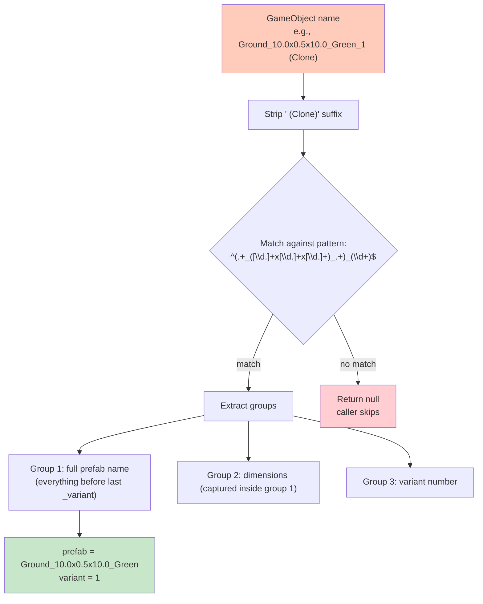

The greedy quantifier on group 1 correctly handles multi-word descriptors like `Plain_Green` because the trailing `_(\d+)$` anchors to the end. `Kind` is unrestricted — any word is accepted as long as the `_NxNxN_` dimension segment is present.

### 5.4 The Catalog as LLM Vocabulary

The set of available prefabs constitutes the LLM's vocabulary for level construction. By encoding dimensions in the name itself, the LLM can:

1. Reason about size without an external lookup table
2. Validate placement compatibility from the name alone
3. Generate names that conform to a known pattern

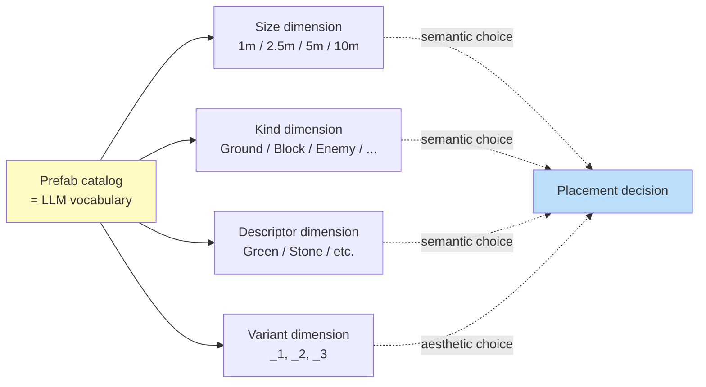

LLM cognitive load is partitioned: structural choices (size, kind, descriptor) require reasoning, while variant selection can be effectively random.

---

## 6. Scene Hierarchy

### 6.1 Required Structure

Briko expects scenes to follow this top-level hierarchy:

```text
{LevelRoot}                ← scene root, name is arbitrary
├── System                 ← Briko does not read or write
├── Platform               ← Briko's primary target for grounds and blocks
│   ├── grounds_<floor>    ← floor-grouped Ground prefab containers
│   ├── blocks_<variant>   ← Block prefab containers (floor inferred)
│   └── ...
└── Entity                 ← Briko reads and writes vol_* GameObjects only
    └── vol_*              ← empty GameObjects with zone_id as name
```

### 6.2 Layer Responsibilities

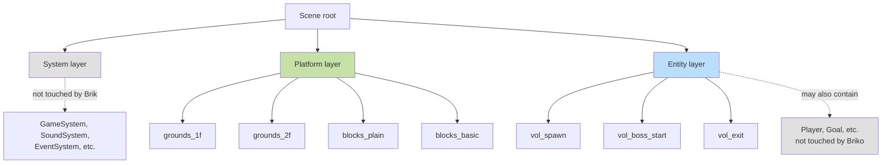

### 6.3 GameObject Naming Patterns

| Container        | Pattern            | Example                        | Contents         |
| ---------------- | ------------------ | ------------------------------ | ---------------- |
| Ground container | `grounds_<floor>`  | `grounds_1f`, `grounds_2f`     | Ground prefabs   |
| Block container  | `blocks_<variant>` | `blocks_plain`, `blocks_basic` | Block prefabs    |
| Zone marker      | `vol_<identifier>` | `vol_spawn`, `vol_boss_start`  | Empty GameObject |

### 6.4 Floor Inference for Blocks

Because Block containers are not floor-grouped in the reference implementation, the floor for each Block is inferred from its world Y-coordinate:

```text
floor(block) = "1f"  if block.position.y < 3.0
             = "2f"  otherwise
```

The threshold `3.0` is justified by:

+ Floor 1 ground thickness: 0.5m
+ Possible block stack height on floor 1: up to 2.5m
+ Total: 3.0m maximum reachable Y on floor 1

Future versions may eliminate this heuristic by introducing explicit `blocks_<floor>` containers.

---

## 7. Layout JSON Format

### 7.1 Schema Overview

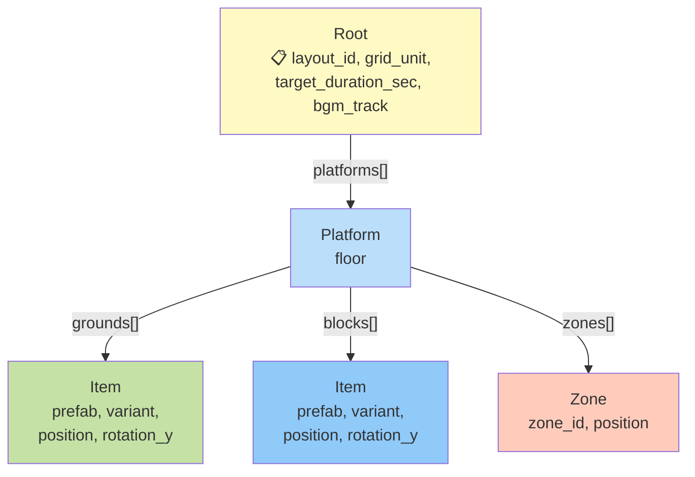

### 7.2 Sample Document

```json
{
  "layout_id": "stage_01",
  "grid_unit": 0.25,
  "target_duration_sec": 180,
  "bgm_track": "stage_01_theme.mp3",
  "platforms": [
    {
      "floor": "1f",
      "grounds": [
        {
          "prefab": "Ground_10.0x0.5x10.0_Green",
          "variant": 1,
          "position": [0, 0, 0]
        },
        {
          "prefab": "Ground_2.5x0.5x2.5_Green",
          "variant": 2,
          "position": [10, 0, 5]
        }
      ],
      "blocks": [
        {
          "prefab": "Block_1.0x1.0x1.0_Plain_Green",
          "variant": 3,
          "position": [2, 0.5, 3]
        }
      ],
      "zones": [
        {
          "zone_id": "vol_spawn",
          "position": [0, 0.5, 0]
        },
        {
          "zone_id": "vol_exit",
          "position": [20, 0.5, 15]
        }
      ]
    }
  ]
}
```

### 7.3 Field Reference

#### Root

| Field                 | Type              | Required | Description                                               |
| --------------------- | ----------------- | -------- | --------------------------------------------------------- |
| `layout_id`           | string            | yes      | Unique identifier; used as default scene name on import   |
| `grid_unit`           | float             | yes      | Grid quantization in meters (fixed at `0.25` in v1)       |
| `target_duration_sec` | int               | yes      | Intended play duration in seconds                         |
| `bgm_track`           | string            | optional | BGM filename (relative to host project's StreamingAssets) |
| `platforms`           | array of Platform | yes      | One or more floor layers                                  |

#### Platform

| Field     | Type          | Required | Description                             |
| --------- | ------------- | -------- | --------------------------------------- |
| `floor`   | string        | yes      | Floor identifier (`"1f"`, `"2f"`, etc.) |
| `grounds` | array of Item | optional | Ground tile placements                  |
| `blocks`  | array of Item | optional | Block obstacle placements               |
| `zones`   | array of Zone | optional | Trigger zone markers                    |

#### Item

| Field        | Type     | Required | Description                                                                                              |
| ------------ | -------- | -------- | -------------------------------------------------------------------------------------------------------- |
| `prefab`     | string   | yes      | Prefab asset name **without** trailing variant number (e.g. `"Ground_10.0x0.5x10.0_Green"`)              |
| `variant`    | int      | yes      | Variant number (1-based); used for scene object naming only, not appended to prefab asset name on import |
| `position`   | float[3] | yes      | World coordinates `[x, y, z]` in meters                                                                  |
| `rotation_y` | int      | optional | Y-axis rotation in degrees, default `0`                                                                  |

#### Zone

| Field      | Type     | Required | Description                             |
| ---------- | -------- | -------- | --------------------------------------- |
| `zone_id`  | string   | yes      | Identifier matching `^vol_[a-z0-9_]+$`  |
| `position` | float[3] | yes      | World coordinates `[x, y, z]` in meters |

### 7.4 Constraints Summary

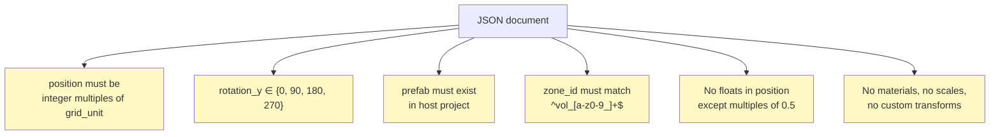

### 7.5 Property Naming Rationale (snake_case)

Briko data classes use `snake_case` C# property names that correspond directly to JSON keys, with no `[JsonProperty]` attribute mapping.

```mermaid
graph LR
    A["C# property<br/>snake_case<br/>e.g., layout_id"]
    B["JSON key<br/>snake_case<br/>e.g., layout_id"]
    C[Newtonsoft.Json<br/>default behavior]
    D[LLM affinity]

    A --> C --> B
    B --> D

    A -.no attribute needed.-> N["No [JsonProperty]"]

    style A fill:#bbdefb
    style B fill:#fff9c4
    style D fill:#c8e6c9
    style N fill:#c5e1a5
```

This deviates from typical C# conventions (where public properties are `PascalCase` or `camelCase`) but matches Germio's `Data.cs` convention. The principle: **the property name is the wire format**.

### 7.6 Serializer Settings

```csharp
new JsonSerializerSettings {
    Formatting = Formatting.Indented,
    NullValueHandling = NullValueHandling.Ignore,
    DefaultValueHandling = DefaultValueHandling.IgnoreAndPopulate,
};
```

Effects:

+ Output is indented for human and LLM readability
+ Default values (e.g., `rotation_y: 0`) are omitted, reducing noise
+ Nulls are omitted

### 7.7 C# Class Diagram

```mermaid
classDiagram
    class Root {
        +string layout_id
        +float grid_unit
        +int target_duration_sec
        +string bgm_track
        +List~Platform~ platforms
    }

    class Platform {
        +string floor
        +List~Item~ grounds
        +List~Item~ blocks
        +List~Zone~ zones
    }

    class Item {
        +string prefab
        +int variant
        +float[] position
        +int rotation_y
    }

    class Zone {
        +string zone_id
        +float[] position
    }

    Root "1" --> "1..*" Platform : platforms
    Platform "1" --> "0..*" Item : grounds
    Platform "1" --> "0..*" Item : blocks
    Platform "1" --> "0..*" Zone : zones
```

All four classes reside in a single file `Editor/Model/Layout.cs` under namespace `Briko.Editor.Model`.

---

## 8. Bidirectional Converter

### 8.1 Forward Flow (JSON → Scene)

```mermaid
flowchart TB
    Start([Layout JSON input]) --> Deser[Deserialize to Root]
    Deser --> NewScene[Create empty Unity scene]
    NewScene --> Build[Build hierarchy:<br/>Level / System / Platform / Entity]

    Build --> Loop1{For each Platform}
    Loop1 --> Ground[Create grounds_floor container]
    Loop1 --> Block[Create blocks_plain container if needed]

    Ground --> Loop2{For each Item in grounds}
    Block --> Loop3{For each Item in blocks}

    Loop2 --> FindG["Search all prefabs by file name<br/>(item.prefab exact match)"]
    Loop3 --> FindB["Search all prefabs by file name<br/>(item.prefab exact match)"]

    FindG --> InstG{Found?}
    FindB --> InstB{Found?}

    InstG -->|yes| PlaceG[InstantiatePrefab + snap position]
    InstG -->|no| WarnG[Log warning, skip]

    InstB -->|yes| PlaceB[InstantiatePrefab + snap position]
    InstB -->|no| WarnB[Log warning, skip]

    Loop1 --> Loop4{For each Zone}
    Loop4 --> Empty[Create empty GameObject<br/>name = zone_id]
    Empty --> SetPos[Set position]

    PlaceG --> Save[SaveScene + AssetDatabase.Refresh]
    PlaceB --> Save
    SetPos --> Save
    WarnG --> Save
    WarnB --> Save

    Save --> End([Scene saved to disk])

    style Start fill:#fff9c4
    style End fill:#c8e6c9
    style WarnG fill:#ffcdd2
    style WarnB fill:#ffcdd2
```

### 8.2 Reverse Flow (Scene → JSON)

```mermaid
flowchart TB
    Start([Active Unity scene]) --> Find1[Find Platform GameObject]
    Find1 -->|found| Walk1[Walk Platform children]
    Find1 -->|not found| Warn1[Log warning, continue]

    Walk1 --> Each1{For each child}
    Each1 -->|name starts with grounds_| GroundC[Extract floor from name<br/>collect Ground items]
    Each1 -->|name starts with blocks_| BlockC[Infer floor from Y<br/>collect Block items]

    GroundC --> Iter1{For each Item descendant}
    BlockC --> Iter2{For each Item descendant}

    Iter1 --> Strip1["Strip ' (Clone)' suffix"]
    Iter2 --> Strip2["Strip ' (Clone)' suffix"]

    Strip1 --> Parse1[PrefabNameParser.Parse]
    Strip2 --> Parse2[PrefabNameParser.Parse]

    Parse1 -->|null| Skip1[Skip]
    Parse2 -->|null| Skip2[Skip]

    Parse1 -->|tuple| Snap1[Snap position to grid<br/>warn if drift > 0.01m]
    Parse2 -->|tuple| Snap2[Snap position to grid<br/>warn if drift > 0.01m]

    Snap1 --> Build1[Construct Item record]
    Snap2 --> Build2[Construct Item record]

    Start --> Find2[Find Entity GameObject]
    Find2 --> Walk2[Walk Entity children]
    Walk2 --> Each2{For each child}
    Each2 -->|matches vol_*| Zone[Construct Zone record]

    Build1 --> Compose[Compose Root]
    Build2 --> Compose
    Zone --> Compose

    Compose --> Out([Layout JSON output])

    style Start fill:#fff9c4
    style Out fill:#c8e6c9
    style Skip1 fill:#ffcdd2
    style Skip2 fill:#ffcdd2
```

### 8.3 Round-trip Property

The bidirectional converter satisfies:

```text
∀ valid JSON j:        Export(Import(j)) ≡_semantic j
∀ valid Scene s:       Import(Export(s)) ≈_layout s
```

Where:

+ `≡_semantic` means JSON documents are equivalent under `JToken.DeepEquals`
+ `≈_layout` means scenes contain identical prefab placements and zone positions (other scene attributes such as material instance IDs may differ)

The discreteness of the input space (§4.3) is what mathematically guarantees this property:

+ No floating-point drift accumulates across round trips
+ Every position has a unique grid-snapped representation
+ Every rotation has a unique cardinal representation
+ Every prefab has a unique name encoding

### 8.4 Round-trip Test Strategy

The reference implementation includes `RoundTripTests.cs` which:

1. Loads a fixture JSON from disk
2. Deserializes to `Root`
3. Re-serializes to a new JSON string
4. Parses both as `JToken`
5. Asserts `JToken.DeepEquals(before, after) == true`

This test exercises the JSON ↔ POCO round-trip but not the JSON ↔ Scene round-trip (which requires Unity runtime and is deferred to v2 PlayMode tests).

### 8.5 Tolerance Handling

| Quantity                     | Tolerance            | Action when exceeded             |
| ---------------------------- | -------------------- | -------------------------------- |
| Position drift from grid     | 0.01m per axis       | Console warning, continue        |
| Rotation drift from cardinal | 1.0°                 | Console warning, continue        |
| Prefab name pattern mismatch | exact match required | Skip object silently             |
| Missing prefab on import     | exact match required | Console warning, skip GameObject |

Briko **never throws fatal exceptions** on data anomalies. The principle: a partial result with warnings is more useful than a complete failure.

---

## 9. Repository Structure

### 9.1 UPM Package Layout

```text
briko/
├── package.json
├── README.md
├── Editor/
│   ├── Briko.Editor.asmdef
│   ├── BrikoLog.cs
│   ├── Exporter.cs
│   ├── ExportMenu.cs
│   ├── Importer.cs
│   ├── ImportMenu.cs
│   ├── Internal/
│   │   ├── PrefabNameParser.cs
│   │   └── GridSnapper.cs
│   └── Model/
│       └── Layout.cs
├── Tests~/
│   └── IntegrationTests/
│       ├── IntegrationTests.csproj
│       ├── Fixtures/
│       │   └── sample_level_minimal.json
│       └── Scripts/
│           ├── Internal/
│           │   ├── PrefabNameParserTests.cs
│           │   └── GridSnapperTests.cs
│           └── Model/
│               ├── LayoutTests.cs
│               └── RoundTripTests.cs
└── docs/
    ├── briko_spec.md                     ← this document
    └── development_plan_v1_detail_JP.md  ← implementation guide
```

### 9.2 The Tests~ Convention

The tilde suffix on `Tests~` is a UPM convention: directories ending in `~` are **invisible to Unity** but visible to standard .NET tooling.

This allows shipping a test project alongside the package without polluting the host project's Unity assemblies.

### 9.3 Namespace Organization

```mermaid
graph TB
    subgraph "Briko.Editor"
        E1[Exporter]
        E2[Importer]
        E3[ExportMenu]
        E4[ImportMenu]
        E5[BrikoLog]
    end

    subgraph "Briko.Editor.Internal"
        I1[PrefabNameParser]
        I2[GridSnapper]
    end

    subgraph "Briko.Editor.Model"
        M1[Root]
        M2[Platform]
        M3[Item]
        M4[Zone]
    end

    subgraph "Briko.Tests.Internal"
        T1[PrefabNameParserTests]
        T2[GridSnapperTests]
    end

    subgraph "Briko.Tests.Model"
        T3[LayoutTests]
        T4[RoundTripTests]
    end

    E1 --> M1
    E2 --> M1
    E1 --> I1
    E2 --> I2
    T1 -.tests.-> I1
    T2 -.tests.-> I2
    T3 -.tests.-> M1
    T4 -.tests.-> M1

    style E1 fill:#bbdefb
    style E2 fill:#bbdefb
    style I1 fill:#fff9c4
    style I2 fill:#fff9c4
    style M1 fill:#c5e1a5
    style M2 fill:#c5e1a5
    style M3 fill:#c5e1a5
    style M4 fill:#c5e1a5
```

### 9.4 Test Project (.csproj) Structure

The test project uses **shared source compilation**: it directly compiles selected files from `Editor/` rather than referencing a compiled assembly.

```xml
<ItemGroup>
  <Compile Include="..\..\Editor\Model\Layout.cs" />
  <Compile Include="..\..\Editor\Internal\PrefabNameParser.cs" />
  <Compile Include="..\..\Editor\Internal\GridSnapper.cs" />

  <Compile Include="Scripts\Internal\PrefabNameParserTests.cs" />
  <Compile Include="Scripts\Internal\GridSnapperTests.cs" />
  <Compile Include="Scripts\Model\LayoutTests.cs" />
  <Compile Include="Scripts\Model\RoundTripTests.cs" />
</ItemGroup>
```

`<EnableDefaultItems>false</EnableDefaultItems>` ensures every file is explicitly listed.

This pattern allows:

+ Tests run on plain .NET 9 without Unity
+ No double-compilation of source files
+ Clear visibility of which Editor classes have NUnit coverage

### 9.5 Class Coverage Pattern

```mermaid
graph LR
    L[Layout.cs] -.tested by.-> LT[LayoutTests.cs]
    P[PrefabNameParser.cs] -.tested by.-> PT[PrefabNameParserTests.cs]
    G[GridSnapper.cs] -.tested by.-> GT[GridSnapperTests.cs]
    All[All Layout classes] -.cross-cutting.-> RT[RoundTripTests.cs]

    Exp[Exporter / Importer / Menus] -.testless<br/>Unity API dependent.-> X[Deferred to v2<br/>PlayMode tests]

    style L fill:#c5e1a5
    style P fill:#fff9c4
    style G fill:#fff9c4
    style Exp fill:#ffcdd2
    style X fill:#ffe0b2
```

Classes that depend on Unity APIs (GameObject, Transform, EditorSceneManager, AssetDatabase) are not unit-tested in v1. Their integration tests are deferred to v2 using Unity Test Framework PlayMode mode.

---

## 10. Coding Conventions

### 10.1 Class Naming

Classes use **single words without project prefix**:

| Used                               | Avoided                              |
| ---------------------------------- | ------------------------------------ |
| `Exporter`                         | `BrikoExporter`                      |
| `Importer`                         | `BrikoImporter`                      |
| `Root`, `Platform`, `Item`, `Zone` | `LayoutRoot`, `LayoutPlatform`, etc. |
| `PrefabNameParser`                 | `BrikoPrefabNameParser`              |

Disambiguation when needed is achieved through namespaces: `Briko.Editor.Exporter` vs `OtherPackage.Exporter`.

### 10.2 Property Naming

| Class type                 | Convention                  | Example                     |
| -------------------------- | --------------------------- | --------------------------- |
| Data class (Layout, etc.)  | `snake_case` (matches JSON) | `layout_id`, `grid_unit`    |
| Service / behavior class   | `camelCase`                 | `home`, `beat`, `mode`      |
| Private field              | `_snake_case`               | `_do_update`, `_jump_power` |
| Local variable / parameter | `snake_case`                | `base_path`, `grid_unit`    |
| Constant                   | `ALL_CAPS`                  | `GRID_UNIT`, `MENU_ROOT`    |
| `[SerializeField]` (Unity) | `_ALL_CAPS`                 | `_JUMP_POWER`               |

### 10.3 Named Arguments Rule

All calls to project-defined methods (Briko or Germio) **must** use named arguments:

```csharp
// Required
GridSnapper.Snap(raw: position, grid_unit: 0.25f);
Importer.ImportToNewScene(layout: root, scene_path: path);

// Disallowed (positional)
GridSnapper.Snap(position, 0.5f);
```

Exceptions (positional permitted):

+ .NET BCL: `Math.Round(value)`, `string.IsNullOrEmpty(s)`
+ Unity API: `GameObject.Find("Platform")`, `transform.position`
+ Newtonsoft.Json: `JsonConvert.SerializeObject(obj)`

### 10.4 File Header

Every C# file begins with:

```csharp
// Copyright (c) STUDIO MeowToon. All rights reserved.
// Licensed under GPL v2.0. See LICENSE in the project root for license information.
```

### 10.5 XML Documentation

Every class and public method has author attribution:

```csharp
/// <summary>
/// One-line description.
/// </summary>
/// <author>h.adachi (STUDIO MeowToon)</author>
public class Foo {
    /// <summary>
    /// One-line description.
    /// </summary>
    /// <author>h.adachi (STUDIO MeowToon)</author>
    public void Bar() { }
}
```

### 10.6 Nullable Annotations

`#nullable enable` is declared **inside** each class body, not at file level:

```csharp
namespace Briko.Editor {
    public class Exporter {
#nullable enable
        // ...
    }
}
```

### 10.7 File Organization for Data Classes

Data classes are grouped into a single file rather than one-class-per-file:

+ `Editor/Model/Layout.cs` contains `Root`, `Platform`, `Item`, `Zone`

This convention matches Germio's `Data.cs` (containing `Scenario`, `State`, `World`, `Level`, `Next`, `Rule`, etc.). Service and behavior classes use one-file-per-class.

---

## 11. Common Layout Patterns

These reference patterns illustrate typical level structures expressible in the Layout JSON. They serve as starting templates for LLM-assisted generation.

### 11.1 Linear Stage

```mermaid
graph LR
    S[vol_spawn] --> A[area 1]
    A --> B[area 2]
    B --> C[area 3]
    C --> Boss[vol_boss_start]
    Boss --> G[vol_exit]

    style S fill:#c8e6c9
    style Boss fill:#ff9800
    style G fill:#ffd700
```

**Characteristics**: high prefab density, narrow elongated space, sequential difficulty curve.

### 11.2 Branching Exploration

```mermaid
graph TB
    Spawn[vol_spawn] --> Path1[main path]
    Path1 --> Branch{junction}
    Branch --> Sub1[secret branch A<br/>vol_secret_a]
    Branch --> Sub2[secret branch B<br/>vol_secret_b]
    Sub1 --> Goal[vol_exit]
    Sub2 --> Goal

    style Spawn fill:#c8e6c9
    style Goal fill:#ffd700
    style Sub1 fill:#fff9c4
    style Sub2 fill:#fff9c4
```

**Characteristics**: large open space, medium density, optional collectible zones.

### 11.3 Boss Arena

```mermaid
graph TB
    Spawn[vol_spawn]
    Arena[central arena]
    Phase1[vol_boss_phase_1]
    Phase2[vol_boss_phase_2]
    Final[vol_boss_final]

    Spawn --> Arena
    Arena --> Phase1
    Phase1 --> Phase2
    Phase2 --> Final

    style Spawn fill:#c8e6c9
    style Phase1 fill:#fff9c4
    style Phase2 fill:#ffccbc
    style Final fill:#ffcdd2
```

**Characteristics**: compact, high block density, multi-phase zone progression.

### 11.4 Speedrun Stage

```mermaid
graph LR
    Spawn[vol_spawn] --> Mid[mid-stage]
    Mid --> Goal[vol_exit]

    Spawn -.timer start.-> T[vol_timer_start]
    Goal -.timer end.-> TE[vol_timer_end]

    style Spawn fill:#c8e6c9
    style Goal fill:#ffd700
    style T fill:#fff9c4
    style TE fill:#fff9c4
```

**Characteristics**: linear, medium density, paired timer zones for Germio integration.

---

## 12. LLM Workflow Models

### 12.1 Human-led with LLM Assistance (v1 Workflow)

```mermaid
sequenceDiagram
    participant H as Human
    participant L as LLM
    participant B as Briko
    participant U as Unity

    H->>U: hand-craft baseline scene
    H->>B: invoke Export menu
    B-->>H: layout.json
    H->>L: prompt with JSON, request variation
    L-->>H: modified layout.json
    H->>B: invoke Import menu
    B->>U: generate new scene
    H->>U: manual polish
```

In this model, the human owns the creative direction and uses the LLM as a generator of variations.

### 12.2 LLM-led with Human Supervision (v2 Workflow)

```mermaid
sequenceDiagram
    participant H as Human (supervisor)
    participant L as LLM (author)
    participant V as Validator (v2)
    participant B as Briko
    participant U as Unity

    H->>L: high-level brief
    loop per stage
        L->>L: generate layout
        L->>V: request validation
        V-->>L: errors or approval
        L->>B: import via API
        B->>U: scene generation
    end
    U-->>H: completed stages
    H->>U: review and select
```

The Validator (planned for v2) provides automated feedback that the LLM uses to self-correct, reducing human intervention to high-level review.

### 12.3 Autonomous Agent Loop (v3 Workflow)

```mermaid
sequenceDiagram
    participant Agent
    participant Briko
    participant Unity
    participant TestRig as AI playtest
    participant Music as BGM analysis

    Agent->>Music: analyze track structure
    Music-->>Agent: tempo, dynamics curve
    Agent->>Briko: generate layout
    Briko->>Unity: scene
    Unity->>TestRig: automated playthrough
    TestRig-->>Agent: completion time, failure points
    Agent->>Agent: derive improvement
    Agent->>Briko: refined layout
    Note over Agent,TestRig: iteration without human input
```

### 12.4 Multi-LLM Collaboration

```mermaid
graph TB
    Director[Director LLM<br/>strategic decisions]
    Designer[Designer LLM<br/>layout generation]
    Critic[Critic LLM<br/>quality review]
    Tester[Tester LLM<br/>playability check]

    Director --> Designer
    Designer --> Critic
    Critic -->|revision request| Designer
    Designer --> Tester
    Tester -->|failure report| Designer
    Tester -->|pass| Director

    Director -.final approval.-> Briko
    Briko -.confirmed.-> Output[Production-ready stage]

    style Director fill:#ffd700,stroke:#000,stroke-width:3px
    style Designer fill:#bbdefb
    style Critic fill:#fff9c4
    style Tester fill:#c5e1a5
    style Output fill:#c8e6c9
```

Specialized roles can be assigned to different LLMs (or different prompts to the same LLM), with Briko serving as the data interchange layer.

---

## 13. Failure Mode Catalog

### 13.1 Round-trip Failure Modes

```mermaid
graph TB
    Root[Round-trip failure causes]

    Root --> F1[1 - Floating-point drift]
    Root --> F2[2 - Naming convention violation]
    Root --> F3[3 - Hierarchy structure deviation]
    Root --> F4[4 - Missing prefab reference]
    Root --> F5[5 - zone_id pattern violation]

    F1 --> S1[Absorbed by grid snap<br/>warning if drift > 0.01m]
    F2 --> S2[Regex match fails<br/>object skipped silently]
    F3 --> S3[Platform / Entity not found<br/>console warning]
    F4 --> S4[File name search miss<br/>placement skipped]
    F5 --> S5[vol_* match fails<br/>excluded from zones list]

    style F1 fill:#ffcdd2
    style F2 fill:#ffcdd2
    style F3 fill:#ffcdd2
    style F4 fill:#ffcdd2
    style F5 fill:#ffcdd2
    style S1 fill:#c8e6c9
    style S2 fill:#c8e6c9
    style S3 fill:#c8e6c9
    style S4 fill:#c8e6c9
    style S5 fill:#c8e6c9
```

### 13.2 LLM Output Failure Modes

```mermaid
graph TB
    LLM[LLM output failure modes]

    LLM --> O1[Off-grid coordinates]
    LLM --> O2[Non-cardinal rotations]
    LLM --> O3[Unknown prefab names]
    LLM --> O4[Invalid zone_id format]
    LLM --> O5[Structural violations<br/>e.g., missing platforms array]

    O1 --> M1[Grid snapper coerces<br/>Console warning issued]
    O2 --> M2[Cardinal snapper coerces<br/>Console warning issued]
    O3 --> M3[Importer logs warning<br/>placement skipped]
    O4 --> M4[Excluded from import<br/>does not propagate to Germio]
    O5 --> M5[Newtonsoft.Json<br/>throws on deserialize<br/>Importer reports error to user]

    style O1 fill:#ffcdd2
    style O2 fill:#ffcdd2
    style O3 fill:#ffcdd2
    style O4 fill:#ffcdd2
    style O5 fill:#ffcdd2
    style M1 fill:#c8e6c9
    style M2 fill:#c8e6c9
    style M3 fill:#c8e6c9
    style M4 fill:#c8e6c9
    style M5 fill:#c8e6c9
```

### 13.3 Mitigation Principles

1. **Never crash on data anomalies.** Briko logs and proceeds.
2. **Surface drift to the user.** Warnings make off-spec data visible.
3. **Skip unknown elements.** Partial output is preferred over no output.
4. **Validate at deserialization time.** Structural violations are caught before processing begins.

---

## 14. Roadmap

### 14.1 Version Plan

```mermaid
graph LR
    V1[v1.0<br/>bidirectional converter] --> V2[v2.0<br/>schema and validation]
    V2 --> V3[v3.0<br/>automation and tooling]
    V3 --> V4[v4.0<br/>extended catalogs]

    style V1 fill:#c8e6c9
    style V2 fill:#fff9c4
    style V3 fill:#bbdefb
    style V4 fill:#e0e0e0
```

### 14.2 v1.0 — Implemented

+ ✅ Layout JSON format defined and stable
+ ✅ Exporter (Scene → JSON)
+ ✅ Importer (JSON → Scene)
+ ✅ Editor menu integration
+ ✅ Round-trip property guaranteed by discrete constraints
+ ✅ Test suite (NUnit, 18 tests, shared source compilation)
+ ✅ Stemic-aligned coding conventions
+ ✅ BrikoLog diagnostic logger

### 14.3 v2.0 — Planned

```mermaid
graph TB
    V2[v2.0 scope]

    V2 --> S1[Public JSON Schema<br/>level_layout.schema.json]
    V2 --> S2[Validator class<br/>zone_id consistency vs Germio]
    V2 --> S3[PlayMode integration tests<br/>Exporter / Importer coverage]
    V2 --> S4[Prompt template library<br/>standardized LLM interaction]
    V2 --> S5[blocks_<floor> hierarchy<br/>eliminate Y-coord inference]

    style V2 fill:#fff9c4
```

### 14.4 v3.0 — Envisioned

```mermaid
graph TB
    V3[v3.0 scope]

    V3 --> S1[Variant auto-selection<br/>aesthetic randomization]
    V3 --> S2[BGM integration<br/>tempo to layout density mapping]
    V3 --> S3[Multi-LLM orchestration<br/>Director / Designer / Critic / Tester]
    V3 --> S4[Web-based Briko Editor<br/>browser-side preview]

    style V3 fill:#bbdefb
```

### 14.5 Out of Scope

The following are explicitly **not** Briko's responsibility:

+ Scenario logic (delegated to Germio)
+ Procedural generation algorithms
+ Prefab asset creation
+ Game runtime (Briko is Editor-only)
+ Asset-store distribution

---

## 15. References

### 15.1 Companion Documents

| Document                                   | Purpose                                         |
| ------------------------------------------ | ----------------------------------------------- |
| `docs/development_plan_v1_detail_JP.md`    | Step-by-step v1 implementation guide (Japanese) |
| `README.md`                                | User-facing introduction                        |
| Germio specification (separate repository) | Companion framework reference                   |

### 15.2 External Resources

+ [Unity Package Manager Custom Layout](https://docs.unity3d.com/Manual/cus-layout.html) — `Tests~` directory convention
+ [com.unity.nuget.newtonsoft-json](https://docs.unity3d.com/Packages/com.unity.nuget.newtonsoft-json@latest) — JSON library
+ [NUnit Documentation](https://docs.nunit.org/) — test framework

### 15.3 Conformance

A Briko-conforming Unity Editor extension must:

1. Read and write JSON matching the format specified in §7
2. Apply discrete constraints from §4.3 on both directions of conversion
3. Implement the snap algorithm from §4.4
4. Parse prefab names per the regex `^(.+_([\d.]+x[\d.]+x[\d.]+)_.+)_(\d+)$` in §5.3
5. Recognize the scene hierarchy from §6.1
6. Match `zone_id` against `^vol_[a-z0-9_]+$`
7. Preserve the round-trip property defined in §8.3
8. Log warnings (not exceptions) on the failure modes listed in §13

---

**End of specification.**
