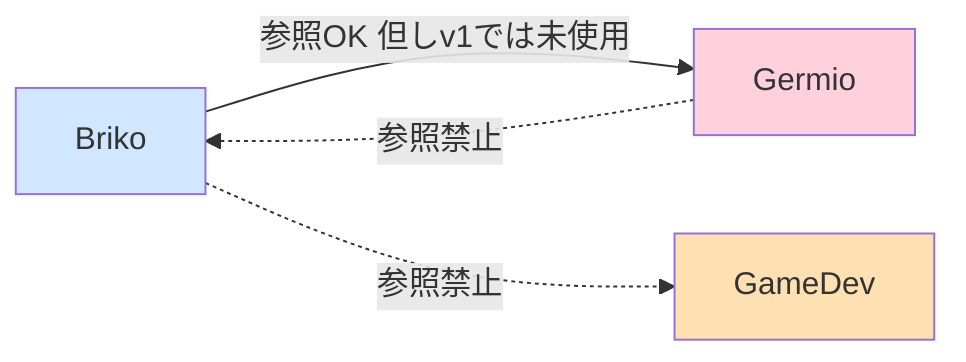
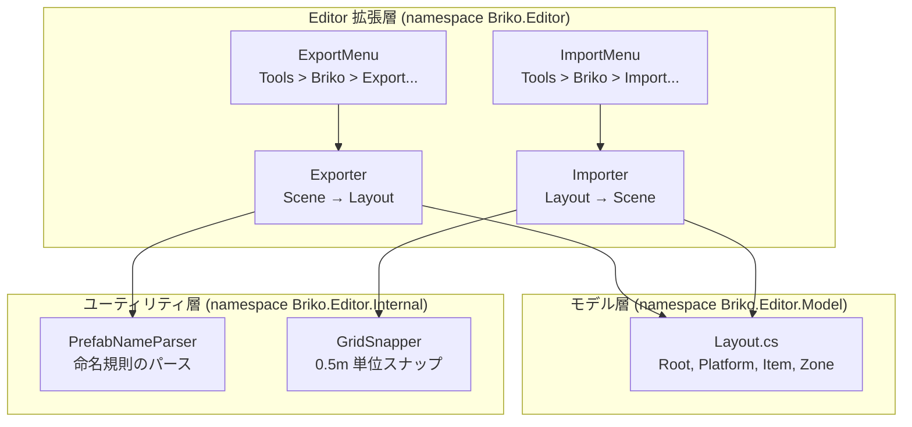
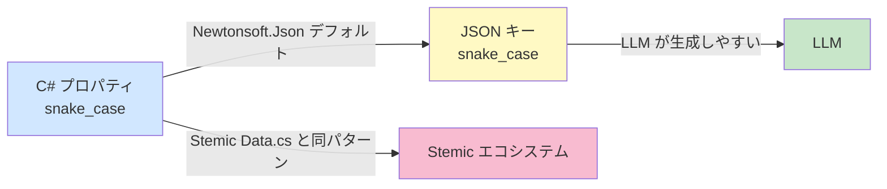

# Briko 開発計画 v1.0 詳細仕様書

> **対象**: GitHub Copilot CLI（Claude Sonnet 4.7）による自律実装
> **作成日**: 2026-04-29
> **対象バージョン**: Briko v1.0
> **依存文書**: `briko_spec.md`（設計仕様）、Stemic 実コード（コーディング規約のソース）

---

## 0. この文書について

### 0.1 目的

本文書は、Briko v1.0 を **GitHub Copilot CLI 上の Claude Sonnet 4.7** が自律的に実装するための、完全に自己完結した作業指示書である。

実装エージェントは本文書だけで以下を判断できる:

+ 何を実装すべきか（What）
+ どの順序で実装すべきか（When）
+ 完成判定の基準は何か（Acceptance Criteria）
+ コーディング規約は何か（How）
+ どのタイミングでコミットすべきか（Commit Policy）

### 0.2 関連文書

| 文書                                             | 役割                           | 必読度 |
| ------------------------------------------------ | ------------------------------ | ------ |
| `briko_spec.md`                                  | 設計の why（なぜそうなるか）   | 必読   |
| 本文書                                           | 実装の what / how / when       | 必読   |
| Stemic 実コード（`game/Assets/Plugins/Germio/`） | コーディング規約の唯一のソース | 必読   |

### 0.3 用語

| 用語                 | 意味                                                    |
| -------------------- | ------------------------------------------------------- |
| **Briko**            | 本パッケージ自身。レベル制作ツール（UPM パッケージ）    |
| **Germio**           | 別パッケージ（git submodule）。シナリオフレームワーク   |
| **Stemic**           | Sprout Quest のコードネーム（同一プロジェクトの別呼称） |
| **UPM**              | Unity Package Manager                                   |
| **実装エージェント** | Copilot CLI 上で本文書を実行する Claude Sonnet 4.7      |
| **ユーザー**         | hiroxpepe（プロジェクトオーナー、最終承認者）           |

### 0.4 重要原則

1. **本文書のスコープを越えない**: v2 以降の項目（後述 §1.3）は実装しない
2. **コミットは勝手に実行しない**: Stemic 規約「Never run `git commit`」を Briko でも適用
3. **既存ファイルを勝手に書き換えない**: §2 で「完了済み」と記された既存ファイルは原則変更禁止（本計画で明示的に指示する変更を除く）
4. **設計判断で迷ったら停止して質問**: 仕様書に明記がなく、本計画にも明記がない場合は、ユーザーに確認

### 0.5 ⚠️ 既存実装のリファクタについて

本リポジトリには **以前のバージョンの dev plan に基づいて Copilot が実装したコード** が既に存在している。本計画は Stemic v2.2 実コード調査を経て規約を厳密化した結果、以下の **リネーム / 再編** を要する:

+ `BrikoExporter.cs` → `Exporter.cs`
+ `BrikoImporter.cs` → `Importer.cs`
+ `BrikoMenuItems.cs` → `ExportMenu.cs` + `ImportMenu.cs` に分割
+ `Editor/Data/Layout*.cs` (4ファイル) → `Editor/Model/Layout.cs` (1ファイル4クラス)
+ 全プロパティを camelCase + `[JsonProperty]` から **snake_case 直接** に変更
+ 名前空間 `MeowToon.Briko.Editor.*` → `Briko.Editor.*`
+ テストファイルを `Tests~/IntegrationTests/Scripts/{Internal,Model}/` 配下に再配置

実装エージェントは **既存コードを本計画の目標状態にリファクタする** ものとし、Task ごとに必要な変更を行う。

---

## 1. v1 のゴールとスコープ

### 1.1 一行で言うと

**Unity シーンと JSON を双方向変換できる UPM パッケージを完成させ、既存 Level 1 から Level 2 を LLM 生成で派生させる土台を作る。**

### 1.2 含まれるもの（v1 のスコープ = `briko_spec.md` §12.1 全6項目）

| #   | 項目                      | 状態            | 担当 Task      |
| --- | ------------------------- | --------------- | -------------- |
| 1   | Briko リポジトリの作成    | ✅ 完了         | -              |
| 2   | `package.json` の最小実装 | ✅ 完了         | -              |
| 3   | Exporter の実装           | ⏳ リファクタ要 | Task 2         |
| 4   | 既存 Level 1 の JSON 化   | ⏳ 未実装       | Task 5（手動） |
| 5   | LLM に Level 2 生成させる | ⏳ 未実装       | Task 6（手動） |
| 6   | Importer の実装           | ⏳ リファクタ要 | Task 3         |

加えて、**テストプロジェクト構築**（`Tests~/IntegrationTests/`）を Task 4 として追加する。

### 1.3 含まれないもの（v2 以降）

実装エージェントは **以下に手を出してはならない**:

+ JSON Schema (`level_layout.schema.json`) の確定（`briko_spec.md` §12.2）
+ Validator の実装（zone_id 整合性チェック等）
+ バリアント自動選択ロジック
+ 音楽イベントとレベル構造の連動（SoundSystem 連携）
+ README の英語・日本語版執筆
+ Org `STUDIO-MeowToon` への移管
+ Sprout Quest 側のシーン編集
+ UI / インスペクタ拡張（v1 はメニューコマンドのみ）
+ Exporter / Importer の Unity 統合テスト（PlayMode/EditMode テスト）— Stemic でも MonoBehaviour 系（CameraSystem, Despawn, Home 等）に NUnit テストはなく、本計画でも踏襲

---

## 2. 既に完了していること

`briko/` リポジトリ直下に以下のファイルが存在し、`master` ブランチに push 済み:

```text
briko/
├── .gitignore
├── README.md
├── package.json
└── Editor/
    └── Briko.Editor.asmdef
```

これらのうち **そのまま残す** のは `.gitignore`, `README.md`, `package.json`（package.json は Task 1 で `dependencies` 追記）。

`Editor/Briko.Editor.asmdef` は **`rootNamespace` のみ修正**（`MeowToon.Briko.Editor` → `Briko.Editor`）。

リポジトリ URL: `https://github.com/hiroxpepe/briko.git`

---

## 3. 前提条件

### 3.1 環境

| 項目                         | 値                |
| ---------------------------- | ----------------- |
| Unity（実装側）              | Unity 6 LTS       |
| Unity（package.json 互換性） | 2022.3 以上       |
| .NET（テストプロジェクト）   | .NET 9            |
| JSON ライブラリ              | Newtonsoft.Json   |
| 名前空間ルート               | `Briko`           |
| 文字コード                   | UTF-8（BOM なし） |
| 改行コード                   | LF                |

### 3.2 Newtonsoft.Json の参照方法

Unity 側からは UPM の **`com.unity.nuget.newtonsoft-json`** に依存させる。

`package.json` の `dependencies` に追記する（Task 1 で実施）:

```jsonc
{
  "dependencies": {
    "com.unity.nuget.newtonsoft-json": "3.2.1"
  }
}
```

テストプロジェクト（.NET 9）側は `Newtonsoft.Json` NuGet パッケージを参照する（Task 4 で `.csproj` に記述）。

### 3.3 検証環境（人間が手動で行う）

実装したパッケージの動作確認は、Stemic プロジェクト側で以下のように file: 参照して行う:

```jsonc
// Stemic/game/Packages/manifest.json
{
  "dependencies": {
    "com.meowtoon.briko": "file:../../../briko"
  }
}
```

**実装エージェントは Stemic 側のファイルを編集しない**。動作確認は Task 5, 6 でユーザーが手動で行う。

### 3.4 依存方向（絶対ルール）



+ **Briko → Germio** の片方向参照は OK（v1 では未使用）
+ **Briko → GameDev**（Stemic 固有コード）は **絶対禁止**
+ **Germio → Briko** は **絶対禁止**（循環参照）

---

## 4. アーキテクチャ

### 4.1 コンポーネント図



### 4.2 想定するシーン階層（`briko_spec.md` §4.4）

Briko が走査・生成する Unity シーンの構造:

```text
{LevelRoot}                ← シーンルート（任意の名前）
├── System                 ← Briko は読み書きしない
├── Platform               ← Briko の主対象
│   ├── grounds_1f         ← floor 1 の Ground プレハブ群
│   ├── grounds_2f         ← floor 2 の Ground プレハブ群（無くても OK）
│   ├── blocks_plain       ← Block プレハブ群（v1 では Y 座標で floor を推定）
│   └── blocks_basic       ← 同上
└── Entity                 ← Briko は zone_id 付き空 GameObject のみ読み書き
    └── (zone_id を名前に持つ空 GameObject)
```

### 4.3 v1 における簡略化判断

| 論点                     | v1 の判断                                                                               | 根拠                                                                      |
| ------------------------ | --------------------------------------------------------------------------------------- | ------------------------------------------------------------------------- |
| `blocks_*` の floor 判定 | Y 座標で推定（`y < 3.0` なら "1f"、それ以上は "2f"）                                    | hierarchy 内の `blocks_plain` と `blocks_basic` には floor 情報が無いため |
| `zones[]` の検出方法     | `Entity` GameObject 配下の、名前が正規表現 `^vol_[a-z0-9_]+$` にマッチする空 GameObject | `briko_spec.md` §3.2 シーケンス図の `vol_boss_start` 等の命名から推定     |
| 既存シーンの自動修正     | しない                                                                                  | Exporter は読み取り専用                                                   |
| マテリアル / スケール    | 一切変更しない                                                                          | `briko_spec.md` §7.3                                                      |

---

## 5. パッケージ構造（v1 完成形）

```text
briko/
├── .gitignore                                          ✅ 既存
├── README.md                                           ✅ 既存
├── package.json                                        ✅ 既存（Task 1 で dependencies 追記）
├── Editor/
│   ├── Briko.Editor.asmdef                             ✅ 既存（Task 1 で rootNamespace 修正）
│   ├── Exporter.cs                                     ⏳ Task 2 (旧 BrikoExporter.cs をリネーム)
│   ├── Importer.cs                                     ⏳ Task 3 (旧 BrikoImporter.cs をリネーム)
│   ├── ExportMenu.cs                                   ⏳ Task 2 (旧 BrikoMenuItems.cs から分離)
│   ├── ImportMenu.cs                                   ⏳ Task 3 (旧 BrikoMenuItems.cs から分離)
│   ├── Internal/
│   │   ├── PrefabNameParser.cs                         ⏳ Task 2 (既存・名前空間のみ修正)
│   │   └── GridSnapper.cs                              ⏳ Task 3 (既存・名前空間のみ修正)
│   └── Model/
│       └── Layout.cs                                   ⏳ Task 1 (旧 Data/Layout*.cs 4ファイルを統合)
├── Tests~/
│   └── IntegrationTests/
│       ├── IntegrationTests.csproj                     ⏳ Task 4 (リファクタ)
│       ├── Fixtures/
│       │   └── sample_level_minimal.json               ⏳ Task 4 (既存・JSONはそのまま)
│       └── Scripts/
│           ├── Internal/
│           │   ├── PrefabNameParserTests.cs            ⏳ Task 4 (移動)
│           │   └── GridSnapperTests.cs                 ⏳ Task 4 (移動)
│           └── Model/
│               ├── LayoutTests.cs                      ⏳ Task 4 (旧 DataModelTests.cs をリネーム)
│               └── RoundTripTests.cs                   ⏳ Task 4 (移動)
├── docs/
│   ├── briko_spec.md                                   ⏳ ユーザーが配置
│   └── development_plan_v1_detail_JP.md                ⏳ 本ファイル
└── artifacts/                                          ⏳ Task 5, 6 の成果物
    ├── level_01_export.json
    └── level_02_generated.json
```

**重要**: `Tests~/` の末尾チルダ `~` は UPM の慣習で、Unity が当該ディレクトリを無視することを意味する。.NET ツールチェーンからは通常通り見える。これにより Unity アセンブリにテストコードが混入しない。

### 5.1 旧構造との対比（リファクタ作業のため）

| 旧（既存）パス                                             | 新パス                                                              |
| ---------------------------------------------------------- | ------------------------------------------------------------------- |
| `Editor/BrikoExporter.cs`                                  | `Editor/Exporter.cs`                                                |
| `Editor/BrikoImporter.cs`                                  | `Editor/Importer.cs`                                                |
| `Editor/BrikoMenuItems.cs`                                 | `Editor/ExportMenu.cs` + `Editor/ImportMenu.cs`                     |
| `Editor/Data/LayoutRoot.cs`                                | （`Editor/Model/Layout.cs` に統合・削除）                           |
| `Editor/Data/LayoutPlatform.cs`                            | （同上）                                                            |
| `Editor/Data/LayoutItem.cs`                                | （同上）                                                            |
| `Editor/Data/LayoutZone.cs`                                | （同上）                                                            |
| `Editor/Internal/PrefabNameParser.cs`                      | 同じパス（namespace のみ変更）                                      |
| `Editor/Internal/GridSnapper.cs`                           | 同じパス（namespace のみ変更）                                      |
| `Tests~/IntegrationTests/Scripts/DataModelTests.cs`        | `Tests~/IntegrationTests/Scripts/Model/LayoutTests.cs`              |
| `Tests~/IntegrationTests/Scripts/RoundTripTests.cs`        | `Tests~/IntegrationTests/Scripts/Model/RoundTripTests.cs`           |
| `Tests~/IntegrationTests/Scripts/PrefabNameParserTests.cs` | `Tests~/IntegrationTests/Scripts/Internal/PrefabNameParserTests.cs` |
| `Tests~/IntegrationTests/Scripts/GridSnapperTests.cs`      | `Tests~/IntegrationTests/Scripts/Internal/GridSnapperTests.cs`      |

---

## 6. データモデル定義

### 6.1 設計方針（Stemic 実コード準拠）

Stemic の `Plugins/Germio/Scripts/Model/Data.cs` の慣習に厳密に従う:

1. **1ファイルに複数クラスを詰める** — Stemic の `Data.cs` には `CounterOp / Scenario / State / World / Level / Next / Rule / Command...` が同居している
2. **クラス名は単語1個** — Stemic の `Scenario`, `State`, `World`, `Level`, `Next`, `Rule` 等。`DataRoot` のような重複プレフィックスはない
3. **公開プロパティは snake_case** — Stemic の `current_scene`, `current_team`, `fired_rules`, `schema_version` 等
4. **`[JsonProperty]` 属性は使わない** — プロパティ名がそのまま JSON キーになる
5. **`#nullable enable` は各クラスの先頭で宣言**

### 6.2 JSON とクラスのマッピング表

`briko_spec.md` §7.2 のサンプル JSON を C# クラスに対応させる:

| JSON キー / プロパティ名 | 型               | 所属クラス     | 備考                         |
| ------------------------ | ---------------- | -------------- | ---------------------------- |
| `layout_id`              | `string`         | `Root`         | レベル識別子                 |
| `grid_unit`              | `float`          | `Root`         | 0.5 固定（v1）               |
| `target_duration_sec`    | `int`            | `Root`         | 180 固定（v1）               |
| `bgm_track`              | `string`         | `Root`         | 空文字許容                   |
| `platforms`              | `List<Platform>` | `Root`         | 1 件以上                     |
| `floor`                  | `string`         | `Platform`     | "1f" / "2f"                  |
| `grounds`                | `List<Item>`     | `Platform`     | 0 件以上                     |
| `blocks`                 | `List<Item>`     | `Platform`     | 0 件以上                     |
| `zones`                  | `List<Zone>`     | `Platform`     | 0 件以上                     |
| `prefab`                 | `string`         | `Item`         | バリアント番号を**含まない** |
| `variant`                | `int`            | `Item`         | 1 以上                       |
| `position`               | `float[]`        | `Item`, `Zone` | 長さ 3、grid_unit の整数倍   |
| `rotation_y`             | `int`            | `Item`         | 0/90/180/270、省略時 0       |
| `zone_id`                | `string`         | `Zone`         | `^vol_[a-z0-9_]+$`           |

### 6.3 `Editor/Model/Layout.cs` の完全スケルトン

このファイルがそのまま実装対象。**4クラスを1ファイルに収める**:

```csharp
// Copyright (c) STUDIO MeowToon. All rights reserved.
// Licensed under GPL v2.0. See LICENSE in the project root for license information.

using System.Collections.Generic;

namespace Briko.Editor.Model {

    /// <summary>
    /// Root container for a serialized level layout.
    /// Maps to level_layout.json (briko_spec.md §7.2).
    /// </summary>
    /// <author>h.adachi (STUDIO MeowToon)</author>
    public class Root {
#nullable enable
        /// <summary>Level identifier, used as scene name on import.</summary>
        public string layout_id { get; set; } = "";

        /// <summary>Grid quantization unit in meters. Fixed at 0.5 for v1.</summary>
        public float grid_unit { get; set; } = 0.5f;

        /// <summary>Target play duration. Fixed at 180 (Beatles single rule) for v1.</summary>
        public int target_duration_sec { get; set; } = 180;

        /// <summary>BGM track filename (placed under StreamingAssets/).</summary>
        public string bgm_track { get; set; } = "";

        /// <summary>Per-floor layout layers.</summary>
        public List<Platform> platforms { get; set; } = new();
    }

    /// <summary>
    /// Per-floor layer holding ground tiles, block obstacles, and trigger zones.
    /// </summary>
    /// <author>h.adachi (STUDIO MeowToon)</author>
    public class Platform {
#nullable enable
        /// <summary>Floor identifier ("1f", "2f", ...).</summary>
        public string floor { get; set; } = "";

        /// <summary>Ground tiles forming the walkable surface.</summary>
        public List<Item> grounds { get; set; } = new();

        /// <summary>Block obstacles on top of grounds.</summary>
        public List<Item> blocks { get; set; } = new();

        /// <summary>Trigger zones (volumetric markers) for Germio integration.</summary>
        public List<Zone> zones { get; set; } = new();
    }

    /// <summary>
    /// Single prefab placement (ground tile or block obstacle).
    /// </summary>
    /// <author>h.adachi (STUDIO MeowToon)</author>
    public class Item {
#nullable enable
        /// <summary>Prefab name without trailing variant number (e.g. "Ground_10.0x0.5x10.0_Green").</summary>
        public string prefab { get; set; } = "";

        /// <summary>Variant number (1-based). Combined with prefab on import: "{prefab}_{variant}".</summary>
        public int variant { get; set; } = 1;

        /// <summary>World position in meters [x, y, z]. All values multiples of grid_unit.</summary>
        public float[] position { get; set; } = new float[3];

        /// <summary>Y-axis rotation in degrees (0/90/180/270). Defaults to 0.</summary>
        public int rotation_y { get; set; } = 0;
    }

    /// <summary>
    /// Trigger zone marker. The zone_id string is the contract with Germio.
    /// </summary>
    /// <author>h.adachi (STUDIO MeowToon)</author>
    public class Zone {
#nullable enable
        /// <summary>Zone identifier matching Germio's germio_config.json (e.g. "vol_boss_start").</summary>
        public string zone_id { get; set; } = "";

        /// <summary>World position in meters [x, y, z].</summary>
        public float[] position { get; set; } = new float[3];
    }
}
```

### 6.4 シリアライズ設定

Newtonsoft.Json の `JsonSerializerSettings` は以下を共通とする（`ExportMenu.cs` 内に配置）:

```csharp
new JsonSerializerSettings {
    Formatting = Formatting.Indented,
    NullValueHandling = NullValueHandling.Ignore,
    DefaultValueHandling = DefaultValueHandling.IgnoreAndPopulate,
};
```

これにより:

+ 整形済み JSON（人間が読める）
+ 既定値（例: `rotation_y: 0`）は出力されない（JSON が肥大化しない）
+ LLM が読みやすい形式

---

## 7. タスク一覧（順序付き）

各タスクには **受入基準** と **コミットメッセージ案** を記載する。**ユーザーの承認を得てから** コミットを実行すること。

### Task 1: パッケージ依存追加とデータモデル実装

#### 7.1.1 作業内容

1. `package.json` に `dependencies` セクションを追加（既存フィールドは変更しない）:

   ```jsonc
   {
     "name": "com.meowtoon.briko",
     "version": "0.1.0",
     // ... 既存フィールド ...
     "dependencies": {
       "com.unity.nuget.newtonsoft-json": "3.2.1"
     }
   }
   ```

2. `Editor/Briko.Editor.asmdef` の修正:
   + `rootNamespace` を `MeowToon.Briko.Editor` から **`Briko.Editor`** に変更
   + `references` に `Newtonsoft.Json` を追加

   ```jsonc
   {
     "name": "Briko.Editor",
     "rootNamespace": "Briko.Editor",
     "references": [
       "Newtonsoft.Json"
     ],
     "includePlatforms": ["Editor"],
     "excludePlatforms": [],
     "allowUnsafeCode": false,
     "overrideReferences": false,
     "precompiledReferences": [],
     "autoReferenced": true,
     "defineConstraints": [],
     "versionDefines": [],
     "noEngineReferences": false
   }
   ```

3. `Editor/Model/` フォルダを作成し、§6.3 のスケルトンに従って `Editor/Model/Layout.cs` を実装

4. **既存ファイルの削除**:
   + `Editor/Data/LayoutRoot.cs`
   + `Editor/Data/LayoutPlatform.cs`
   + `Editor/Data/LayoutItem.cs`
   + `Editor/Data/LayoutZone.cs`
   + `Editor/Data/` フォルダ自体（空になったら）

#### 7.1.2 受入基準

+ [ ] `Editor/Model/Layout.cs` が §6.3 のスケルトンに完全一致して実装されている
+ [ ] `Root`, `Platform`, `Item`, `Zone` の4クラスが**全て同じファイル**に格納されている
+ [ ] 全プロパティが **snake_case** で `[JsonProperty]` 属性を持たない
+ [ ] 全クラスが `Briko.Editor.Model` 名前空間に属している
+ [ ] 全クラスが §9 のコーディング規約に従っている（著作権ヘッダ、`#nullable enable`、`/// <author>` XMLドキュメント）
+ [ ] `Editor/Data/` フォルダおよびその中の旧4ファイルが削除されている
+ [ ] asmdef の `rootNamespace` が `Briko.Editor` に修正されている
+ [ ] Unity プロジェクトで file: 参照したとき、コンパイルエラーが出ない（ユーザーが手動確認）

#### 7.1.3 コミットメッセージ案

```text
refactor: consolidate layout data model into single file

- Merge LayoutRoot/LayoutPlatform/LayoutItem/LayoutZone into Editor/Model/Layout.cs
- Rename classes to Root/Platform/Item/Zone (Stemic Data.cs convention)
- Switch properties from camelCase + [JsonProperty] to snake_case direct
- Move namespace from MeowToon.Briko.Editor.Data to Briko.Editor.Model
- Fix asmdef rootNamespace to Briko.Editor
- Wire Newtonsoft.Json via UPM dependency
```

---

### Task 2: Exporter と ExportMenu の実装

#### 7.2.1 作業内容

1. `Editor/Internal/PrefabNameParser.cs` の **namespace のみ変更**（既存実装を流用）:
   + 旧: 不問（実コード調査）
   + 新: `namespace Briko.Editor.Internal { ... }`

   実装内容:

   + 入力: `Ground_10.0x0.5x10.0_Green_1` のような GameObject 名（`(Clone)` 接尾辞は除去済み）
   + 出力: `(prefab: "Ground_10.0x0.5x10.0_Green", variant: 1)`
   + 正規表現: `^(Ground|Block)_([\d.]+x[\d.]+x[\d.]+)_(.+)_(\d+)$`
   + マッチしない場合は `null` を返す

2. `Editor/Exporter.cs` を実装（旧 `BrikoExporter.cs` のロジックを流用しつつ全面改名）:
   + クラス名: `Exporter`（旧 `BrikoExporter`）
   + 名前空間: `Briko.Editor`
   + `using Briko.Editor.Model;` で `Root`, `Platform`, `Item`, `Zone` を参照
   + `using Briko.Editor.Internal;` で `PrefabNameParser`, `GridSnapper` を参照
   + 公開 API: `public static Root ExportFromActiveScene()`
   + 内部処理は旧実装と同じ（`Platform` GameObject 走査 → grounds/blocks 収集 → `Entity` 走査 → zones 収集）

   **プロパティアクセスの注意**: 新モデルは snake_case なので、`layout.layoutId` ではなく `layout.layout_id`、`item.rotationY` ではなく `item.rotation_y` を使う。

3. `Editor/ExportMenu.cs` を実装（旧 `BrikoMenuItems.cs` から Export 部分のみを抽出）:
   + クラス名: `ExportMenu`
   + 名前空間: `Briko.Editor`
   + メニュー: `Tools/Briko/Export Active Scene to JSON...`
   + クリック時の動作:
     1. `EditorUtility.SaveFilePanel` で保存先を選択（拡張子 `.json`、初期ファイル名 `level_layout.json`）
     2. キャンセルされたら何もしない
     3. `Exporter.ExportFromActiveScene()` を呼ぶ
     4. `JsonConvert.SerializeObject` で文字列化（§6.4 の設定使用）
     5. `File.WriteAllText` で UTF-8 書き込み
     6. 成功時は `EditorUtility.DisplayDialog` で結果を通知（grounds N, blocks M, zones K）

#### 7.2.2 アルゴリズム詳細: 位置の正規化

エクスポート時、`Transform.position` は以下のように JSON の `position` に変換する:

1. `grid_unit = 0.5f`
2. `snapped_x = Mathf.Round(transform.position.x / grid_unit) * grid_unit`
3. `snapped_y, snapped_z` も同様
4. JSON には `[snapped_x, snapped_y, snapped_z]` を `float` の配列として書く
5. 元の値と `snapped_*` の差が `0.01f` を超えた場合、**警告を Console に出す**（エクスポートは続行）

**根拠**: 浮動小数点誤差を許容しつつ、シーンが大きく規格から外れている場合は人間に気づかせるため。

#### 7.2.3 アルゴリズム詳細: rotation_y の正規化

1. `Transform.rotation.eulerAngles.y` を取得
2. `0/90/180/270` のうち最も近い値に丸める
3. 元の値との差が `1.0f` を超えた場合、警告を Console に出す
4. JSON には丸めた値を書く（`0` の場合は `DefaultValueHandling.IgnoreAndPopulate` により省略される）

#### 7.2.4 受入基準

+ [ ] `Exporter.ExportFromActiveScene()` が `Briko.Editor.Model.Root` を返す
+ [ ] メニュー `Tools/Briko/Export Active Scene to JSON...` が動作する（手動確認）
+ [ ] 規格外の position（grid_unit の倍数でない）には Console 警告が出る
+ [ ] 規格外の rotation_y には Console 警告が出る
+ [ ] §9 のコーディング規約に準拠
+ [ ] Project-defined メソッド呼び出しは全て **named parameter**（Unity API/.NET BCL/Newtonsoft.Json は除外）
+ [ ] 旧 `Editor/BrikoExporter.cs` および旧 `Editor/BrikoMenuItems.cs` の **Export 部分が削除されている**

#### 7.2.5 コミットメッセージ案

```text
refactor: rename BrikoExporter to Exporter and split menu

- Editor/Exporter.cs (was BrikoExporter.cs)
- Editor/ExportMenu.cs (split from BrikoMenuItems.cs)
- Update all property accesses to snake_case
- Move namespace to Briko.Editor (drop MeowToon prefix)
- PrefabNameParser namespace updated to Briko.Editor.Internal
```

---

### Task 3: Importer と ImportMenu の実装

#### 7.3.1 作業内容

1. `Editor/Internal/GridSnapper.cs` の **namespace のみ変更**（既存実装を流用）:
   + 新: `namespace Briko.Editor.Internal { ... }`

   実装内容:

   + `public static float[] Snap(float[] raw, float grid_unit)` — 各成分を `Math.Round(value / grid_unit) * grid_unit` で丸める

2. `Editor/Importer.cs` を実装（旧 `BrikoImporter.cs` のロジックを流用しつつ全面改名）:
   + クラス名: `Importer`（旧 `BrikoImporter`）
   + 名前空間: `Briko.Editor`
   + `using Briko.Editor.Model;` で `Root`, `Platform`, `Item`, `Zone` を参照
   + `using Briko.Editor.Internal;` で `GridSnapper` を参照
   + 公開 API: `public static void ImportToNewScene(Root layout, string scene_path)`
   + 内部処理は旧実装と同じ（新規シーン作成 → Level/System/Platform/Entity 階層生成 → プレハブ配置 → ゾーン配置 → シーン保存）
   + **重要**: 旧実装にない `AssetDatabase.Refresh()` を `EditorSceneManager.SaveScene` の直後に追加

   **プロパティアクセスの注意**: 新モデルは snake_case なので、`platform.floor` はそのままだが、`item.rotationY` ではなく `item.rotation_y`、`layout.layoutId` ではなく `layout.layout_id` を使う。

3. `Editor/ImportMenu.cs` を実装（旧 `BrikoMenuItems.cs` から Import 部分のみを抽出）:
   + クラス名: `ImportMenu`
   + 名前空間: `Briko.Editor`
   + メニュー: `Tools/Briko/Import JSON to New Scene...`
   + クリック時の動作:
     1. `EditorUtility.OpenFilePanel` で読み込む JSON を選択
     2. キャンセルなら何もしない
     3. `JsonConvert.DeserializeObject<Root>` で復元
     4. `EditorUtility.SaveFilePanel` で保存先 `.unity` パスを取得
     5. 絶対パス → プロジェクトルートからの相対パスに変換
     6. `Importer.ImportToNewScene(layout: layout, scene_path: relative_path)` を実行
     7. 成功時は DisplayDialog で通知

#### 7.3.2 プレハブ検索のフォールバック

`AssetDatabase.FindAssets` でプレハブが見つからない場合の挙動:

1. プレハブ名で完全一致検索
2. ヒットがなければ Console 警告:

   ```text
   [Briko] Prefab not found: Ground_10.0x0.5x10.0_Green_1 (skipped)
   ```

3. その GameObject の生成はスキップ（処理は続行）

**根拠**: Stemic 側に対応プレハブが無い場合でも、Importer がクラッシュしないように。

#### 7.3.3 受入基準

+ [ ] `Importer.ImportToNewScene()` が新規シーンを生成する
+ [ ] メニュー `Tools/Briko/Import JSON to New Scene...` が動作する（手動確認）
+ [ ] 全 position / rotation_y がグリッドにスナップされる
+ [ ] プレハブが見つからない場合、警告を出してスキップする（クラッシュしない）
+ [ ] **`EditorSceneManager.SaveScene` の直後に `AssetDatabase.Refresh()` が呼ばれる**（旧実装の不具合修正）
+ [ ] `briko_spec.md` §7.2 のサンプル JSON をそのまま入力にして動作する（プレハブが揃っている場合）
+ [ ] §9 のコーディング規約に準拠
+ [ ] 旧 `Editor/BrikoImporter.cs` および旧 `Editor/BrikoMenuItems.cs` が完全に削除されている

#### 7.3.4 コミットメッセージ案

```text
refactor: rename BrikoImporter to Importer and split menu

- Editor/Importer.cs (was BrikoImporter.cs)
- Editor/ImportMenu.cs (split from BrikoMenuItems.cs)
- Add AssetDatabase.Refresh() after SaveScene (fixes Project view delay)
- Update all property accesses to snake_case
- Move namespace to Briko.Editor
- GridSnapper namespace updated to Briko.Editor.Internal
- BrikoMenuItems.cs deleted (split complete)
```

---

### Task 4: テストプロジェクト再編

#### 7.4.1 作業内容

1. `Tests~/IntegrationTests/IntegrationTests.csproj` を更新（Stemic の構成を参考）:

   ```xml
   <Project Sdk="Microsoft.NET.Sdk">
     <PropertyGroup>
       <TargetFramework>net9.0</TargetFramework>
       <LangVersion>latest</LangVersion>
       <Nullable>enable</Nullable>
       <IsPackable>false</IsPackable>
       <EnableDefaultItems>false</EnableDefaultItems>
       <RootNamespace>Briko.Tests</RootNamespace>
     </PropertyGroup>

     <ItemGroup>
       <PackageReference Include="Microsoft.NET.Test.Sdk" Version="17.11.1" />
       <PackageReference Include="NUnit" Version="4.2.2" />
       <PackageReference Include="NUnit3TestAdapter" Version="4.6.0" />
       <PackageReference Include="Newtonsoft.Json" Version="13.0.3" />
     </ItemGroup>

     <ItemGroup>
       <!-- Briko Layout model (shared source compilation) -->
       <Compile Include="..\..\Editor\Model\Layout.cs" />
       <Compile Include="..\..\Editor\Internal\PrefabNameParser.cs" />
       <Compile Include="..\..\Editor\Internal\GridSnapper.cs" />

       <!-- Test code -->
       <Compile Include="Scripts\Internal\PrefabNameParserTests.cs" />
       <Compile Include="Scripts\Internal\GridSnapperTests.cs" />
       <Compile Include="Scripts\Model\LayoutTests.cs" />
       <Compile Include="Scripts\Model\RoundTripTests.cs" />
     </ItemGroup>

     <ItemGroup>
       <None Update="Fixtures\sample_level_minimal.json">
         <CopyToOutputDirectory>PreserveNewest</CopyToOutputDirectory>
       </None>
     </ItemGroup>
   </Project>
   ```

   **重要**:

   + `EnableDefaultItems=false` のため新規 .cs は必ず `<Compile Include>` で明示
   + 旧 `<Compile Include="..\..\Editor\Data\LayoutRoot.cs" />` 等の **4行は削除**
   + 新たに `<Compile Include="..\..\Editor\Model\Layout.cs" />` を追加

2. **テストファイルの再配置**（Stemic の `Plugins/Germio/Scripts/Model/Data.cs` ↔ `tests/IntegrationTests/Scripts/Model/DataModelTests.cs` 対応に準拠）:

   ```text
   旧 Tests~/IntegrationTests/Scripts/DataModelTests.cs
   → 新 Tests~/IntegrationTests/Scripts/Model/LayoutTests.cs

   旧 Tests~/IntegrationTests/Scripts/RoundTripTests.cs
   → 新 Tests~/IntegrationTests/Scripts/Model/RoundTripTests.cs

   旧 Tests~/IntegrationTests/Scripts/PrefabNameParserTests.cs
   → 新 Tests~/IntegrationTests/Scripts/Internal/PrefabNameParserTests.cs

   旧 Tests~/IntegrationTests/Scripts/GridSnapperTests.cs
   → 新 Tests~/IntegrationTests/Scripts/Internal/GridSnapperTests.cs
   ```

3. **`LayoutTests.cs` の実装**（旧 `DataModelTests.cs` をベースに、新モデルに合わせて更新）:
   + 名前空間: `Briko.Tests.Model`
   + クラス名: `LayoutTests`
   + 旧モデル `LayoutRoot/LayoutPlatform/LayoutItem/LayoutZone` への参照を `Root/Platform/Item/Zone` に置換
   + プロパティ参照を `layoutId` → `layout_id` 等に置換
   + テストメソッド命名: Stemic 慣習 `<TestedClass>_<Feature>_<ExpectedBehavior>`（例: `Root_LayoutId_DefaultsToEmpty`, `Item_RotationY_DefaultsToZero`）

4. **`RoundTripTests.cs` の実装**（旧版をベースに更新）:
   + 名前空間: `Briko.Tests.Model`
   + `JsonConvert.DeserializeObject<Root>` で復元
   + `JToken.DeepEquals` でラウンドトリップ等価性を検証

5. **`PrefabNameParserTests.cs` / `GridSnapperTests.cs`**:
   + 名前空間を `Briko.Tests.Internal` に変更
   + その他のロジックは既存をそのまま流用

#### 7.4.2 テスト命名規約（Stemic 準拠）

Stemic の `DataModelTests.cs` は以下の形式:

```csharp
[Test, Description("State has a counters dictionary of float values")]
public void State_HasCountersDictionary() { ... }

[Test, Description("Rule.once defaults to true (fire-once by default)")]
public void Rule_Once_DefaultsToTrue() { ... }
```

**形式**: `<TestedClass>_<MethodOrFeature>_<ExpectedBehavior>`、`[Description]` 属性で英文補足。

旧 dev plan の `Test_<Method>_<Scenario>_<ExpectedResult>` 形式は **誤り**。Stemic 形式に合わせる。

#### 7.4.3 テスト実行コマンド

```sh
dotnet test briko/Tests~/IntegrationTests/IntegrationTests.csproj
```

単一テスト実行:

```sh
dotnet test briko/Tests~/IntegrationTests/IntegrationTests.csproj --filter "FullyQualifiedName~LayoutTests"
```

#### 7.4.4 受入基準

+ [ ] `dotnet test` で全テストが通る
+ [ ] テスト件数が最低 12 件以上（各テストファイルで3件以上）
+ [ ] `EnableDefaultItems=false` 設定が守られている（新規 .cs は `<Compile>` で明示）
+ [ ] テストファイルが `Internal/` および `Model/` サブフォルダに整理されている
+ [ ] テストの名前空間が `Briko.Tests.Internal` または `Briko.Tests.Model` のいずれか
+ [ ] テストメソッド名が Stemic 慣習（`<Class>_<Feature>_<Behavior>`）に従う
+ [ ] 旧 `DataModelTests.cs` がフラットな位置に残っていない（必ず `Model/LayoutTests.cs` に移動済み）

#### 7.4.5 コミットメッセージ案

```text
refactor: reorganize tests into Internal/Model subfolders

- Tests~/.../Scripts/Internal/{PrefabNameParser,GridSnapper}Tests.cs
- Tests~/.../Scripts/Model/{Layout,RoundTrip}Tests.cs
- Rename DataModelTests to LayoutTests (matches Layout.cs)
- Update namespaces to Briko.Tests.{Internal,Model}
- Update <Compile Include> paths in csproj
- Adopt Stemic test method naming: Class_Feature_Behavior
```

---

### Task 5: 既存 Level 1 の JSON 化（手動実行）

**この Task はユーザーが手動で実行する**。実装エージェントは指示書を残すだけ。

#### 7.5.1 手順

1. Stemic プロジェクトの `game/Packages/manifest.json` に Briko を追加:

   ```jsonc
   {
     "dependencies": {
       "com.meowtoon.briko": "file:../../../briko"
     }
   }
   ```

2. Stemic を Unity Editor で開く

3. Level 1 のシーンを開く

4. メニュー `Tools/Briko/Export Active Scene to JSON...` を実行

5. 保存先: `briko/artifacts/level_01_export.json`

6. Console に出た警告（grid_snap 違反等）をメモ

#### 7.5.2 受入基準

+ [ ] `artifacts/level_01_export.json` が生成された
+ [ ] grounds, blocks, zones のいずれかが 0 件でない（実際のレベルが空でない限り）
+ [ ] Console に致命的エラーが出ていない（警告は許容）

#### 7.5.3 想定される問題と対処

| 症状                                 | 想定原因                                                 | 対処                                                                                      |
| ------------------------------------ | -------------------------------------------------------- | ----------------------------------------------------------------------------------------- |
| `Platform` GameObject が見つからない | シーンの GameObject 階層が想定と異なる                   | `briko_spec.md` §4.4 と実シーンを比較。差分があれば本計画に追記してエージェントに修正依頼 |
| プレハブ名が正規表現にマッチしない   | 命名規則が §4.3 と違う                                   | 実物を観察。エージェントに正規表現の調整を依頼                                            |
| zone が 0 件                         | `vol_*` 命名が使われていない、または `Entity` 階層が違う | 実物を観察。検出ロジックを調整                                                            |

これらの問題が発生した場合、**v1 の範囲内で正規表現とロジックの調整は許容される**。

---

### Task 6: LLM 生成検証（手動実行）

**この Task もユーザーが手動で実行する**。

#### 7.6.1 手順

1. `artifacts/level_01_export.json` を Claude もしくは ChatGPT に提示

2. プロンプト例:

   > 添付の JSON は Unity ゲームのレベル 1 のレイアウトです。
   > これを参考に、難易度を少し上げた Level 2 のレイアウトを生成してください。
   > 制約:
   > + JSON 構造は完全に同じ
   > + position は grid_unit (0.5) の整数倍のみ
   > + rotation_y は 0/90/180/270 のみ
   > + プレハブ名と variant 番号の組み合わせは Level 1 で使われているものに限定
   > + プレハブ数は ±20% の範囲で増減可
   > + zones の zone_id は変更しない（Germio 側の `germio_config.json` と同期するため）

3. 生成された JSON を `briko/artifacts/level_02_generated.json` として保存

4. Stemic で Unity Editor を開き、メニュー `Tools/Briko/Import JSON to New Scene...` を実行

5. 入力: `level_02_generated.json`、出力先: `Stemic/game/Assets/Scenes/Level_02_Generated.unity` 等

6. シーンを開いて目視確認

#### 7.6.2 受入基準

+ [ ] `level_02_generated.json` が生成された
+ [ ] それを Importer で Unity シーンに変換できた
+ [ ] 生成されたシーンが Unity Editor 上で破綻なく表示される

#### 7.6.3 v1 の合格判定

**Level 2 の品質は問わない**。LLM による初回生成の品質が低くても、以下が達成できていれば v1 は合格:

+ Briko のラウンドトリップが動く
+ 既存資産から JSON を抽出できる
+ LLM が読める JSON を渡せる
+ LLM の出力を Unity シーンに戻せる

品質改善は v2 以降のプロンプトエンジニアリングおよび Validator 実装の領域。

---

## 8. v1 完成判定基準（最終チェックリスト）

```text
[ ] Task 1 完了（Layout.cs 統合、snake_case 化、namespace 修正、Data/ 削除）
[ ] Task 2 完了（Exporter.cs + ExportMenu.cs、旧 BrikoExporter 削除）
[ ] Task 3 完了（Importer.cs + ImportMenu.cs、AssetDatabase.Refresh 追加、旧 BrikoImporter / BrikoMenuItems 削除）
[ ] Task 4 完了（テスト再編、全テスト pass）
[ ] Task 5 完了（artifacts/level_01_export.json 生成、ユーザー手動）
[ ] Task 6 完了（artifacts/level_02_generated.json 生成 → Import 動作、ユーザー手動）
[ ] dotnet test で 12 件以上のテストが pass
[ ] Stemic で file: 参照したときコンパイルエラーがない
[ ] briko リポジトリの master ブランチに全コミットが push 済み
```

すべてチェックが付けば、Briko v1.0 完成。

---

## 9. コーディング規約（Stemic 実コード準拠）

本節は Stemic v2.2 の実装コード（`game/Assets/Plugins/Germio/Scripts/`）から抽出した規約。**Copilot Instructions の文言ではなく実コードが正**である。

### 9.1 命名規則

| 対象                              | 規則                            | 例（Stemic 実物）                                                                                        |
| --------------------------------- | ------------------------------- | -------------------------------------------------------------------------------------------------------- |
| クラス名                          | 単一プレフィックスなし、短く    | `Storage`, `Validator`, `Vault`, `Bus`, `Zone`, `Block`, `Despawn`, `Home`, `Dashboard`, `MermaidParser` |
| データクラス                      | 同上、特別扱いなし              | `Scenario`, `State`, `World`, `Level`, `Next`, `Rule`                                                    |
| 私有フィールド                    | `_snake_case`                   | `_do_update`, `_jump_power`                                                                              |
| ローカル変数 / 引数               | `snake_case`                    | `base_path`, `trigger_id`, `level_id`                                                                    |
| 公開プロパティ（**Data クラス**） | `snake_case`（JSON キーと一致） | `current_scene`, `fired_rules`, `schema_version`, `layout_id`, `grid_unit`                               |
| 公開プロパティ（その他）          | `camelCase`                     | `home`, `beat`, `mode`                                                                                   |
| `[SerializeField]`                | `_ALL_CAPS`                     | `_JUMP_POWER`, `_FORWARD_SPEED_LIMIT`                                                                    |
| 定数                              | `ALL_CAPS`                      | `GRID_UNIT_DEFAULT`, `MENU_ROOT`                                                                         |
| 名前空間                          | `<RootProject>.<Layer>`         | `Germio.Core`, `Germio.Model`, `Germio.Editor`, `Briko.Editor.Model`                                     |

**重要**: Briko の Data クラスは `snake_case` プロパティ。`[JsonProperty]` 属性は使わない（Stemic も使っていない）。

### 9.2 ファイルヘッダ

すべての .cs ファイルは以下で始まる:

```csharp
// Copyright (c) STUDIO MeowToon. All rights reserved.
// Licensed under GPL v2.0. See LICENSE in the project root for license information.
```

### 9.3 XML ドキュメント

すべてのクラスとパブリックメソッドに著者表記:

```csharp
/// <summary>
/// 一行で何をするか
/// </summary>
/// <author>h.adachi (STUDIO MeowToon)</author>
public class Foo {
    /// <summary>
    /// 一行で何をするか
    /// </summary>
    /// <author>h.adachi (STUDIO MeowToon)</author>
    public void Bar() { }
}
```

### 9.4 Nullable 注釈

各クラス本体の冒頭に `#nullable enable`（ファイル先頭ではない）:

```csharp
namespace Briko.Editor {
    public class Exporter {
#nullable enable
        // ... 中身 ...
    }
}
```

### 9.5 名前付き引数（最重要）

**プロジェクト定義のメソッド呼び出しは全て named parameter**:

```csharp
// OK
PrefabNameParser.Parse(name: gameObject.name);
GridSnapper.Snap(raw: transform.position, grid_unit: 0.5f);
Importer.ImportToNewScene(layout: layout, scene_path: path);

// NG
PrefabNameParser.Parse(gameObject.name);
GridSnapper.Snap(transform.position, 0.5f);
```

**例外（named parameter 不要）**:

+ .NET BCL: `Math.Round(value)`, `string.IsNullOrEmpty(s)`
+ Unity API: `GameObject.Find("Platform")`, `transform.position`
+ Newtonsoft.Json: `JsonConvert.SerializeObject(obj)`

### 9.6 1ファイル1クラスの例外（Data クラス）

**Stemic は Data 系を1ファイルに集約する**:

+ `Plugins/Germio/Scripts/Model/Data.cs` には `CounterOp / Scenario / State / World / Level / Next / Rule / Command...` が同居
+ Briko も同パターン: `Editor/Model/Layout.cs` に `Root / Platform / Item / Zone` を同居

サービスクラスや Editor 拡張クラスは1ファイル1クラス。

### 9.7 テスト命名と1対1原則

**Stemic の実慣習**:

```text
ソース                        テスト
Storage.cs       ↔  StorageTests.cs        (1対1)
Validator.cs     ↔  ValidatorTests.cs      (1対1)
Bus.cs           ↔  BusTests.cs            (1対1)
MermaidParser.cs ↔  MermaidParserTests.cs  (1対1)
ExprAst.cs       ↔  ExprAstTests.cs        (1対1)
ExprLexer.cs     ↔  ExprLexerTests.cs      (1対1)
ExprParser.cs    ↔  ExprParserTests.cs     (1対1)
Data.cs          ↔  DataModelTests.cs      (1対1、複数クラス内包の Data はまとめて1テスト)
```

**追加テスト**（1対1 を置き換えず、上に積む）:

+ `EvaluatorAdvancedTests.cs`（`EvaluatorTests.cs` に加えて）
+ `StorageEncryptionTests.cs`, `StorageIntegrationTests.cs`
+ `ValidatorLlmFormatTests.cs`
+ `BusClearTests.cs`

**横断テスト**（cross-cutting）:

+ `EdgeCaseTests.cs`, `PersistenceTests.cs`, `CookbookExamplesTests.cs`, `Phase2EdgeCaseTests.cs`

**testless なクラス**（Unity API 依存、NUnit ではテスト不可）:

+ MonoBehaviour 系: `CameraSystem.cs`, `GameSystem.cs`, `SoundSystem.cs`, `Despawn.cs`, `Home.cs`
+ Editor 拡張: `Dashboard.cs`, `McpServerMenu.cs`, `SchemaExportMenu.cs`

**Briko への適用**:

+ `PrefabNameParser.cs` ↔ `PrefabNameParserTests.cs`（1対1）
+ `GridSnapper.cs` ↔ `GridSnapperTests.cs`（1対1）
+ `Layout.cs` ↔ `LayoutTests.cs`（1対1、複数クラス内包の Layout はまとめて1テスト）
+ `RoundTripTests.cs`（cross-cutting、Stemic の `PersistenceTests` 同様）
+ `Exporter.cs` / `Importer.cs` / `ExportMenu.cs` / `ImportMenu.cs` は **testless**（Unity API 依存、PlayMode/EditMode 統合テストは v2）

### 9.8 標準 import

C# ファイルでは以下を使ってよい:

```csharp
using System;
using System.Collections.Generic;
using Newtonsoft.Json;
using UnityEditor;
using UnityEngine;
using Briko.Editor.Model;
using Briko.Editor.Internal;
```

### 9.9 Unity 拡張パターン

v1 では以下のパターンを使用しない（v2 以降の検討項目）:

+ UniRx の `UpdateAsObservable()`
+ 拡張メソッド `Get<T>()`, `Add<T>()`, `Like()`
+ `EvtArgs` / `Changed` デリゲート

理由: v1 は Editor 拡張のみで、ランタイム MonoBehaviour を持たないため。

---

## 10. JSON データ形式

### 10.1 snake_case 直接の根拠

`briko_spec.md` §7.2 が JSON 仕様として snake_case を採用。Stemic の Data クラスも全て snake_case プロパティで `[JsonProperty]` を使わない。



これにより:

+ Stemic の Data クラス慣習を維持
+ `[JsonProperty]` 属性が不要（コードがクリーン）
+ LLM 生成の親和性を確保

### 10.2 シリアライザ設定

§6.4 を参照。`Indented`, `Ignore null`, `Ignore default` の3点が共通設定。

---

## 11. コミットポリシー

### 11.1 絶対ルール

> **`git commit` を実装エージェントが勝手に実行しない**。

これは Stemic 規約「**Never run `git commit`. Commits are only permitted when the user explicitly requests them.**」を Briko にも適用したもの。

### 11.2 コミット粒度

各 Task ごとに 1 コミット。Task 内で複数のファイルを編集しても、最後に1回だけコミットする。

### 11.3 コミットメッセージ規約

Conventional Commits に準拠:

| プレフィックス | 用途                     |
| -------------- | ------------------------ |
| `feat:`        | 新機能                   |
| `fix:`         | バグ修正                 |
| `chore:`       | 設定 / メンテナンス      |
| `docs:`        | ドキュメントのみ         |
| `test:`        | テスト追加 / 修正        |
| `refactor:`    | 機能変更なしのリファクタ |

各 Task の §X.Y.5 のコミットメッセージ案を参考にする。**今回はリファクタ中心なので `refactor:` が多くなる**。

### 11.4 コミット実行のタイミング

実装エージェントは Task 完了時に以下のメッセージを出してユーザーの承認を待つ:

> Task X が完了しました。以下の差分でコミットしますか？
>
> （`git status` の出力を貼る）
>
> 提案メッセージ: `refactor: ...`
>
> 承認いただければ `git add . && git commit -m "..." && git push origin master` を実行します。

ユーザーが「OK」「commit して」等の明示的な承認を返したときのみ、コミットと push を実行する。

---

## 12. 既知の論点と判断

### 12.1 floor 推定の閾値

**論点**: `blocks_*` GameObject 配下の Block プレハブを `1f` と `2f` のどちらに分類するか。

**v1 判断**: Y 座標で推定（`y < 3.0f` なら "1f"、それ以上は "2f"）。閾値 `3.0f` の根拠は `briko_spec.md` §4.2 のグリッド階層で 1F の Ground 厚みが 0.5m、その上に 1m〜2.5m の Block が積めることから、3m を境界としている。

**v2 候補**: シーン階層に `blocks_1f` / `blocks_2f` のグルーピングを導入し、推定を不要にする。

### 12.2 zone 検出の正規表現

**論点**: Entity 配下のどの GameObject が「zone」か。

**v1 判断**: 名前が `^vol_[a-z0-9_]+$` にマッチする空 GameObject。Collider の有無は問わない。

**v2 候補**: 専用コンポーネント `BrikoZoneMarker` を追加し、それが付いた GameObject のみを zone とする。

### 12.3 Newtonsoft.Json のバージョン

**論点**: UPM 版 (`com.unity.nuget.newtonsoft-json`) と NuGet 版 (`Newtonsoft.Json`) のバージョン整合性。

**v1 判断**:

+ Unity 側: `com.unity.nuget.newtonsoft-json@3.2.1`（内部的に Newtonsoft.Json 13.x ベース）
+ .NET 9 テスト側: `Newtonsoft.Json` 13.0.3

メジャーバージョンが揃っているので、シリアライズ結果は一致する想定。

### 12.4 Round-trip の同一性判定

**論点**: Export → Import → Export で得られた2つの JSON が「同じ」とはどう定義するか。

**v1 判断**: Newtonsoft.Json の `JToken.DeepEquals` で判定する（プロパティ順序や空白を無視した意味的等価）。

```csharp
var json_before = JToken.Parse(originalJson);
var json_after = JToken.Parse(reSerializedJson);
Assert.That(JToken.DeepEquals(json_before, json_after), Is.True);
```

### 12.5 名前空間にプロジェクトプレフィックスを付けないこと

**論点**: `MeowToon.Briko.Editor` か `Briko.Editor` か。

**v1 判断**: **`Briko.Editor`**（`MeowToon` を付けない）。Stemic は `Germio.Core`, `Germio.Model` 等を使い、`MeowToon.Germio.*` のような企業プレフィックスは付けていない。Briko も同パターン。

### 12.6 クラス名にプロジェクトプレフィックスを付けないこと

**論点**: `BrikoExporter` か `Exporter` か。

**v1 判断**: **`Exporter`**（`Briko` を付けない）。Stemic は `Storage`, `Validator`, `Bus`, `Zone` 等の単語1個クラス名を使い、`GermioStorage` のようなプレフィックスは付けていない。Briko も同パターン。曖昧さは名前空間（`Briko.Editor.Exporter` vs `OtherPackage.Exporter`）で解決する。

---

## 13. 参考資料

### 13.1 必読

+ `docs/briko_spec.md` — Briko の設計仕様（why）
+ 本文書 — Briko の実装計画（what / how / when）
+ Stemic 実コード（`game/Assets/Plugins/Germio/Scripts/`）— コーディング規約の唯一のソース

### 13.2 Stemic の参考ファイル（パターンの出典）

| パターン                  | Stemic 実装                                                          |
| ------------------------- | -------------------------------------------------------------------- |
| 1ファイル複数 Data クラス | `Plugins/Germio/Scripts/Model/Data.cs`                               |
| 1対1 テスト命名           | `tests/IntegrationTests/Scripts/Core/StorageTests.cs` 他             |
| Editor 拡張命名           | `Plugins/Germio/Scripts/Editor/Dashboard.cs`, `SchemaExportMenu.cs`  |
| サービスクラス命名        | `Plugins/Germio/Scripts/Core/Validator.cs`, `Storage.cs`, `Vault.cs` |
| テストフォルダ階層        | `tests/IntegrationTests/Scripts/{Core,Model,Systems,Schema}/`        |

### 13.3 Unity / UPM

+ [UPM Custom Package Layout](https://docs.unity3d.com/Manual/cus-layout.html)
+ [com.unity.nuget.newtonsoft-json](https://docs.unity3d.com/Packages/com.unity.nuget.newtonsoft-json@latest)

### 13.4 NUnit

+ [NUnit Documentation](https://docs.nunit.org/) — 4.x 系

---

## 14. 作業順 TODO チェックリスト

実装エージェントは以下の順番で作業を進める。各項目完了時にユーザーへ報告し、コミット承認を得る。

```text
☐ Task 1.1: package.json に dependencies 追加
☐ Task 1.2: Briko.Editor.asmdef の rootNamespace を Briko.Editor に変更
☐ Task 1.3: Briko.Editor.asmdef に Newtonsoft.Json 参照追加
☐ Task 1.4: Editor/Model/ フォルダ作成
☐ Task 1.5: Editor/Model/Layout.cs を実装（Root/Platform/Item/Zone を1ファイルに）
☐ Task 1.6: Editor/Data/LayoutRoot.cs を削除
☐ Task 1.7: Editor/Data/LayoutPlatform.cs を削除
☐ Task 1.8: Editor/Data/LayoutItem.cs を削除
☐ Task 1.9: Editor/Data/LayoutZone.cs を削除
☐ Task 1.X: ユーザーに Task 1 の完了報告 + コミット承認待ち

☐ Task 2.1: Editor/Internal/PrefabNameParser.cs の namespace を Briko.Editor.Internal に変更
☐ Task 2.2: Editor/Exporter.cs を実装（旧 BrikoExporter.cs のロジックを流用、クラス名・namespace・プロパティアクセスを更新）
☐ Task 2.3: Editor/ExportMenu.cs を実装（旧 BrikoMenuItems.cs から Export 部分を抽出）
☐ Task 2.4: 旧 Editor/BrikoExporter.cs を削除
☐ Task 2.X: ユーザーに Task 2 の完了報告 + コミット承認待ち

☐ Task 3.1: Editor/Internal/GridSnapper.cs の namespace を Briko.Editor.Internal に変更
☐ Task 3.2: Editor/Importer.cs を実装（AssetDatabase.Refresh 追加、namespace・プロパティアクセスを更新）
☐ Task 3.3: Editor/ImportMenu.cs を実装（旧 BrikoMenuItems.cs から Import 部分を抽出）
☐ Task 3.4: 旧 Editor/BrikoImporter.cs を削除
☐ Task 3.5: 旧 Editor/BrikoMenuItems.cs を削除（Export/Import 分離完了）
☐ Task 3.X: ユーザーに Task 3 の完了報告 + コミット承認待ち

☐ Task 4.1: Tests~/IntegrationTests/Scripts/Internal/ フォルダ作成
☐ Task 4.2: Tests~/IntegrationTests/Scripts/Model/ フォルダ作成
☐ Task 4.3: 旧 PrefabNameParserTests.cs を Internal/ に移動、namespace 更新
☐ Task 4.4: 旧 GridSnapperTests.cs を Internal/ に移動、namespace 更新
☐ Task 4.5: 旧 DataModelTests.cs を Model/LayoutTests.cs にリネーム移動、新モデル参照に更新
☐ Task 4.6: 旧 RoundTripTests.cs を Model/ に移動、namespace 更新、新モデル参照に更新
☐ Task 4.7: IntegrationTests.csproj の <Compile Include> を全面更新
☐ Task 4.8: dotnet test を実行して全 pass を確認
☐ Task 4.X: ユーザーに Task 4 の完了報告 + コミット承認待ち

──── ここから先はユーザー手動 ────

☐ Task 5: Stemic 側で UPM file: 参照を設定
☐ Task 5: Stemic で Level 1 を開いて Export 実行
☐ Task 5: artifacts/level_01_export.json をリポジトリに配置（必要に応じて gitignore 判断）

☐ Task 6: LLM に Level 2 を生成依頼
☐ Task 6: artifacts/level_02_generated.json を保存
☐ Task 6: Stemic で Import 実行 → 新規シーン生成確認
```

---

## 15. 改訂履歴

| 版  | 日付       | 変更点                                                                                                                                                                                                                   | 著者                       |
| --- | ---------- | ------------------------------------------------------------------------------------------------------------------------------------------------------------------------------------------------------------------------ | -------------------------- |
| 1.0 | 2026-04-29 | 初版（Stemic v2.2 実コード調査結果に基づく規約反映、リファクタ前提の構成）                                                                                                                                               | Claude Opus 4.7 + h.adachi |
| 1.1 | 2026-04-29 | `gridUnit` → `grid_unit` 統一（§7.2.2, §7.3.1, §9.5）。Stemic 規約「ローカル変数・引数は snake_case」を厳格適用。実装側コード（GridSnapper, Exporter, Importer, GridSnapperTests 計11箇所）は別途 Copilot CLI が修正済み | Claude Opus 4.7 + h.adachi |

---

**Document Version**: 1.1
**Status**: 実装計画確定（リファクタ着手可、テスト pass 待ち）
**Next Action**: dotnet test で全 pass を確認 → コミット承認 → Task 5 へ
