# Hierarchy Sorter Specification

> **Briko Editor Extension — Hierarchy Alignment Mode**
>
> Automatically reorganizes the Unity scene hierarchy by floor without moving any prefab in world space.

---

**Document Version**: 1.0
**Last Updated**: 2026-05-05
**Status**: Draft

---

## Table of Contents

| Section | Topic                           |
| ------- | ------------------------------- |
| 1       | Overview                        |
| 2       | Floor Detection                 |
| 3       | Block Assignment                |
| 4       | Landing and Corridor Assignment |
| 5       | Variant Renumbering             |
| 6       | Output Hierarchy                |
| 7       | Exporter Compatibility          |
| 8       | Algorithm Flow                  |
| 9       | Failure Modes                   |

---

## 1. Overview

The Hierarchy Sorter is a Unity Editor tool that reorganizes scene GameObjects into a floor-based hierarchy. It operates **purely on the scene hierarchy** — no prefab world positions are modified.

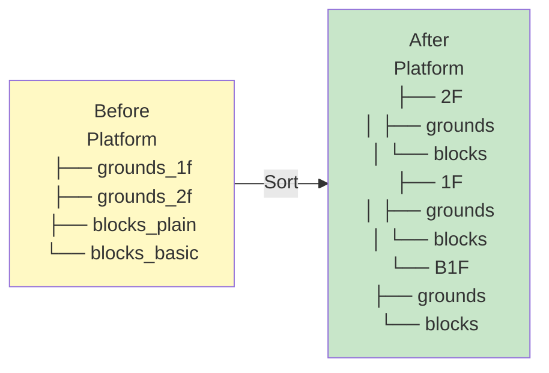

### 1.1 What It Does

+ Groups Ground and Block prefabs under floor containers (`2F`, `1F`, `B1F`, ...)
+ Renumbers variant suffixes within each floor (`_1`, `_2`, `_3`, ...)
+ Leaves world positions, rotations, and scales untouched

### 1.2 What It Does Not Do

+ Move any prefab in 3D space
+ Modify prefab assets
+ Change game logic or zone assignments

### 1.3 Menu Entry

```text
Tools > Briko > Sort Hierarchy by Floor
```

---

## 2. Floor Detection

### 2.1 Floor Reference Grounds

Only Ground prefabs with **X ≥ 5.0m and Z ≥ 5.0m** are used as floor anchors.

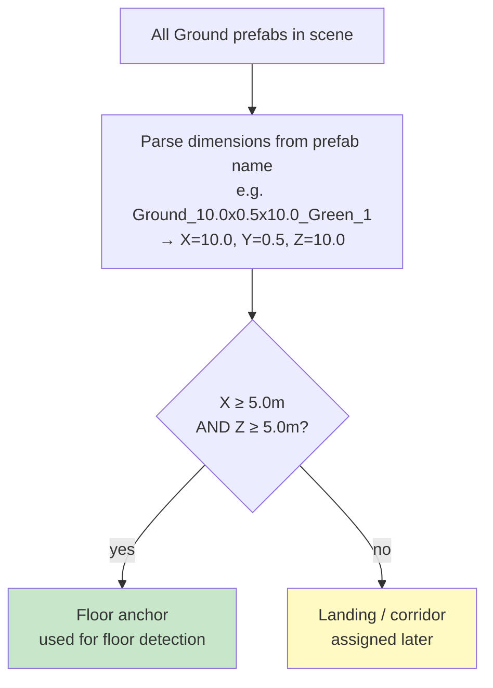

| Prefab dimensions   | Role               |
| ------------------- | ------------------ |
| `10.0 × 0.5 × 10.0` | Floor anchor       |
| `5.0 × 0.5 × 5.0`   | Floor anchor       |
| `2.5 × 0.5 × 2.5`   | Landing / corridor |

### 2.2 Surface Y Calculation

The **surface Y** of a Ground prefab is its top face in world space:

```text
surface_Y = prefab_position_Y + (prefab_height / 2)
           = prefab_position_Y + 0.25
```

### 2.3 Floor Numbering

Floor anchors are sorted by surface Y descending. The floor whose surface Y contains **Y = 0m** is assigned **1F**. Floors above are **2F, 3F, ...** and floors below are **B1F, B2F, ...**

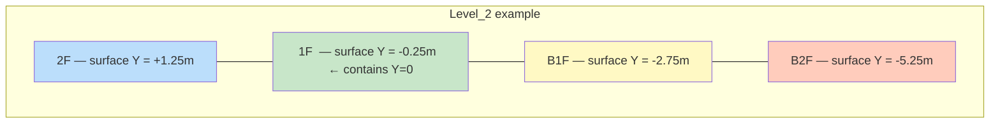

### 2.4 Travel Direction Detection

Landing assignment depends on the level's travel direction, detected automatically from zone positions.

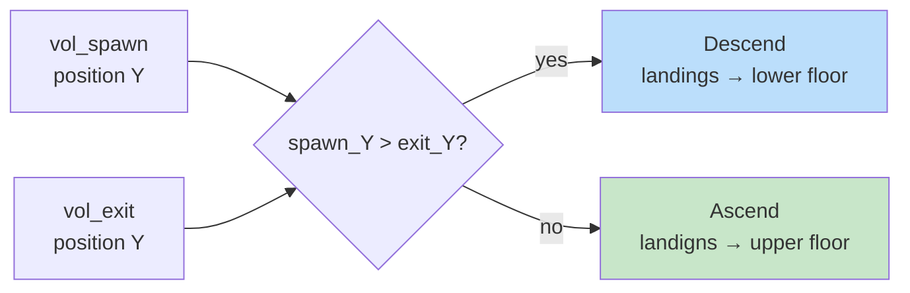

---

## 3. Block Assignment

Each Block prefab is assigned to the floor whose surface Y is **within 1.4m below the block's position Y**.

The 1.4m threshold is derived from the character height (approx. 1.4m) — any block reachable from a floor surface belongs to that floor.

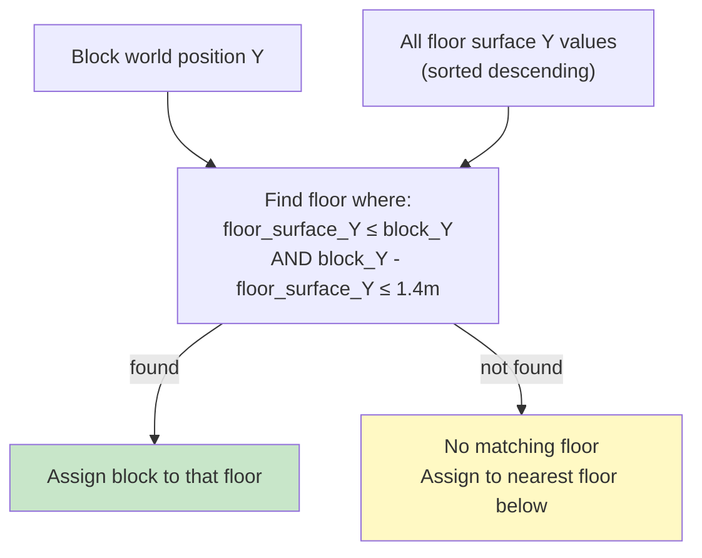

---

## 4. Landing and Corridor Assignment

Ground prefabs with X < 5.0m or Z < 5.0m (landings and corridors) are assigned based on travel direction.

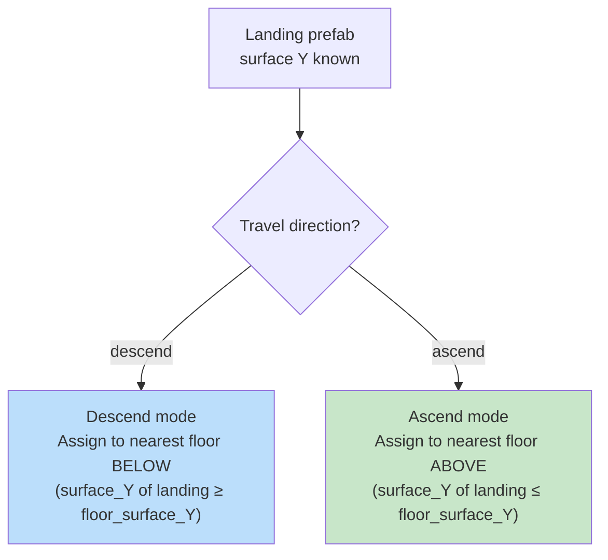

---

## 5. Variant Renumbering

After sorting, all prefabs within each floor container are renumbered **per prefab base_name** in **grouped order**. Groups appear contiguously — all instances of one type together, then all of the next type, and so on.

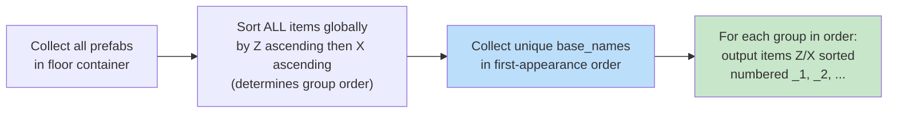

### 5.1 Group Order Rule

The **order of groups** is determined by the first occurrence of each base_name in the globally Z/X-sorted list.

```text
Example — 1F blocks (global Z order):
  Plain(z=2.5) ← FIRST Plain → Plain group is 1st
  0.5  (z=3.25) ← FIRST 0.5 → 0.5 group is 2nd
  Green(z=4.0)  ← FIRST Green → Green group is 3rd
  Plain(z=6.75)
  Plain(z=15.75)
  Green(z=16.25)
  Plain(z=25.75)
  Green(z=25.5)
  Green(z=30.75)

Output (grouped):
  Block_1.0x1.0x1.0_Plain_Green_1  (z=2.5)   ← Plain group all together
  Block_1.0x1.0x1.0_Plain_Green_2  (z=6.75)
  Block_1.0x1.0x1.0_Plain_Green_3  (z=15.75)
  Block_1.0x1.0x1.0_Plain_Green_4  (z=25.75)
  Block_0.5x0.5x0.5_Green_1        (z=3.25)  ← 0.5 group
  Block_1.0x1.0x1.0_Green_1        (z=4.0)   ← Green group all together
  Block_1.0x1.0x1.0_Green_2        (z=16.25)
  Block_1.0x1.0x1.0_Green_3        (z=25.5)
  Block_1.0x1.0x1.0_Green_4        (z=30.75)
```

### 5.2 Rationale

+ Each prefab type (base_name) is numbered independently starting from_1
+ All instances of the same type appear contiguously in the Hierarchy
+ Group order is deterministic: determined by the smallest Z of each type
+ Designers can see all Ground_10, all Ground_5, all Ground_2.5 as separate blocks

### 5.3 Name Format

```text
{prefab_base_name}_{variant_number}

Groups are output in first-appearance Z order. Within each group: Z asc → X asc.
```

### 5.3 Game Logic Safety

Ground and Block objects carry no game logic. Events and triggers are handled exclusively by `vol_*` zone GameObjects under `Entity`. Renumbering Ground/Block variants never breaks game logic.

---

## 6. Output Hierarchy

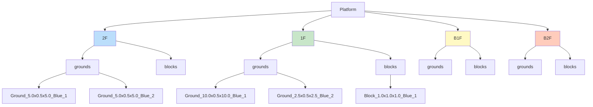

### 6.1 Container Naming Rules

| Container          | Name      | Example      |
| ------------------ | --------- | ------------ |
| Floor above ground | `{N}F`    | `2F`, `3F`   |
| Ground floor       | `1F`      | `1F`         |
| Floor below ground | `B{N}F`   | `B1F`, `B2F` |
| Ground container   | `grounds` | `grounds`    |
| Block container    | `blocks`  | `blocks`     |

---

## 7. Exporter Compatibility

The Exporter must be updated to read the new hierarchy structure.

### 7.1 Previous Structure (v1)

```text
Platform
├── grounds_1f     ← prefix-based detection
├── grounds_2f
├── blocks_plain   ← prefix-based detection
└── blocks_basic
```

### 7.2 New Structure (post-sort)

```text
Platform
├── 1F
│   ├── grounds    ← fixed name under floor container
│   └── blocks
└── B1F
    ├── grounds
    └── blocks
```

### 7.3 Exporter Update Logic

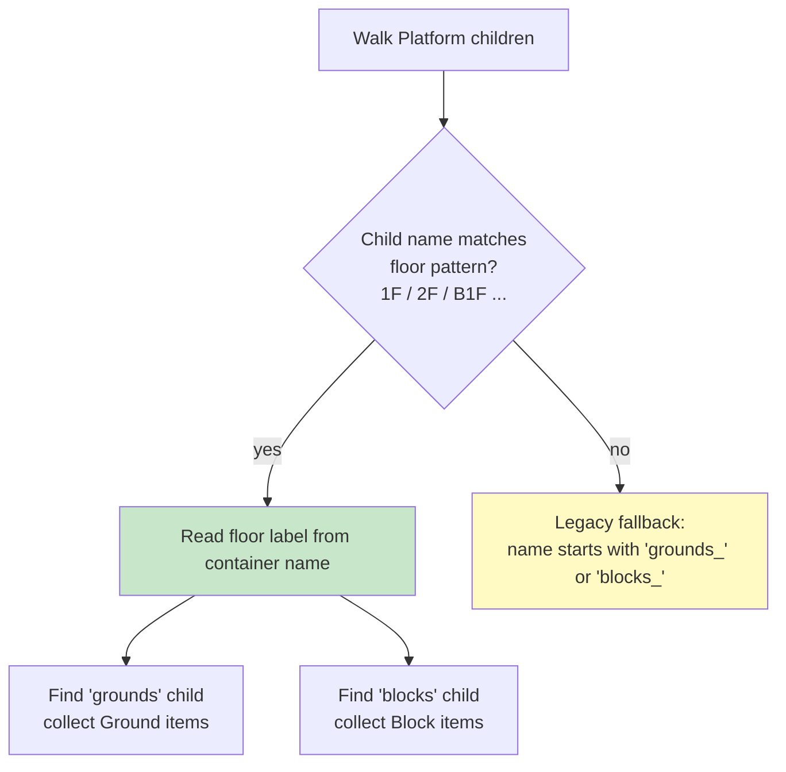

The Exporter retains legacy fallback support so unsorted scenes continue to export correctly.

---

## 8. Algorithm Flow

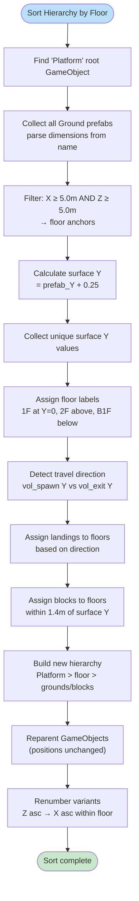

---

## 9. Failure Modes

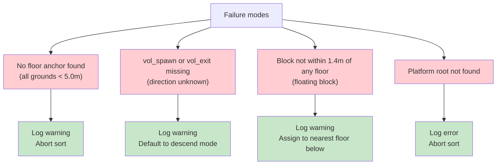

| Failure                          | Action                                     |
| -------------------------------- | ------------------------------------------ |
| No floor anchor found            | Log warning, abort                         |
| `vol_spawn` / `vol_exit` missing | Log warning, default to descend            |
| Block not assignable             | Log warning, assign to nearest floor below |
| `Platform` root not found        | Log error, abort                           |

Briko never crashes on data anomalies. Partial results with warnings are preferred over complete failure.

---

## 11. Idempotency (briko_5_4_3)

`Sort Hierarchy by Floor` must produce identical results when run multiple times on the same scene.

### 11.1 Re-run Safety

On re-run, `old_containers` captures existing floor containers (`1F`, `2F`, `B1F`, ...). These floor containers have non-zero `childCount` because they contain empty `grounds`/`blocks` structural children. The deletion check **must NOT use `childCount == 0`** — old containers are always destroyed unconditionally.

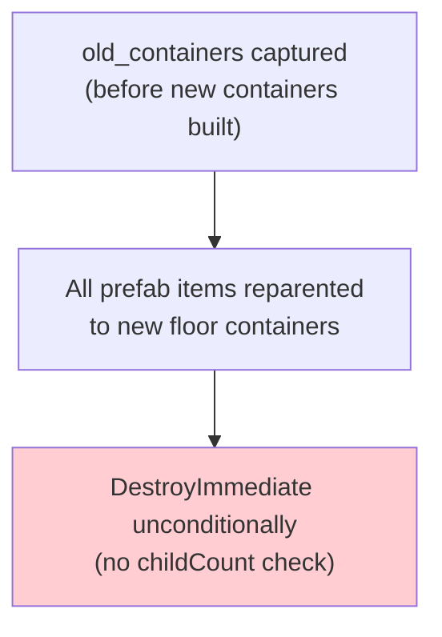

The predicate for identifying structural containers (safe to destroy) is:

```text
IsStructuralContainer(name) =
    IsFloorContainer(name)     // 1F, 2F, B1F, ...
    OR IsGroundsContainer(name)  // grounds, grounds_1f, ...
    OR IsBlocksContainer(name)   // blocks, blocks_plain, ...
```

### 11.2 Variant Sibling Order

After `RenumberContainerChildren`, sibling indices must be updated so the Unity Hierarchy displays children in Z ascending → X ascending order (matching the variant number order).

`SetSiblingIndex(i)` is called on each child after renaming so that:

+ Child with `_1` appears first
+ Child with `_2` appears second
+ etc.

Validation: `IsVariantOrderValid(items_in_sibling_order)` checks that for each base_name, variants appear in ascending order starting from `_1`.

---

**End of specification.**

---

## 10. Implementation Class Design (briko_5_4_1)

### 10.1 Class Responsibilities

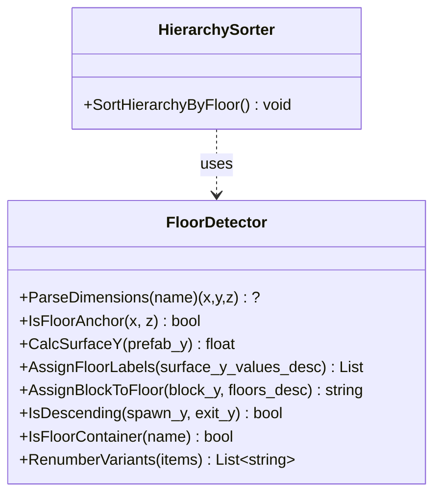

`FloorDetector` (pure, `Briko.Editor.Internal`) — all platform-independent logic.
`HierarchySorter` (Unity Editor, `Briko.Editor`) — scene hierarchy operations only.

### 10.2 New FloorDetector Methods

#### IsFloorContainer(string name) → bool

Returns `true` if `name` matches a floor container label.

+ Above / at ground: regex `^\d+F$` → `"1F"`, `"2F"`, `"3F"` ...
+ Below ground: regex `^B\d+F$` → `"B1F"`, `"B2F"` ...
+ Case-sensitive: uppercase `F` only.

Used by `HierarchySorter` to distinguish floor containers from `grounds` / `blocks` / `Platform` when walking the post-sort hierarchy, and by `Exporter` (Task C) for the same purpose.

#### RenumberVariants(`List<(string base_name, float x, float z)>` items) → `List<string>`

Sorts `items` by **Z ascending → X ascending**, then returns new names with sequential `_1`, `_2`, ... suffix.

+ Input: list of `(prefab_base_name, world_x, world_z)` for all items in one container
+ Output: renamed list in sorted order
+ Empty input → empty output (no crash)
+ Mixed base names within one container are numbered sequentially across the whole list

### 10.3 HierarchySorter Menu Entry

```text
Tools > Briko > Sort Hierarchy by Floor
```

Implemented as `[MenuItem]` in `Editor/HierarchySorter.cs`, namespace `Briko.Editor`.

---

**End of specification.**
