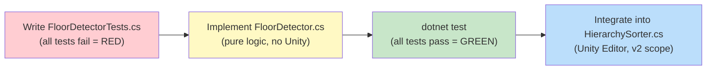
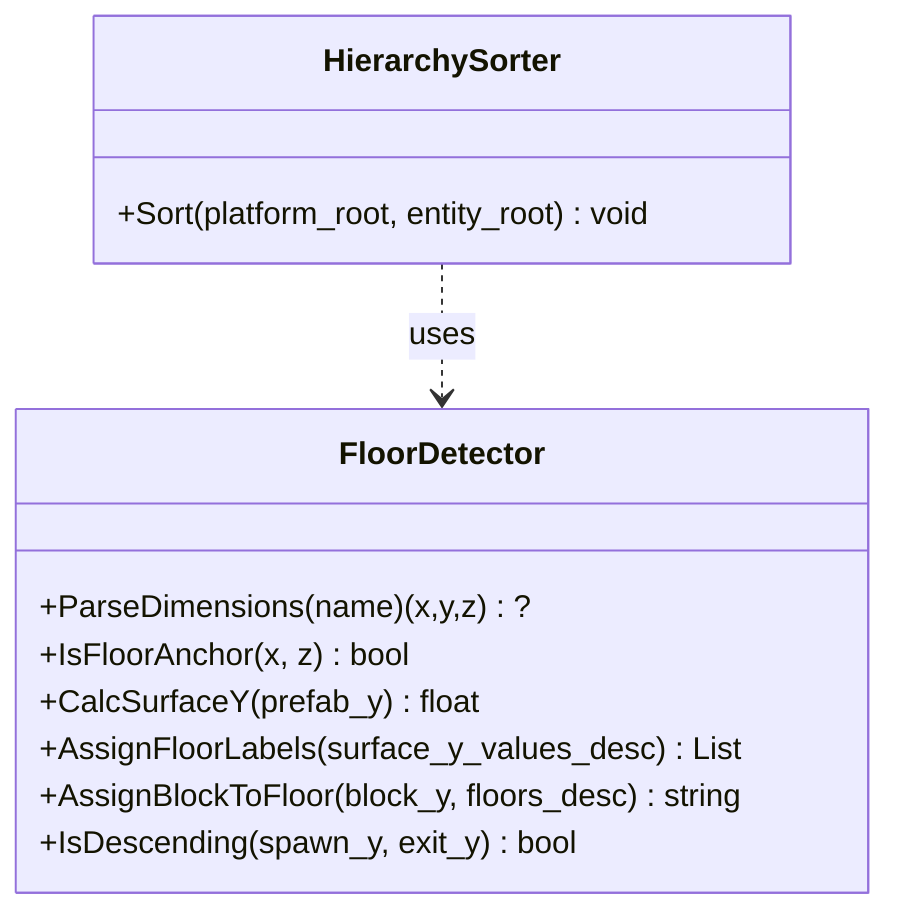
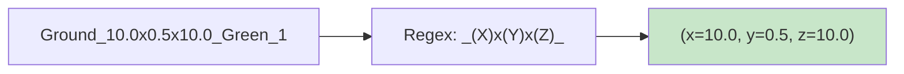
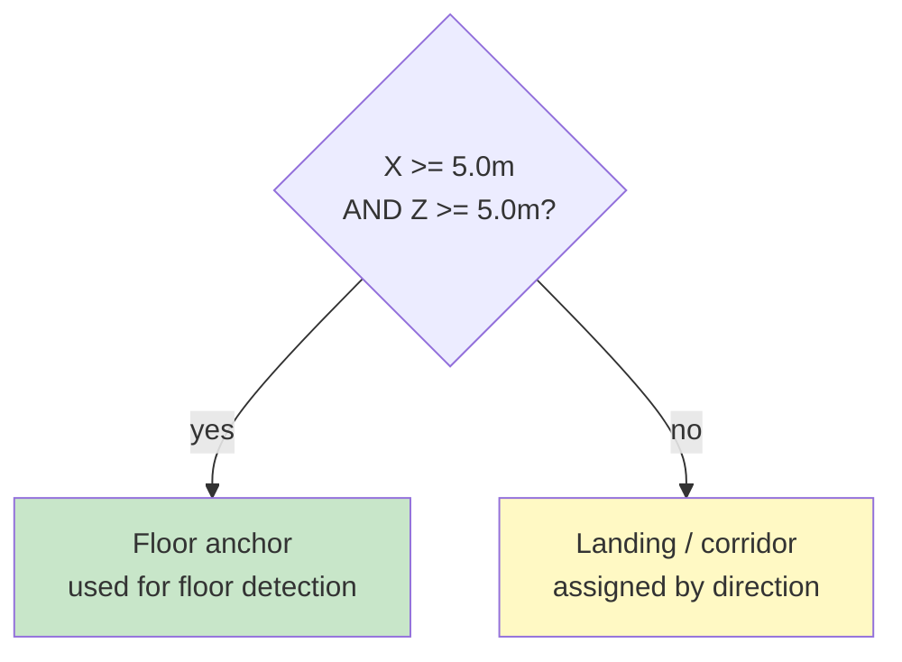
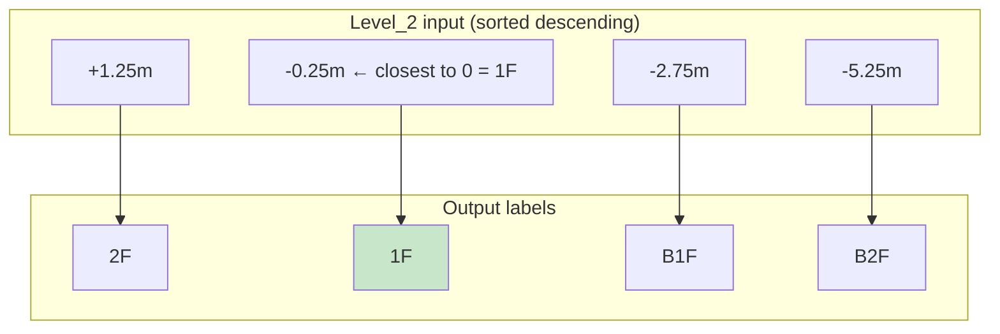
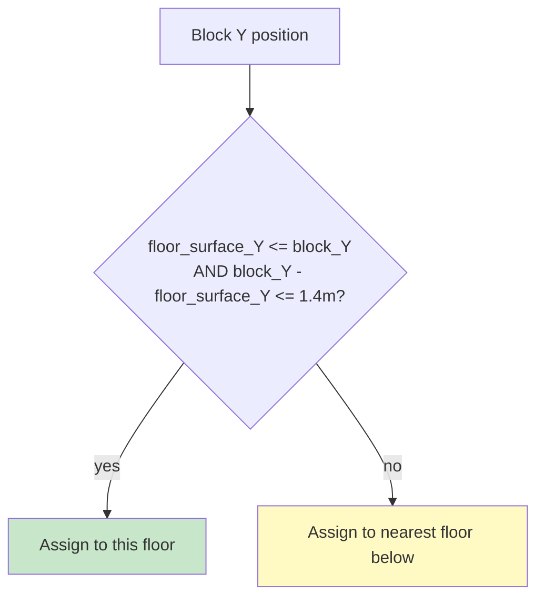
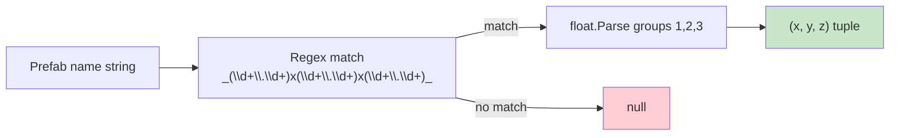
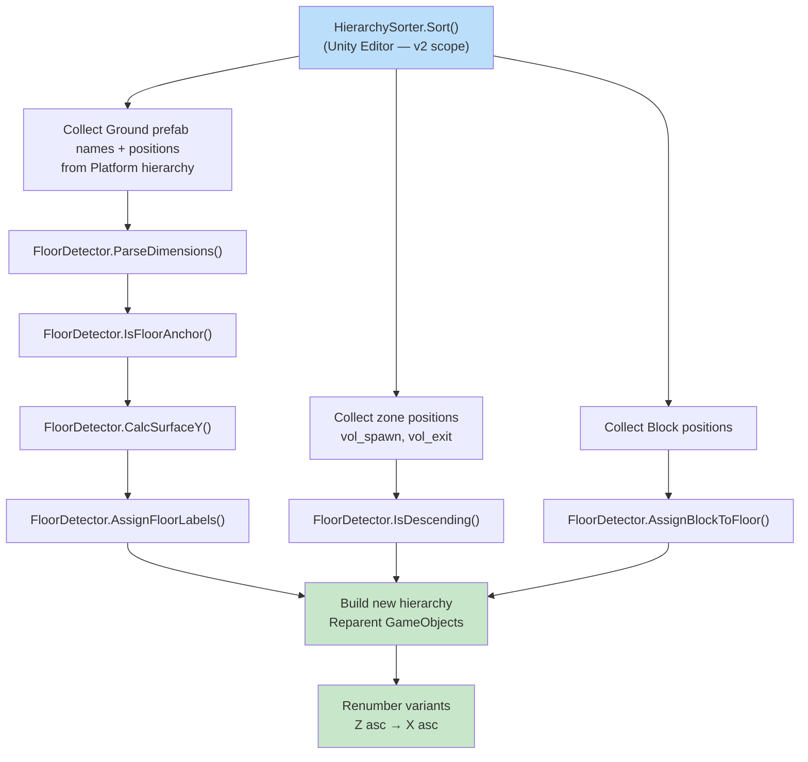
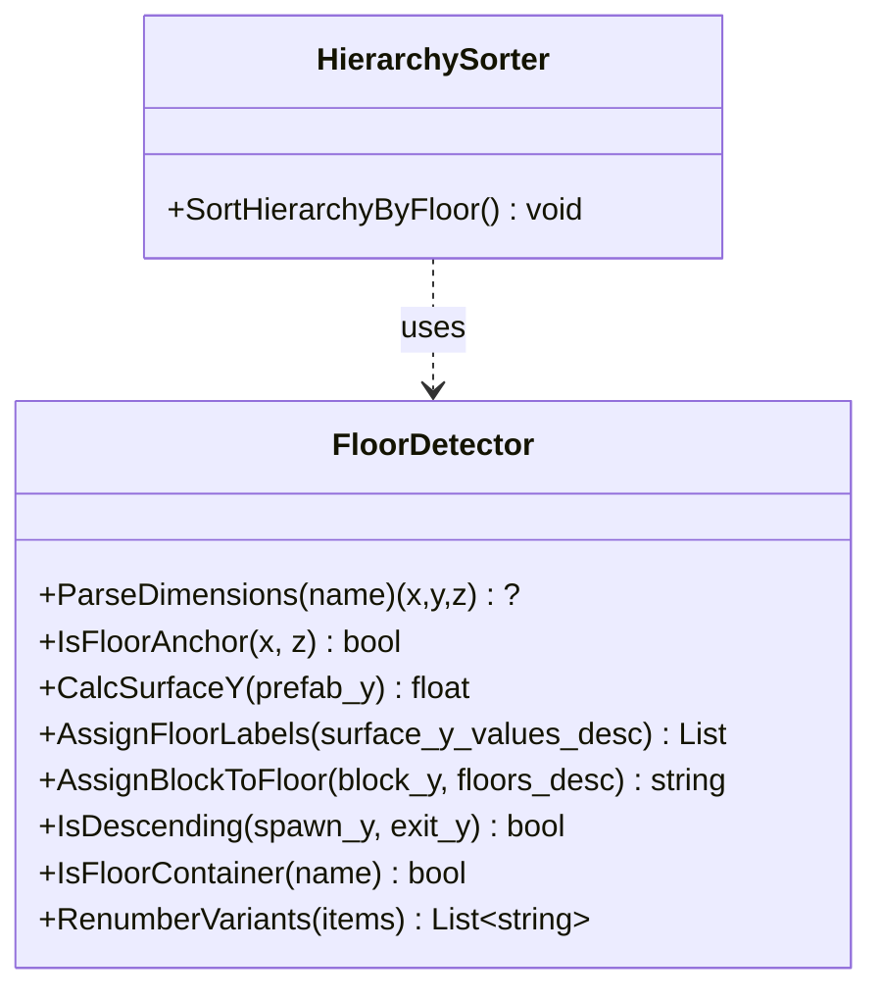

# Hierarchy Sorter — TDD Specification

> **Briko Editor Extension — Floor Detection Logic**
>
> Test-Driven Development plan for `FloorDetector` — the pure logic core of the Hierarchy Sorter.
> Write tests first (RED), implement to make them GREEN.

---

**Document Version**: 1.0
**Last Updated**: 2026-05-05
**Status**: RED → GREEN in progress

---

## Table of Contents

| Section | Topic |
|---|---|
| 1 | TDD Strategy |
| 2 | Class Design |
| 3 | Test Cases (RED) |
| 4 | Implementation Design (GREEN) |
| 5 | Integration with HierarchySorter |
| 6 | Files Delivered |

---

## 1. TDD Strategy



### 1.1 Why Pure Logic First

The Hierarchy Sorter's core intelligence — floor detection, block assignment, variant renumbering — has **no Unity dependencies**. By extracting it into `FloorDetector` (pure static methods), we can:

- Run tests with `dotnet test` without Unity Test Framework
- Prove correctness before touching the scene hierarchy
- Reuse logic in future tools (Importer, Validator)

### 1.2 What Is NOT Tested Here

Unity API operations are deferred to v2 PlayMode tests:

| Operation | Reason deferred |
|---|---|
| `transform.SetParent()` | Requires Unity runtime |
| `GameObject.Find()` | Requires Unity runtime |
| `AssetDatabase` | Requires Unity Editor context |

---

## 2. Class Design



`FloorDetector` is a **pure static utility** in `Briko.Editor.Internal`. All methods take and return plain C# types (`float`, `string`, `List`). No `Vector3`, no `GameObject`, no Unity.

### 2.1 Constants

| Constant | Value | Rationale |
|---|---|---|
| `FLOOR_ANCHOR_MIN_XZ` | `5.0f` | Ground ≥ 5m × 5m = floor |
| `GROUND_HALF_HEIGHT` | `0.25f` | Half of Ground thickness (0.5m) |
| `CHARACTER_HEIGHT` | `1.4f` | Max block height reachable from floor |

---

## 3. Test Cases (RED)

### 3.1 ParseDimensions



| Test | Input | Expected |
|---|---|---|
| `ParseDimensions_GroundName_ReturnsXYZ` | `Ground_10.0x0.5x10.0_Green_1` | `(10.0, 0.5, 10.0)` |
| `ParseDimensions_SmallGround_ReturnsXYZ` | `Ground_2.5x0.5x2.5_Blue_3` | `(2.5, 0.5, 2.5)` |
| `ParseDimensions_BlockName_ReturnsXYZ` | `Block_1.0x1.0x1.0_Plain_Green_1` | `(1.0, 1.0, 1.0)` |
| `ParseDimensions_InvalidName_ReturnsNull` | `Ground_invalid` | `null` |

### 3.2 IsFloorAnchor



| Test | Input | Expected |
|---|---|---|
| `IsFloorAnchor_TenByTen_ReturnsTrue` | `x=10.0, z=10.0` | `true` |
| `IsFloorAnchor_FiveByFive_ReturnsTrue` | `x=5.0, z=5.0` | `true` ← boundary |
| `IsFloorAnchor_TwoPointFiveByTwoPointFive_ReturnsFalse` | `x=2.5, z=2.5` | `false` |
| `IsFloorAnchor_OneByOne_ReturnsFalse` | `x=1.0, z=1.0` | `false` |

### 3.3 CalcSurfaceY

```
surface_Y = prefab_position_Y + 0.25
```

| Test | Input | Expected |
|---|---|---|
| `CalcSurfaceY_PrefabAtMinusHalf_ReturnsZero` | `prefab_y=-0.25` | `0.0` ← 1F surface (center at -0.25, top at 0.0) |
| `CalcSurfaceY_PrefabAtOne_ReturnsOnePointTwoFive` | `prefab_y=1.0` | `1.25` ← 2F in Level_2 |
| `CalcSurfaceY_PrefabAtMinusFivePointFive_ReturnsMinusFivePointTwoFive` | `prefab_y=-5.5` | `-5.25` ← B2F in Level_2 |

### 3.4 AssignFloorLabels



| Test | Input | Expected |
|---|---|---|
| `AssignFloorLabels_Level2Surfaces_ReturnsFourFloors` | `[1.25, -0.25, -2.75, -5.25]` | `["2F","1F","B1F","B2F"]` |
| `AssignFloorLabels_SingleSurfaceAtZero_Returns1F` | `[0.0]` | `["1F"]` |
| `AssignFloorLabels_TwoSurfaces_Returns2FAnd1F` | `[1.25, -0.25]` | `["2F","1F"]` |
| `AssignFloorLabels_EmptyList_ReturnsEmpty` | `[]` | `[]` |
| `AssignFloorLabels_Level3Surfaces_ReturnsFourAboveGroundFloors` | `[4.75, 2.25, 1.25, -0.25]` | `["4F","3F","2F","1F"]` ← Level_3 real data |

### 3.5 AssignBlockToFloor



| Test | Block Y | Expected Floor |
|---|---|---|
| `AssignBlockToFloor_BlockOnFirstFloor_Returns1F` | `0.0` | `1F` (surface=-0.25, diff=0.25) |
| `AssignBlockToFloor_BlockOnSecondFloor_Returns2F` | `1.5` | `2F` (surface=1.25, diff=0.25) |
| `AssignBlockToFloor_BlockOnB2F_ReturnsB2F` | `-5.0` | `B2F` (surface=-5.25, diff=0.25) |
| `AssignBlockToFloor_BlockAboveCharacterHeight_FallsBackToNearestFloorBelow` | `7.0` | `4F` ← Level_3 real data: 2.25m > 1.4m, fallback path |

### 3.6 IsDescending

| Test | spawn_Y | exit_Y | Expected |
|---|---|---|---|
| `IsDescending_SpawnAboveExit_ReturnsTrue` | `0.0` | `-5.0` | `true` |
| `IsDescending_SpawnBelowExit_ReturnsFalse` | `-5.0` | `0.0` | `false` |
| `IsDescending_SpawnEqualsExit_ReturnsFalse` | `0.0` | `0.0` | `false` |

---

## 4. Implementation Design (GREEN)

### 4.1 ParseDimensions

Uses `Regex` to extract dimension segment `_(X)x(Y)x(Z)_` from the prefab name. Returns `null` on mismatch.



### 4.2 AssignFloorLabels Algorithm

```
1. Find index of surface_Y closest to 0.0  → base_idx (= 1F)
2. For each surface_Y at index i:
     rel = base_idx - i
     if rel == 0  → "1F"
     if rel > 0   → "{rel+1}F"   (above 1F)
     if rel < 0   → "B{-rel}F"  (below 1F)
```

### 4.3 AssignBlockToFloor Algorithm

```
For each floor in floors_desc (sorted descending):
  diff = block_Y - floor.surface_Y
  if diff >= 0 AND diff <= 1.4m → return floor.label

If none matched → return label of nearest floor below block_Y
```

---

## 5. Integration with HierarchySorter



`FloorDetector` provides all floor intelligence. `HierarchySorter` handles only Unity API calls (reparenting, renaming, SetActive).

---

## 6. Files Delivered

| File | Path | Role |
|---|---|---|
| `FloorDetector.cs` | `Editor/Internal/FloorDetector.cs` | Pure logic implementation |
| `FloorDetectorTests.cs` | `Tests~/IntegrationTests/Scripts/Internal/FloorDetectorTests.cs` | NUnit tests |
| `hierarchy_sorter_tdd.md` | `docs/hierarchy_sorter_tdd.md` | This document |

### 6.1 Test Count

| Class | Tests | Coverage |
|---|---|---|
| `ParseDimensions` | 4 | name parsing |
| `IsFloorAnchor` | 4 | XZ threshold |
| `CalcSurfaceY` | 3 | Y + 0.25 |
| `AssignFloorLabels` | 4 | floor numbering |
| `AssignBlockToFloor` | 3 | 1.4m threshold |
| `IsDescending` | 3 | travel direction |
| **Total** | **21** | |

### 6.2 IntegrationTests.csproj Addition Required

Add to `<ItemGroup>` in `IntegrationTests.csproj`:

```xml
<Compile Include="..\..\Editor\Internal\FloorDetector.cs" />
<Compile Include="Scripts\Internal\FloorDetectorTests.cs" />
```

---

**End of specification.**

---

## 7. HierarchySorter Pure Logic — Additional Test Cases (briko_5_4_1)

The following tests cover two new pure static methods added to `FloorDetector` to support `HierarchySorter`.

### 7.1 Class Design Update



### 7.2 IsFloorContainer

Returns `true` if the given container name matches a floor label (`1F`, `2F`, `B1F`, ...). Used by `HierarchySorter` to detect post-sort floor containers when walking the Platform hierarchy.

Pattern: `^\d+F$` (above / at ground) or `^B\d+F$` (below ground). Uppercase only — spec mandates uppercase `F`.

| Test | Input | Expected |
|---|---|---|
| `IsFloorContainer_1F_ReturnsTrue` | `"1F"` | `true` |
| `IsFloorContainer_2F_ReturnsTrue` | `"2F"` | `true` |
| `IsFloorContainer_3F_ReturnsTrue` | `"3F"` | `true` ← multi-floor |
| `IsFloorContainer_B1F_ReturnsTrue` | `"B1F"` | `true` |
| `IsFloorContainer_B2F_ReturnsTrue` | `"B2F"` | `true` |
| `IsFloorContainer_Grounds_ReturnsFalse` | `"grounds"` | `false` |
| `IsFloorContainer_GroundsUnderscore_ReturnsFalse` | `"grounds_1f"` | `false` |
| `IsFloorContainer_Blocks_ReturnsFalse` | `"blocks"` | `false` |
| `IsFloorContainer_Platform_ReturnsFalse` | `"Platform"` | `false` |
| `IsFloorContainer_LowercaseF_ReturnsFalse` | `"1f"` | `false` ← spec is uppercase |
| `IsFloorContainer_EmptyString_ReturnsFalse` | `""` | `false` ← edge case |

### 7.3 RenumberVariants

Sorts a list of `(base_name, x, z)` tuples by **Z ascending → X ascending**, then assigns sequential variant suffixes **per base_name group**, each group starting from `_1`. Returns the renamed list in **sorted order** (global Z/X).

Signature: `RenumberVariants(List<(string base_name, float x, float z)> items) → List<string>`

**Per-type numbering rule**: Within the sorted list, each unique base_name has its own counter starting at 1. Different base_names do not share a counter.

| Test | Scenario | Expected |
|---|---|---|
| `RenumberVariants_SingleItem_ReturnsVariant1` | 1 item at (0, 0) | `["base_1"]` |
| `RenumberVariants_TwoItemsDifferentZ_SortsByZAscending` | Z=10 before Z=0, same type | Z=0 → `_1`, Z=10 → `_2` |
| `RenumberVariants_TwoItemsSameZDifferentX_SortsByXAscending` | X=10 before X=0, same type | X=0 → `_1`, X=10 → `_2` |
| `RenumberVariants_ThreeItems_NumbersSequentiallyByZThenX` | 3 items same type | (0,0)→`_1`, (10,0)→`_2`, (0,10)→`_3` |
| `RenumberVariants_EmptyList_ReturnsEmpty` | empty input | `[]` |
| `RenumberVariants_MixedBaseNames_NumbersSequentially` (**modified**) | 2 different types, different Z | each type gets `_1` (not global sequential) |
| `RenumberVariants_DifferentBasenames_EachStartAtOne` (**new**) | TypeA(z=0), TypeB(z=5) | `[TypeA_1, TypeB_1]` ← each type resets to _1 |
| `RenumberVariants_InterleavedBasenames_NumberedPerType` (**modified**) | TypeA(z=0), TypeB(z=5), TypeA(z=10) | `[TypeA_1, TypeA_2, TypeB_1]` ← grouped: all TypeA first, then TypeB |
| `RenumberVariants_InterleavedTypesOutputGrouped` (**new**) | Plain(z=2.5), 0.5(z=3.25), Green(z=4.0), Plain(z=6.75) | `[Plain_1, Plain_2, 0.5_1, Green_1]` ← grouped by first-appearance Z |

### 7.4 Updated Test Count

| Class / Section | Method | Tests |
|---|---|---|
| `FloorDetectorTests` | `ParseDimensions` | 4 |
| `FloorDetectorTests` | `IsFloorAnchor` | 4 |
| `FloorDetectorTests` | `CalcSurfaceY` | 3 |
| `FloorDetectorTests` | `AssignFloorLabels` | 4 |
| `FloorDetectorTests` | `AssignBlockToFloor` | 3 |
| `FloorDetectorTests` | `IsDescending` | 3 |
| `FloorDetectorTests` | `AssignFloorLabels` (Level_3 real data) | 1 |
| `FloorDetectorTests` | `AssignBlockToFloor` (fallback path, Level_3 real data) | 1 |
| `HierarchySorterTests` | `IsFloorContainer` | 11 |
| `HierarchySorterTests` | `RenumberVariants` | 6 |
| **Total** | | **40** |

### 7.5 Files Added (briko_5_4_1)

| File | Path | Role |
|---|---|---|
| `HierarchySorterTests.cs` | `Tests~/IntegrationTests/Scripts/Internal/HierarchySorterTests.cs` | NUnit RED→GREEN tests |
| `HierarchySorter.cs` | `Editor/HierarchySorter.cs` | Unity Editor tool (`Tools > Briko > Sort Hierarchy by Floor`) |

`IntegrationTests.csproj` addition:

```xml
<Compile Include="Scripts\Internal\HierarchySorterTests.cs" />
```

---

**End of specification.**

---

## 8. Bug Fixes — briko_5_4_3

### 8.1 Bug 1: Empty containers duplicated on re-run

**Root cause**: `DestroyImmediate` was gated on `childCount == 0`. On re-run, old floor containers (1F, 2F, ...) have non-zero childCount (empty grounds/blocks inside) → not destroyed → duplicate containers.

**Fix**: New `FloorDetector.IsStructuralContainer(name)` identifies containers safe to destroy. HierarchySorter destroys old containers unconditionally.

#### IsStructuralContainer(string name) → bool

Returns `true` if the name is a structural container (floor label OR grounds/blocks pattern). Used by HierarchySorter to unconditionally destroy old containers.

`IsStructuralContainer(name)` = `IsFloorContainer(name) || IsGroundsContainer(name) || IsBlocksContainer(name)`

| Test | Input | Expected |
|---|---|---|
| `IsStructuralContainer_FloorLabel_ReturnsTrue` | `"1F"` | `true` |
| `IsStructuralContainer_BasementLabel_ReturnsTrue` | `"B1F"` | `true` |
| `IsStructuralContainer_GroundsPostSort_ReturnsTrue` | `"grounds"` | `true` |
| `IsStructuralContainer_GroundsPreSort_ReturnsTrue` | `"grounds_1f"` | `true` |
| `IsStructuralContainer_BlocksPostSort_ReturnsTrue` | `"blocks"` | `true` |
| `IsStructuralContainer_BlocksPreSort_ReturnsTrue` | `"blocks_plain"` | `true` |
| `IsStructuralContainer_PlatformRoot_ReturnsFalse` | `"Platform"` | `false` |
| `IsStructuralContainer_PrefabName_ReturnsFalse` | `"Ground_10.0x0.5x10.0_Green_1"` | `false` |

### 8.2 Bug 2: Sibling order not sorted (_2 before _1 in Hierarchy)

**Root cause**: `RenumberContainerChildren` renamed correctly but did not call `SetSiblingIndex`. Children retained original insertion order in Hierarchy.

**Fix**: Add `SetSiblingIndex(i)` after each rename. New `FloorDetector.IsVariantOrderValid` validates the Hierarchy ordering purely.

#### IsVariantOrderValid(List<(string base_name, int variant)> items_in_sibling_order) → bool

Validates that for each base_name, variants appear in ascending order starting from 1 in the given sibling-order list.
Returns `false` if any base_name's first occurrence is not `_1`, or if subsequent occurrences are not `previous + 1`.

| Test | Input (sibling order) | Expected |
|---|---|---|
| `IsVariantOrderValid_EmptyList_ReturnsTrue` | `[]` | `true` |
| `IsVariantOrderValid_SingleItem_ReturnsTrue` | `[("A",1)]` | `true` |
| `IsVariantOrderValid_SameTypeAscending_ReturnsTrue` | `[("A",1),("A",2)]` | `true` |
| `IsVariantOrderValid_SameTypeDescending_ReturnsFalse` | `[("A",2),("A",1)]` | `false` ← BUG case |
| `IsVariantOrderValid_MixedTypesAllInOrder_ReturnsTrue` | `[("A",1),("B",1),("A",2)]` | `true` |
| `IsVariantOrderValid_MixedTypesOutOfOrder_ReturnsFalse` | `[("A",2),("B",1),("A",1)]` | `false` |

### 8.3 Updated Test Count

| Section | Method | Tests |
|---|---|---|
| `HierarchySorterTests` | `IsStructuralContainer` | 8 |
| `HierarchySorterTests` | `IsVariantOrderValid` | 6 |
| **New total** | | **+14** |

---

**End of specification.**
