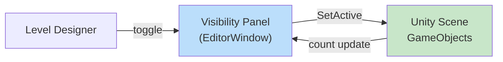
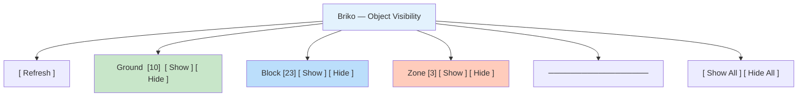
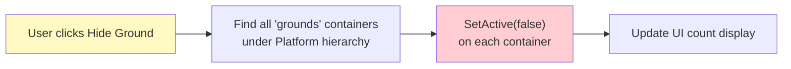
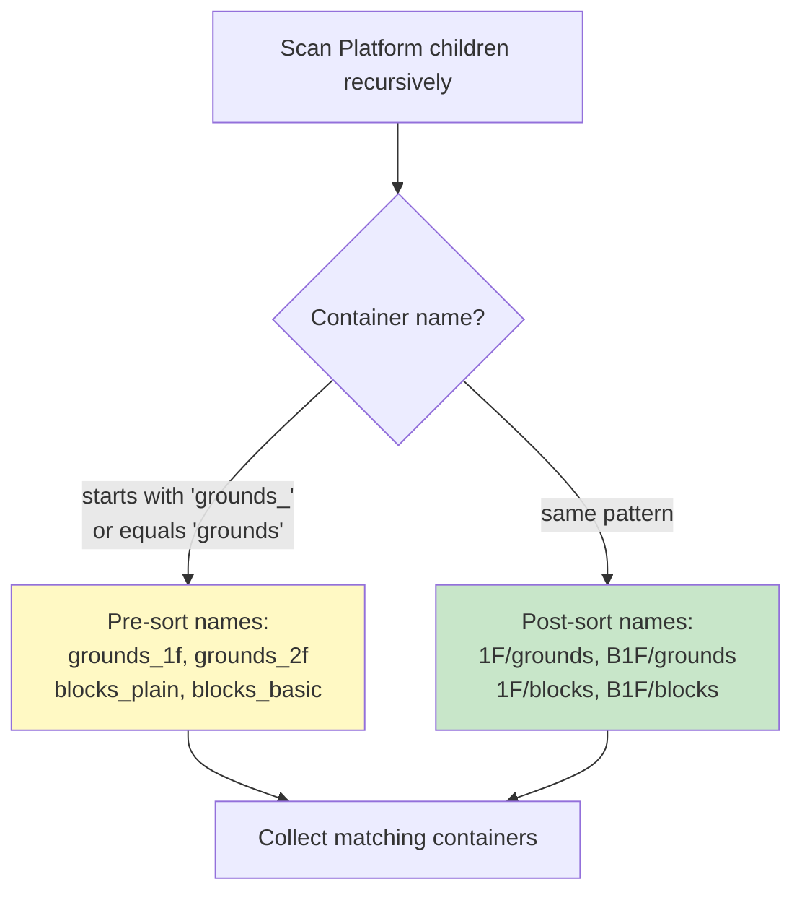
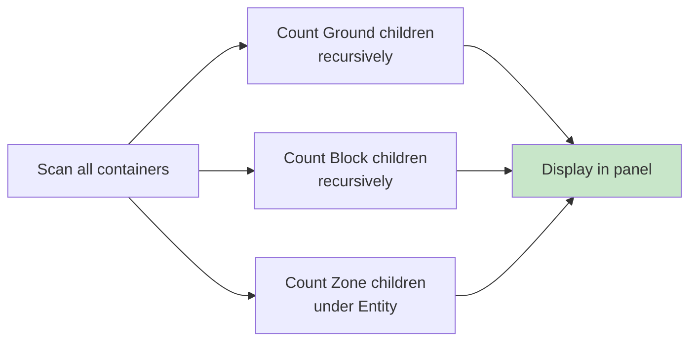
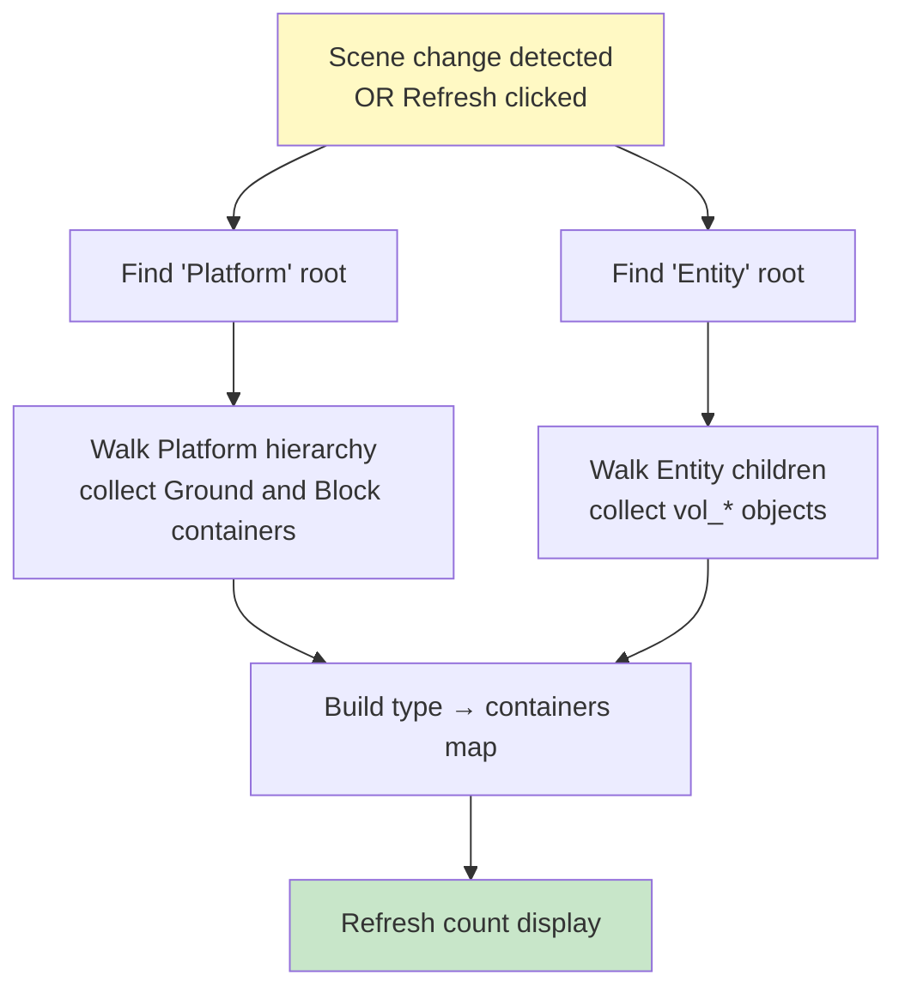
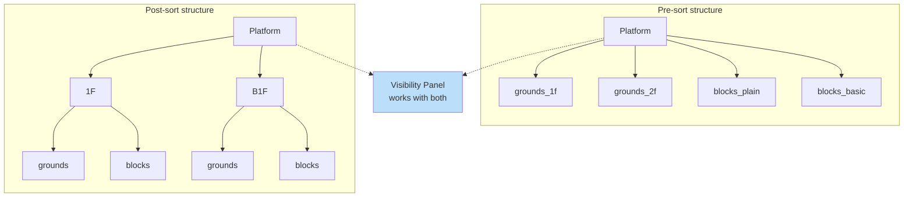
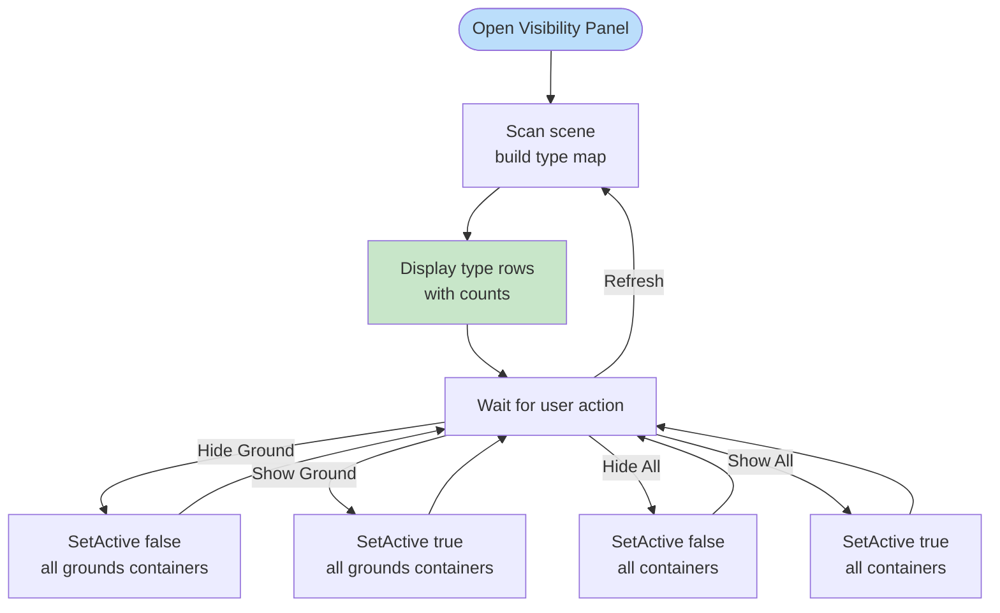
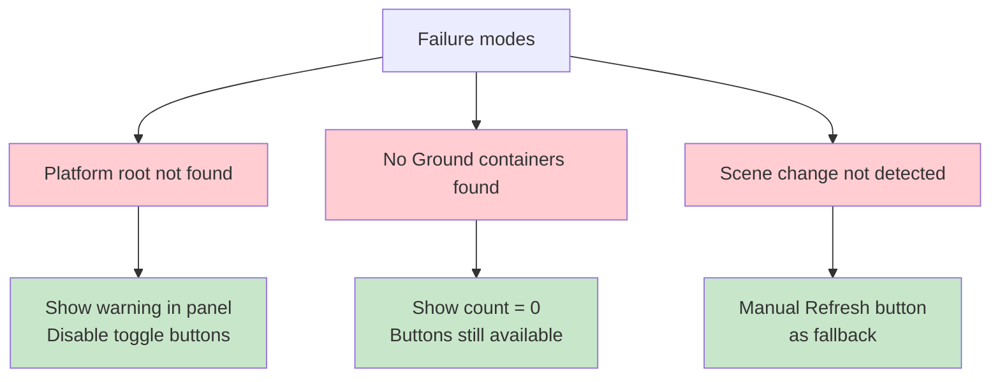
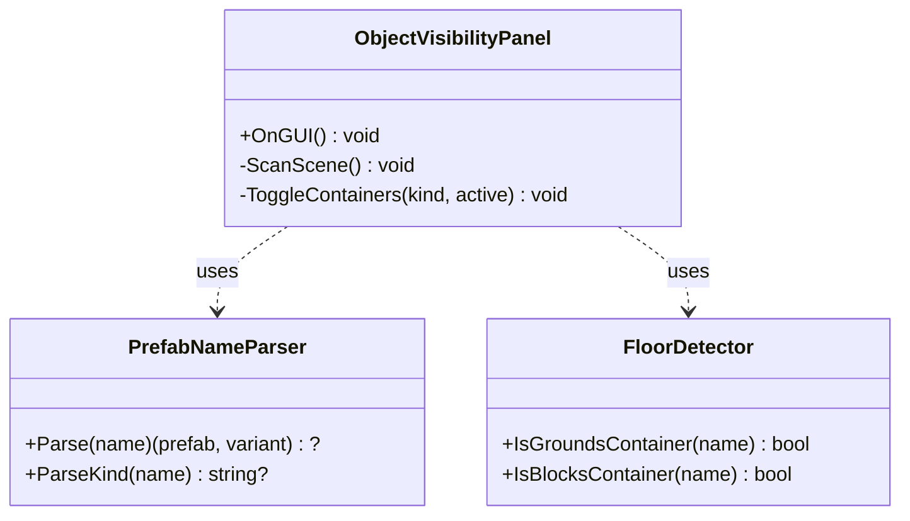

# Object Visibility UI Specification

> **Briko Editor Extension — Object Visibility Panel**
>
> A persistent Unity Editor window for toggling visibility by object type and displaying per-type counts during level design.

---

**Document Version**: 1.0
**Last Updated**: 2026-05-05
**Status**: Draft

---

## Table of Contents

| Section | Topic                              |
| ------- | ---------------------------------- |
| 1       | Overview                           |
| 2       | UI Layout                          |
| 3       | Visibility Toggle Behavior         |
| 4       | Count Display                      |
| 5       | Scene Scanning                     |
| 6       | Independence from Hierarchy Sorter |
| 7       | Algorithm Flow                     |
| 8       | Failure Modes                      |

---

## 1. Overview

The Object Visibility Panel is a persistent **EditorWindow** that allows the level designer to show or hide object types independently, and see counts at a glance.



### 1.1 Menu Entry

```text
Tools > Briko > Object Visibility
```

### 1.2 Window Behavior

+ Dockable, persistent across play mode
+ Auto-refreshes counts when scene changes
+ Independent of Hierarchy Sorter — works before and after sorting

---

## 2. UI Layout



### 2.1 Per-type Row

Each object type has one row:

| Element     | Description                                |
| ----------- | ------------------------------------------ |
| Type label  | `Ground` / `Block` / `Zone` / future types |
| Count       | Number of instances currently in scene     |
| Show button | Sets all containers of this type active    |
| Hide button | Sets all containers of this type inactive  |

### 2.2 Global Controls

| Button     | Action                           |
| ---------- | -------------------------------- |
| `Show All` | Shows all object types           |
| `Hide All` | Hides all object types           |
| `Refresh`  | Rescans scene and updates counts |

---

## 3. Visibility Toggle Behavior

Toggling operates on **container GameObjects**, not individual prefab instances. This keeps the operation O(1) regardless of how many prefabs are inside.



### 3.1 Container Search Strategy

The panel searches for containers by **name pattern**, compatible with both pre-sort and post-sort structures:



### 3.2 Zone Visibility

Zone GameObjects (`vol_*`) live under `Entity`, not `Platform`. The panel searches `Entity` children for `vol_*` pattern and toggles them individually.

---

## 4. Count Display

Counts reflect the **total number of prefab instances** of each type currently in the scene, regardless of visibility state.



### 4.1 Count Rules

+ Count includes **hidden** objects (visibility state does not affect count)
+ Count updates on `Refresh` or when `EditorSceneManager.sceneChanged` fires
+ Future object types (Enemy, Trap, etc.) are detected by kind prefix from prefab name

---

## 5. Scene Scanning



### 5.1 Type Detection from Prefab Name

Object type is determined from the **Kind** segment of the prefab name (first segment before dimensions):

```text
Ground_10.0x0.5x10.0_Green_1  →  Kind = Ground
Block_1.0x1.0x1.0_Blue_2      →  Kind = Block
Enemy_1.0x2.0x1.0_Red_1       →  Kind = Enemy
```

New kinds are auto-detected and appear as new rows in the panel without code changes.

---

## 6. Independence from Hierarchy Sorter

The Visibility Panel works correctly with **both** pre-sort and post-sort scene structures.



---

## 7. Algorithm Flow



---

## 8. Failure Modes



| Failure                   | Action                              |
| ------------------------- | ----------------------------------- |
| `Platform` root not found | Show warning, disable toggles       |
| No containers found       | Show count = 0, buttons available   |
| Scene change not detected | Manual `Refresh` button as fallback |

---

**End of specification.**

---

## 9. Implementation Class Design (briko_5_4_1)

### 9.1 Class Responsibilities



`PrefabNameParser` and `FloorDetector` are pure (`Briko.Editor.Internal`).
`ObjectVisibilityPanel` is a Unity `EditorWindow` (`Briko.Editor`).

### 9.2 New Pure Methods

#### PrefabNameParser.ParseKind(string name) → string?

Extracts the **Kind** prefix from a prefab name — the segment before the dimension part.

```text
Ground_10.0x0.5x10.0_Green_1  →  "Ground"
Block_1.0x1.0x1.0_Plain_Green_3  →  "Block"
Enemy_1.0x2.0x1.0_Red_2  →  "Enemy"
```

Regex: `^([^_]+)_[\d.]+x[\d.]+x[\d.]+`. Returns `null` if no dimension segment found.

#### FloorDetector.IsGroundsContainer(string name) → bool

Returns `true` if the container name matches the grounds pattern (both pre-sort and post-sort):

+ `"grounds"` (exact — post-sort)
+ `"grounds_*"` (prefix — pre-sort, e.g. `"grounds_1f"`, `"grounds_2f"`)

#### FloorDetector.IsBlocksContainer(string name) → bool

Returns `true` if the container name matches the blocks pattern:

+ `"blocks"` (exact — post-sort)
+ `"blocks_*"` (prefix — pre-sort, e.g. `"blocks_plain"`, `"blocks_basic"`)

### 9.3 TDD Test Cases

#### PrefabNameParser.ParseKind (7 tests)

| Test                                       | Input                                  | Expected      | Note                            |
| ------------------------------------------ | -------------------------------------- | ------------- | ------------------------------- |
| `ParseKind_GroundName_ReturnsGround`       | `"Ground_10.0x0.5x10.0_Green_1"`       | `"Ground"`    |                                 |
| `ParseKind_BlockName_ReturnsBlock`         | `"Block_1.0x1.0x1.0_Plain_Green_3"`    | `"Block"`     |                                 |
| `ParseKind_EnemyName_ReturnsEnemy`         | `"Enemy_1.0x2.0x1.0_Red_2"`            | `"Enemy"`     | future type                     |
| `ParseKind_BipyramidName_ReturnsBipyramid` | `"Bipyramid_0.5x1.0x0.5_Plain_Blue_1"` | `"Bipyramid"` |                                 |
| `ParseKind_InvalidName_ReturnsNull`        | `"Ground_invalid"`                     | `null`        | no dimension segment            |
| `ParseKind_ZoneName_ReturnsNull`           | `"vol_spawn"`                          | `null`        | ← zones must NOT become UI rows |
| `ParseKind_EmptyString_ReturnsNull`        | `""`                                   | `null`        | edge case                       |

#### FloorDetector.IsGroundsContainer (7 tests)

| Test                                          | Input          | Expected | Note                      |
| --------------------------------------------- | -------------- | -------- | ------------------------- |
| `IsGroundsContainer_Grounds_ReturnsTrue`      | `"grounds"`    | `true`   | post-sort                 |
| `IsGroundsContainer_Grounds1f_ReturnsTrue`    | `"grounds_1f"` | `true`   | pre-sort                  |
| `IsGroundsContainer_Grounds2f_ReturnsTrue`    | `"grounds_2f"` | `true`   | pre-sort                  |
| `IsGroundsContainer_Blocks_ReturnsFalse`      | `"blocks"`     | `false`  |                           |
| `IsGroundsContainer_FloorLabel_ReturnsFalse`  | `"1F"`         | `false`  |                           |
| `IsGroundsContainer_UppercaseG_ReturnsFalse`  | `"Grounds"`    | `false`  | ← spec is lowercase only  |
| `IsGroundsContainer_NoSeparator_ReturnsFalse` | `"groundsX"`   | `false`  | ← no underscore separator |

#### FloorDetector.IsBlocksContainer (7 tests)

| Test                                         | Input            | Expected | Note                      |
| -------------------------------------------- | ---------------- | -------- | ------------------------- |
| `IsBlocksContainer_Blocks_ReturnsTrue`       | `"blocks"`       | `true`   | post-sort                 |
| `IsBlocksContainer_BlocksPlain_ReturnsTrue`  | `"blocks_plain"` | `true`   | pre-sort                  |
| `IsBlocksContainer_BlocksBasic_ReturnsTrue`  | `"blocks_basic"` | `true`   | pre-sort                  |
| `IsBlocksContainer_Grounds_ReturnsFalse`     | `"grounds"`      | `false`  |                           |
| `IsBlocksContainer_FloorLabel_ReturnsFalse`  | `"1F"`           | `false`  |                           |
| `IsBlocksContainer_UppercaseB_ReturnsFalse`  | `"Blocks"`       | `false`  | ← spec is lowercase only  |
| `IsBlocksContainer_NoSeparator_ReturnsFalse` | `"blocksX"`      | `false`  | ← no underscore separator |

### 9.4 Files Added (briko_5_4_1)

| File                            | Path                                                                     | Role                                                     |
| ------------------------------- | ------------------------------------------------------------------------ | -------------------------------------------------------- |
| `ObjectVisibilityPanelTests.cs` | `Tests~/IntegrationTests/Scripts/Internal/ObjectVisibilityPanelTests.cs` | NUnit RED→GREEN tests                                    |
| `ObjectVisibilityPanel.cs`      | `Editor/ObjectVisibilityPanel.cs`                                        | Unity EditorWindow (`Tools > Briko > Object Visibility`) |

`IntegrationTests.csproj` addition:

```xml
<Compile Include="Scripts\Internal\ObjectVisibilityPanelTests.cs" />
```

---

**End of specification.**
